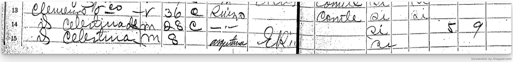

El nombre de Francisco Clemenzo aparece por primera vez en el acta de nacimiento de su nieto Félix Ricardo Clemenzo.

A partir de ese dato logré identificarlo en el censo de 1895 en la provincia de Entre Ríos, donde figura junto a algunos de sus hijos.

De ese registro se desprenden algunos puntos:
- Era de origen suizo.
- Declaraba tener 36 años en 1895 (aunque esa edad no coincide en todos los documentos).
- Ya tenía varios hijos en ese momento, y después nacerían más.

### Los lugares donde vivió

La documentación encontrada hasta ahora ubica a Francisco en distintos lugares:

- Ardon, Valais, Suiza, alrededor de 1870 (aún sin certeza de que se trate de é) ⁉
- Colonia San José, Entre Ríos, en 1892 ✅
- Colonia Yeruá, Departamento de Concordia, Entre Ríos, en 1899 ✅
- Concepción del Uruguay, Entre Ríos, en 1928 ✅

<iframe src="mapa-francisco-embed.html" width="100%" height="500" frameborder="0"></iframe>

Todavía no logré encontrar un registro de su llegada a la Argentina. En la base del CEMLA (Centro de Estudios Migratorios Latinoamericanos), donde suelen figurar los desembarcos, no aparecen ni Francisco ni Celestina.

> [!NOTE] Posibles pasos a seguir
> Revisar salidas de barco desde Suiza o investigar qué puertos usaban habitualmente los emigrantes del Valais.

### La edad de Francisco

Si tomamos como válido el registro de Ardon, Francisco habría nacido el 22 de julio de 1859. Eso lo ubicaría con 11 años en el censo suizo de 1870 y con 14 años al llegar a Argentina en 1873.

En el libro Valaisans émigrés au 19ème siècle de Maurice Carron aparece mencionado un François Clémensoz, originario de Ardon, que habría partido hacia Argentina en 1873.
Si aceptamos que se trata de Francisco, eso significaría que llegó al país con 14 años. Este dato encajaría con la fecha de nacimiento de 1859 y con la edad que declaró en algunos documentos posteriores.
Sin embargo, todavía no encontré un registro de embarque o llegada que confirme este dato, por lo que lo considero una hipótesis probable pero pendiente de verificación.

El siguiente documento donde vuelve a aparecer es la partida de bautismo de León Francisco Clemenzo en 1892, lo que deja un vacío de casi veinte años sin registros.

En el censo de 1895, Francisco declara tener 36 años, lo que coincide con un nacimiento alrededor de 1859. Sin embargo, en 1897, con el nacimiento de su hija Luisa, vuelve a declarar tener 36 años.

Finalmente, al morir en 1928, el acta de defunción indica que tenía 72 años, tres más de los que corresponderían si aceptamos 1859 como año de nacimiento.

Todos estos datos se pueden verificar en el archivo de Francois Clemenzo, tanto en su galería como en sus menciones.

> [!NOTE] Sobre la edad
> Las contradicciones en las edades son muy comunes en genealogía. No siempre los propios protagonistas recordaban con exactitud sus fechas.

### Las variaciones en el apellido

Otro punto llamativo son las variaciones del apellido en distintos registros:

- Clemenzo
- Clemence
- Clemenso
- Clemenceau

A pesar de estas formas, Francisco firmaba como Clemenzoz.

En francés, la z final se pronuncia muy suavemente, casi como una s, lo que puede explicar la confusión. Sin embargo, en el censo suizo de 1870 el apellido aparece claramente como Clemenzo.

En una charla que tuve con un posible pariente lejano, él mencionó que un antepasado suyo nacido en Valais había cambiado su apellido a Clemenso tras vivir en Francia. Esto me sirvió como ejemplo de que las variaciones en los apellidos no eran algo excepcional.

> [!NOTE] Preguntas abiertas sobre Francisco
> Quedan todavía varias cuestiones sin resolver:
> ¿Por qué no aparecen los registros de nacimiento o bautismo de todos sus hijos?
> ¿Cuál fue su verdadera ocupación? Algunos documentos lo mencionan como labrador y otros como carpintero.
> ¿Por qué no pudos establecerse en una Colonia?
> ¿De qué forma llegó a la Argentina y en qué año exactamente?
