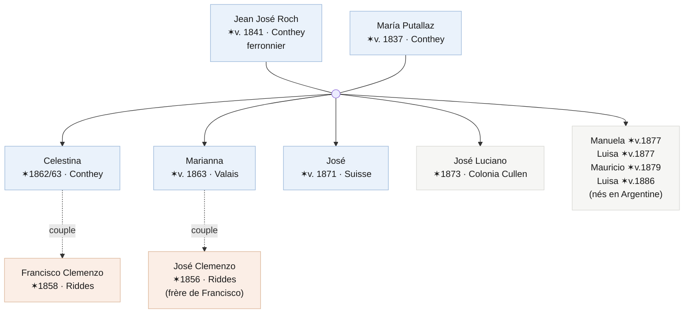

# À la recherche des Roh

Il y a un moment dans toute recherche où il est bon de cesser de pousser la porte qui ne s'ouvre pas et d'essayer celle d'à côté. Depuis des années, je poursuis **Francisco Clemenzo** par le côté des Clemenzo : ses parents à Riddes, son départ du Valais en 1873, sa trace en Entre Ríos. Et entre son émigration et sa réapparition déjà adulte et en couple, il y a un vide de treize ans que je n'arrive pas à combler par ce chemin.

Ce texte parle de changer de côté. Si je ne trouve pas Francisco en cherchant les Clemenzo, je vais chercher la femme avec laquelle il a formé une famille : **Celestina Roh**. Et pour la trouver, elle et toute sa famille.

## Le changement de perspective : chercher les hommes par leurs femmes

Il y a un schéma dans cette famille que j'ai mis du temps à voir parce que je l'avais trop proche. Depuis François Clemenzo, né en 1809, et pendant des générations, presque aucun homme de la ligne directe n'a omis de s'installer dans la maison de sa femme. L'exception est récente et partielle : mon grand-père a acheté un appartement avec ma grand-mère via un prêt hypothécaire — et même avant cela, très probablement, ils ont aussi vécu un temps chez la mère d'elle.

Cela a un nom. Les anthropologues l'appellent **résidence uxorilocale** : le couple s'établit dans la maison ou le village de la famille de l'épouse, pas du mari. L'inverse — ce qu'on attendrait en Europe rurale du XIXe siècle — est la résidence patrilocale, où la femme entre dans la maison de l'homme. Chez les Clemenzo, c'est l'inverse qui s'est produit, une fois après l'autre.

Ce n'est pas une coutume héréditaire : c'est ce qu'on fait quand il n'y a pas de patrimoine. Celui qui a une maison et une terre ramène l'épouse ; celui qui n'a rien, s'installe où il y a. François a perdu la ferme familiale lors des ventes aux enchères de 1862. Son fils Francisco a émigré à quinze ans les mains vides. Chaque génération a recommencé de zéro, et tant qu'il n'y a rien d'autre à offrir, le schéma s'est répété de lui-même.

Pour la recherche, cela cesse d'être une curiosité et devient une méthode. Si les hommes se mutaient chez elles :

- les **actes de mariage** doivent être cherchés dans la paroisse de la mariée, pas du marié ;
- les **adresses et les villes** suivent les femmes, pas les hommes ;
- et le **vide de Francisco** entre 1873 et 1886 se résout probablement non dans les papiers des Clemenzo, mais dans ceux des **Roh**.

D'où ce virage. Allons aux Roh.

## L'arbre des Roh avec lequel je pars

En rassemblant ce qui était déjà dispersé dans les archives — un acte de baptême de 1873, un recensement de 1895, une licence d'inhumation de 1950 — on reconstruit une famille assez complète. Et apparaît la première surprise : les Clemenzo et les Roh ne se sont croisés qu'une fois, mais **deux**. Deux frères Clemenzo ont formé couple avec deux sœurs Roh.

Le mariage fondateur est **Jean José Roch** (ferronnier, né vers 1841 à Conthey) et **María Putallaz** (vers 1837, aussi de Conthey) — deux noms classiques de cette commune du Valais. Ils se sont mariés en Suisse et leurs premiers enfants y sont nés, notamment Celestina (vers 1862) et Marianna (vers 1863). Ils ont émigré autour de **1872-1873** : le fils José y est encore né, mais José Luciano y est déjà né en **Colonia Cullen**, dans le département San Javier de Santa Fe. Le reste des enfants est né en Argentine.

Et là l'intrigue s'emmêle, ce qui rend cette famille intéressante : **Celestina a formé couple avec Francisco, et sa sœur Marianna avec José, le frère de Francisco.** Deux Clemenzo, deux Roh. Plus tard, il faudra démêler qui a eu des enfants avec qui et quand — il y a un couple de nœuds que je n'ai pas encore résolus — mais le squelette est celui-ci.

## Les documents dont je dispose

Quatre pièces soutiennent tout ce qui précède. Aucune n'est définitive par elle-même ; ensemble, elles dessinent la famille.

**Le baptême de José Luciano (Colonia Cullen, 29 juin 1873).** C'est la pièce la plus précieuse, car elle ancre la famille dans le temps et le lieu. L'acte dit que José Luciano est né le 14 juin 1873, *fils légitime de Juan José Roch et María Putallaz, tous deux originaires du canton du Valais en Suisse, et voisins de ladite Colonia*. Les parrains — Serafín et Adela Marietan — sont une autre famille valaisanne de la même colonie. Cela me donne trois certitudes : les Roch étaient déjà à Santa Fe en 1873, ils étaient mariés (fils *légitime*), et ils ne sont pas venus seuls mais au sein d'un groupe de Valaisans.

**Le recensement national de 1895 (Colón, Entre Ríos).** Plus de vingt ans plus tard, la famille entière apparaît ensemble dans le même foyer : José Roch (54, suisse, ferronnier), María Putallaz (58, suisse) et sept enfants, de Marianna jusqu'à une Luisa de neuf ans. C'est la photo de groupe qui confirme l'arbre et révèle le fait du métier. Elle montre aussi qu'entre 1873 et 1895, les Roch ont déménagé de Santa Fe à Entre Ríos.

**La licence d'inhumation de Celestina (Santa Fe, 1950).** Celestina est morte de pneumonie le 2 octobre 1950, à 87 ans, rue Suipacha au 3900 de la ville de Santa Fe. Le document la nomme *Celestina Roch de Clemenceau* — le nom de famille était déjà mutée de Clemenzo à Clemence puis à Clemenceau — et la déclare *veuve*. Ce « veuve » est une des choses qu'il faudra examiner de près.

**Le baptême de María Celestina (1885).** Une petite-fille — ou quelque chose de plus emmêlé — qui porte le nom de famille Roh et pose des questions que je ne ferme pas encore.

## Pourquoi je ne les avais pas trouvés

C'est bon de noter les erreurs, car elles représentent la moitié de l'apprentissage. J'ai cherché les Roh pendant longtemps sans succès, et maintenant je comprends pourquoi :

1. **Je les cherchais à Entre Ríos, mais la famille a atterri à Santa Fe.** Le premier sol argentin des Roch était Colonia Cullen, San Javier. Les actes les plus anciens sont là, pas à Colón.
2. **Le nom de famille change de forme** : Roh, Roch, Roz ; et Putallaz, Puthallaz, Putalaz. Chercher une seule graphie laisse de côté la moitié des registres.
3. **En Suisse je visais le Valais en général**, quand il fallait enfoncer la paroisse de **Conthey**, où Roh et Putallaz sont des noms très denses.

## Prochaines étapes concrètes

Le plan se divise en deux rives.

**En Suisse, tout passe par Conthey :**

- Chercher la famille Roch dans le **Registre des émigrés** du Valais (le document d'archive *DI 358*, le même où j'ai trouvé Francisco), en filtrant par Conthey et la fenêtre 1872-1873. Ce registre est reproduit et indexé dans le livre d'Alexandre et Christophe Carron, ***Nos cousins d'Amérique*** (Sierre, 1989-1990), et est consultable en ligne via la plateforme [emigration-valais.ch](https://www.emigration-valais.ch). C'est la piste la plus forte.
- Retracer la famille dans les **recensements du Valais de Conthey** (1829-1880, numérisés sur [recensements.vallesiana.ch](https://recensements.vallesiana.ch)) : le ménage Roch-Putallaz *avant* l'émigration donnerait la composition complète, les âges et la confirmation de la commune et du quartier exacts.
- L'**acte de mariage de Juan José Roch et María Putallaz** à Conthey, vers 1860-1862. Il nommerait les parents des deux et monterait une génération d'un seul coup.
- Les **baptêmes** de Celestina, Marianna et José à Conthey, pour fixer les dates et la filiation.

**En Argentine, Santa Fe d'abord :**

- La **paroisse de San Javier / Colonia Cullen**, entre 1872 et 1885 : dans le même livre où se trouve José Luciano devraient apparaître les baptêmes de Manuela, Mauricio et les deux Luisas.
- Suivre la **piste Marietan** : les parrains de 1873 ont voyagé dans le même groupe de colons. Leur trace peut révéler avec qui les Roh ont émigré.
- Reconstruire le **déplacement de Santa Fe à Entre Ríos** : quand les Roch ont-ils déménagé à Colón, et l'ont-ils fait en compagnie de Francisco ? Si la réponse est oui, le vide de treize ans commence à se remplir.

Si la théorie est correcte, ce n'est pas me perdre en explorant une famille qui ne porte pas mon nom. Je me dirige vers le lieu où la famille qui le porte a décidé, une fois après l'autre, d'aller vivre.

---

*Dernière mise à jour : 2026-06-13*
