# À la recherche des Roh

Il y a un moment dans toute recherche où il est bon de cesser de pousser la porte qui ne s'ouvre pas et d'essayer celle d'à côté. Depuis des années, je poursuis **Francisco Clemenzo** par le côté des Clemenzo : ses parents à Riddes, son départ du Valais en 1873, sa trace en Entre Ríos. Et entre son émigration et sa réapparition déjà adulte et en couple, il y a un vide de treize ans que je n'arrive pas à combler par ce chemin.

Ce texte parle de changer de côté. Si je ne trouve pas Francisco en cherchant les Clemenzo, je vais chercher la femme avec laquelle il a formé une famille : **Celestina Roh**. Et pour la trouver, elle et toute sa famille.

## Le changement de perspective : chercher les hommes par leurs femmes

Il y a un schéma dans cette famille que j'ai mis du temps à voir parce que je l'avais trop proche. Depuis François Clemenzo, né en 1809, et pendant des générations, presque aucun homme de la ligne directe n'a omis de s'installer dans la maison de sa femme. L'exception est récente et partielle : mon grand-père a acheté un appartement avec ma grand-mère via un prêt hypothécaire — et même avant cela, très probablement, ils ont aussi vécu un temps chez la mère d'elle.

Cela a un nom. Les anthropologues l'appellent **résidence uxorilocale** : le couple s'établit dans la maison ou le village de la famille de l'épouse, pas du mari. L'inverse — ce qu'on attendrait en Europe rurale du XIXe siècle — est la résidence patrilocale, où la femme entre dans la maison de l'homme. Chez les Clemenzo, c'est l'inverse qui s'est produit, une fois après l'autre.

Ce n'est pas une coutume héréditaire : c'est ce qu'on fait quand il n'y a pas de patrimoine. Celui qui a une maison et une terre ramène l'épouse ; celui qui n'a rien, s'installe où il y a. François a perdu la ferme familiale lors des ventes aux enchères de 1862. Son fils Francisco a émigré à quinze ans les mains vides. Chaque génération a recommencé de zéro, et tant qu'il n'y a rien d'autre à offrir, le schéma s'est répété de lui-même.

Pour la recherche, cela cesse d'être une curiosité et devient une méthode. Si les hommes se mutaient chez elles :

- les **actes de mariage** doivent être cherchés dans la paroisse de la mariée, pas du marié ;
- les **adresses et les villes** suivent les femmes, pas les hommes ;
- et le **vide de Francisco** entre 1873 et 1886 se résout probablement non dans les papiers des Clemenzo, mais dans ceux des **Roh**.

D'où ce virage. Allons aux Roh.

## L'arbre des Roh avec lequel je pars

En rassemblant ce qui était déjà dispersé dans les archives — un acte de baptême de 1873, un recensement de 1895, une licence d'inhumation de 1950 — on reconstruit une famille assez complète. Et apparaît la première surprise : les Clemenzo et les Roh ne se sont croisés qu'une fois, mais **deux**. Deux frères Clemenzo ont formé couple avec deux sœurs Roh.

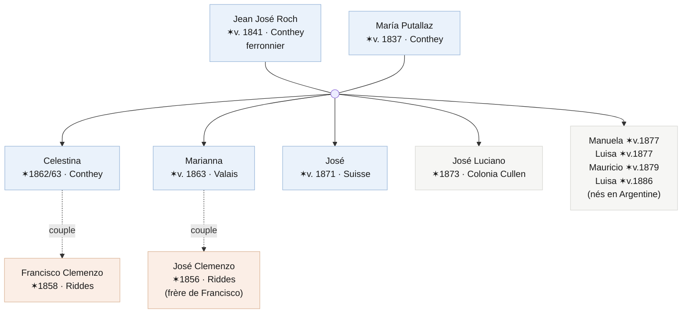

Le mariage fondateur est **Jean José Roch** (ferronnier, né vers 1841 à Conthey) et **María Putallaz** (vers 1837, aussi de Conthey) — deux noms classiques de cette commune du Valais. Ils se sont mariés en Suisse et leurs premiers enfants y sont nés, notamment Celestina (vers 1862) et Marianna (vers 1863). Ils ont émigré autour de **1872-1873** : le fils José y est encore né, mais José Luciano y est déjà né en **Colonia Cullen**, dans le département San Javier de Santa Fe. Le reste des enfants est né en Argentine.

Et là l'intrigue s'emmêle, ce qui rend cette famille intéressante : **Celestina a formé couple avec Francisco, et sa sœur Marianna avec José, le frère de Francisco.** Deux Clemenzo, deux Roh. Plus tard, il faudra démêler qui a eu des enfants avec qui et quand — il y a un couple de nœuds que je n'ai pas encore résolus — mais le squelette est celui-ci.

## Les documents dont je dispose

Quatre pièces soutiennent tout ce qui précède. Aucune n'est définitive par elle-même ; ensemble, elles dessinent la famille.

**Le baptême de José Luciano (Colonia Cullen, 29 juin 1873).** C'est la pièce la plus précieuse, car elle ancre la famille dans le temps et le lieu. L'acte dit que José Luciano est né le 14 juin 1873, *fils légitime de Juan José Roch et María Putallaz, tous deux originaires du canton du Valais en Suisse, et voisins de ladite Colonia*. Les parrains — Serafín et Adela Marietan — sont une autre famille valaisanne de la même colonie. Cela me donne trois certitudes : les Roch étaient déjà à Santa Fe en 1873, ils étaient mariés (fils *légitime*), et ils ne sont pas venus seuls mais au sein d'un groupe de Valaisans.

**Le recensement national de 1895 (Colón, Entre Ríos).** Plus de vingt ans plus tard, la famille entière apparaît ensemble dans le même foyer : José Roch (54, suisse, ferronnier), María Putallaz (58, suisse) et sept enfants, de Marianna jusqu'à une Luisa de neuf ans. C'est la photo de groupe qui confirme l'arbre et révèle le fait du métier. Elle montre aussi qu'entre 1873 et 1895, les Roch ont déménagé de Santa Fe à Entre Ríos.

**La licence d'inhumation de Celestina (Santa Fe, 1950).** Celestina est morte de pneumonie le 2 octobre 1950, à 87 ans, rue Suipacha au 3900 de la ville de Santa Fe. Le document la nomme *Celestina Roch de Clemenceau* — le nom de famille était déjà mutée de Clemenzo à Clemence puis à Clemenceau — et la déclare *veuve*. Ce « veuve » est une des choses qu'il faudra examiner de près.

**Le baptême de María Celestina (1885).** Une petite-fille — ou quelque chose de plus emmêlé — qui porte le nom de famille Roh et pose des questions que je ne ferme pas encore.

## Pourquoi je ne les avais pas trouvés

C'est bon de noter les erreurs, car elles représentent la moitié de l'apprentissage. J'ai cherché les Roh pendant longtemps sans succès, et maintenant je comprends pourquoi :

1. **Je les cherchais à Entre Ríos, mais la famille a atterri à Santa Fe.** Le premier sol argentin des Roch était Colonia Cullen, San Javier. Les actes les plus anciens sont là, pas à Colón.
2. **Le nom de famille change de forme** : Roh, Roch, Roz ; et Putallaz, Puthallaz, Putalaz. Chercher une seule graphie laisse de côté la moitié des registres.
3. **En Suisse je visais le Valais en général**, quand il fallait enfoncer la paroisse de **Conthey**, où Roh et Putallaz sont des noms très denses.

## Prochaines étapes concrètes

Le plan se divise en deux rives.

**En Suisse, tout passe par Conthey :**

- Chercher la famille Roch dans le **Registre des émigrés** du Valais (le document d'archive *DI 358*, le même où j'ai trouvé Francisco), en filtrant par Conthey et la fenêtre 1872-1873. Ce registre est reproduit et indexé dans le livre d'Alexandre et Christophe Carron, ***Nos cousins d'Amérique*** (Sierre, 1989-1990), et est consultable en ligne via la plateforme [emigration-valais.ch](https://www.emigration-valais.ch). C'est la piste la plus forte.
- Retracer la famille dans les **recensements du Valais de Conthey** (1829-1880, numérisés sur [recensements.vallesiana.ch](https://recensements.vallesiana.ch)) : le ménage Roch-Putallaz *avant* l'émigration donnerait la composition complète, les âges et la confirmation de la commune et du quartier exacts.
- L'**acte de mariage de Juan José Roch et María Putallaz** à Conthey, vers 1860-1862. Il nommerait les parents des deux et monterait une génération d'un seul coup.
- Les **baptêmes** de Celestina, Marianna et José à Conthey, pour fixer les dates et la filiation.

**En Argentine, Santa Fe d'abord :**

- La **paroisse de San Javier / Colonia Cullen**, entre 1872 et 1885 : dans le même livre où se trouve José Luciano devraient apparaître les baptêmes de Manuela, Mauricio et les deux Luisas.
- Suivre la **piste Marietan** : les parrains de 1873 ont voyagé dans le même groupe de colons. Leur trace peut révéler avec qui les Roh ont émigré.
- Reconstruire le **déplacement de Santa Fe à Entre Ríos** : quand les Roch ont-ils déménagé à Colón, et l'ont-ils fait en compagnie de Francisco ? Si la réponse est oui, le vide de treize ans commence à se remplir.

Si la théorie est correcte, ce n'est pas me perdre en explorant une famille qui ne porte pas mon nom. Je me dirige vers le lieu où la famille qui le porte a décidé, une fois après l'autre, d'aller vivre.

---

---

## Mises à jour

*Ce post est un document vivant. Ce qui précède est le point de départ, écrit le **13 juin 2026**. À mesure que la recherche avancera, les découvertes seront ajoutées ici, chacune avec sa date.*

### 13 juin 2026 — La famille se multiplie

Un lot de partidas est apparu — actes civils du Registre Civil d'Entre Ríos et un du livre paroissial de Rosario del Tala — qui fait exploser l'arbre des Roh. D'une famille connue à grands traits, nous passons à des noms, des dates, des métiers et un parcours à travers une bonne partie de la province. Je le résume ici.

**Les patriarches, avec des dates.** Nous savons maintenant que **Juan José Roch est mort à Colón en 1897**, et que sa veuve, **María Putallaz, était encore en vie en 1905**, installée à Rosario del Tala près de son fils Mauricio. Le chemin de la famille en Argentine était bien plus long que je ne le pensais : de **Colonia Cullen** (San Javier, Santa Fe, 1873) ils sont passés à **Diamante** (où Mauricio est né vers 1879), puis à **Colón / San José**, et de là plusieurs enfants se sont dispersés à **Rosario del Tala, Villa Mantero et la Colonia Rocamora**. Deux des fils étaient **forgerons**, comme leur père : un métier hérité.

**Les enfants de Juan José Roch et María Putallaz.**

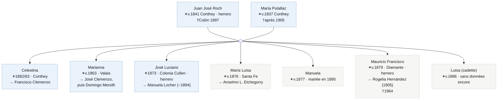

**Quatre de ces enfants ont laissé suffisamment de traces.** Je les passe en revue un par un, avec leurs registres en galerie (clic pour agrandir). Tout cela viendra aussi enrichir le site —la recherche de chacun dans le [Wiki](../../wiki.html), ses documents dans la fiche de l'[arbre](../../arbol.html)— au fur et à mesure que je le mettrai à jour.

#### Mariana Roh — trois unions et deux enfants avec un Clemenzo

C'est la sœur dont la vie est la plus compliquée, et celle qui touche le plus près ma branche. Elle a eu **au moins trois chapitres**. Le premier : une union avec **José Clemenzo** — le frère de Francisco — dont sont nés **José Domingo** (baptisé à Santa Fe le 27 juillet 1884, « fils de José Clemencia y Mariana Roh, suisses ») et **María Luisa Clemenzo** (1885). José Domingo a été baptisé à l'**Église Matriz de Todos los Santos**, la même paroisse où un an plus tard on a amené la fille de Celestina : les deux sœurs Roh, avec les deux frères Clemenzo, élevant des enfants à Santa Fe en même temps.

(Un détail de prénoms que je remarque seulement maintenant : cette María Luisa Clemenzo, fille de José, a une **cousine homonyme** — une autre María Luisa Clemenzo, fille de Francisco, née en 1897 —. Les deux, presque certainement, en l'honneur de leur grand-mère suisse commune : **Marie Louise Stalder**, la mère de Francisco et José.)

Le deuxième chapitre : le **19 novembre 1896 à Colón, Marianna a épousé Francisco José Vergère**, un veuf de Conthey de 60 ans — dont la mère était aussi une Roh —. Dans l'acte, elle déclare *n'avoir jamais été mariée auparavant*, ce qui confirme que son union avec José Clemenzo n'a jamais été formelle. Le troisième : veuve de Vergère, elle a épousé **Domingo Mersilli en 1915**.

**Conclusion :** l'union avec José Clemenzo est prouvée par deux baptêmes ; son premier mariage formel était en 1896. Les âges que les papiers lui attribuent varient entre 1862 et 1871 — à affiner avec son acte de baptême de Conthey.

<strong>Registres de Mariana Roh</strong> (4)

José Domingo · baptême · Santa Fe 1884

Mariage avec Vergère · 1896 (1/2)

Mariage avec Vergère · 1896 (2/2)

Mariage avec Mersilli · 1915

#### Mauricio Francisco Roh — le forgeron de Diamante et sa progéniture de six

Né à **Diamante vers 1878** (fixé par son carnet d'enrôlement, classe 1878), **forgeron** comme son père, il a épousé à Rosario del Tala **Rogelia Hernández** le 10 juillet 1905 — par double acte le même jour : civil et paroissial —. Avec elle, six enfants entre 1906 et 1917. Il est mort le 7 février 1964 à la Maison de Retraite de Concepción del Uruguay.

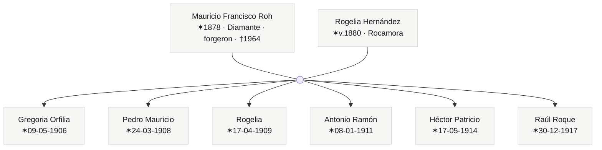

**Conclusion :** sa branche est la plus nombreuse et la seule qu'on peut suivre du berceau (Diamante, 1878) à la tombe (1964). Son mariage fixe la **mort du patriarche** (Juan José déjà « défunt » en 1905) et la **survie de la mère** (María Putallaz, veuve, vivait à proximité).

<strong>Registres de Mauricio Francisco Roh</strong> (11)

Mariage avec Rogelia · civil · 1905

Mariage avec Rogelia · religieux · 1905

Carnet d'enrôlement · classe 1878

Décès · 1964

Gregoria Orfilia · naissance 1906 (1/2)

Gregoria Orfilia · naissance 1906 (2/2)

Pedro Mauricio · naissance 1908

Rogelia · naissance 1909

Antonio Ramón · naissance 1911

Héctor Patricio · naissance 1914

Raúl Roque · naissance 1917

#### María Luisa Roh — six enfants Etchegorry, les deux premiers avant le « oui »

Née à **Santa Fe vers 1876**, elle a formé couple avec **Anselmo Leopoldo Etchegorry**, commerçant de Colón. Six enfants entre 1898 et 1916 — et là le schéma familial se répète : **les deux premiers sont nés avant le mariage** (Leopoldo Ramón ~1898 et Laurindo Anselmo en 1902) et le couple ne s'est marié qu'en **1908**, les légitimant au même acte.

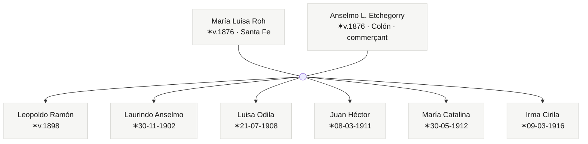

**Conclusion :** « enfants d'abord, papiers ensuite », comme Celestina et Marianna. Trois sœurs, le même scénario. Son mariage de 1908 confirme aussi la mort de Juan José Roch à Colón en 1897.

<strong>Registres de María Luisa Roh</strong> (8)

Mariage avec Etchegorry · 1908 (1/2)

Mariage avec Etchegorry · 1908 (2/2)

Laurindo Anselmo · naissance 1902

Luisa Odila · naissance 1908 (1/2)

Luisa Odila · naissance 1908 (2/2)

Juan Héctor · naissance 1911

María Catalina · naissance 1912

Irma Cirila · naissance 1916

#### José Luciano Roh — le forgeron qui a épousé une Locher

Du premier fils documenté, nous n'avons pour l'instant qu'une seule pièce : son **mariage avec Manuela Locher**, vers 1894. Forgeron, comme son père et son frère Mauricio. Dans l'acte, il figure comme « né dans le canton du Valais », alors que son baptême le donne né en **Colonia Cullen en 1873** : erreur de plume, comme il en abonde ici.

<strong>Registres de José Luciano Roh</strong> (1)

Mariage avec Manuela Locher · ~1894

#### Fils libres

- Le recensement de 1895 amène **deux Luisas** : une de ~1877 (María Luisa, celle d'Etchegorry) et une de ~1886. Ce sont deux sœurs ; de la cadette, rien encore.
- Les belles-mères de deux fils Roh — **Catalina Imhoff** et **Sofía Imhoff** — partagent un nom de famille suisse. Parenté possible entre les familles politiques, à confirmer.

#### Conclusion — nous cherchions Francisco et tout le monde est apparu sauf lui

Le pari de ce post était simple : si les hommes Clemenzo se mutaient dans la maison de leurs femmes, pour trouver Francisco il fallait chercher Celestina, et pour la trouver, les Roh. Cela a fonctionné presque trop bien. Nous avons trouvé la famille entière.

Tous sauf les deux que je cherchais vraiment.

Car voici ce qui me laisse pensif : **José Clemenzo — le frère de Francisco — laisse bien une trace à Santa Fe**, comme père de José Domingo en 1884. Les Roh étaient à Santa Fe depuis 1873. Celestina y apparaît en 1885, amenant sa fille au baptême — enregistrée avec le nom Roh, *sans père dans l'acte* —. Mais de **Francisco, dans tous ces papiers de Santa Fe, pas une seule ligne**. Il n'apparaît qu'à Entre Ríos, en 1891.

La recherche des Roh a fini par dessiner Francisco par son absence : le seul trou dans une photo de famille par ailleurs complète. La prochaine étape est concrète — passer au crible les baptêmes de Todos los Santos de Santa Fe entre 1884 et 1891, en cherchant n'importe quel Clemenzo —. Si Francisco était à Santa Fe, il doit avoir laissé au moins une signature.

### 13 juin 2026 (plus tard) — Et ils sont apparus à Aven

Le même jour, est arrivée la pièce que cette recherche poursuivait depuis le premier paragraphe : **la famille Roch dans le recensement fédéral suisse de 1870, dans le village d'Aven, commune de Conthey.** Sans discussion, c'est eux.

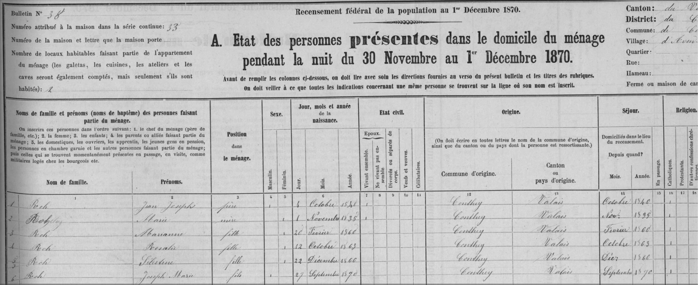
_Recensement fédéral suisse de 1870 — la famille Roch à Aven, Conthey_

Le foyer, la nuit du 30 novembre 1870 :

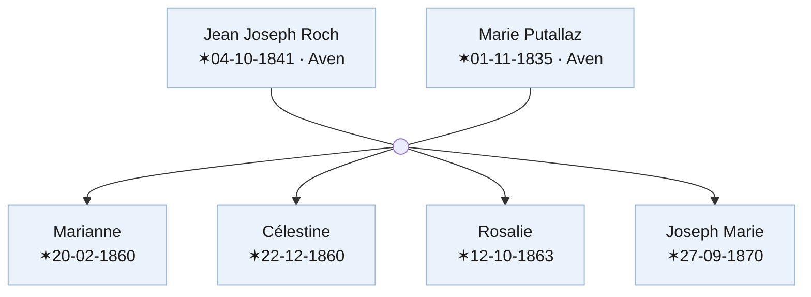

Ce que cela confirme et ce que cela corrige :

- **Célestine est née le 22 décembre 1860, à Aven.** Date et lieu exacts. (Avant, je l'avais comme « 1862/63, Suisse ».)
- **Le hameau est Aven**, commune de Conthey : la donnée qui manquait pour savoir où chercher.
- **Apparaît une sœur inconnue : Rosalie** (1863). Elle n'est pas dans le recensement argentin de 1895.
- **Il y avait deux José, pas un.** Ici se trouve **Joseph Marie, né en septembre 1870** — le dernier fils suisse, qui a épousé Manuela Locher —, distinct de **José Luciano, né déjà en Argentine en 1873**.
- **Une nouvelle énigme :** Marianne figure née en **février 1860** et Célestine en **décembre 1860**. Impossible la même année pour la même mère. Erreur de date, ou Marianne est belle-fille ? Laissé ouvert.

### 14 juin 2026 — Le généalogiste de Conthey donne des noms et des dates

Une autre pièce attendait dans mon propre dossier : un PDF intitulé *Émigrés de Conthey*, téléchargé de [valais-argentine.ch](https://www.valais-argentine.ch/) et jamais lu attentivement. Compilé par **Gabriel Antonin**, généalogiste de Conthey. Dans le groupe **« 1873 — Amérique du Sud »** :

> **Roh Jean Joseph**, (5.10.1840), *maréchal*, de Jean Joseph et d'Anne Marie Papilloud ; **Putallaz Marie**, (01.11.1835), de Jean François et de Catherine Roh, épouse du précédent depuis le 01.05.1859. Ils ont eu 4 enfants : Marianne (19.02.1862), Marie Rosalie (24.10.1864), Marie Célestine (22.12.1867) et Joseph Marie (27.02.1870).

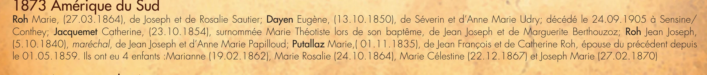
_L'entrée « 1873 — Amérique du Sud » dans la liste des émigrés de Conthey de Gabriel Antonin._

Un seul paragraphe, et il résout presque tout. La famille avec des dates confirmées :

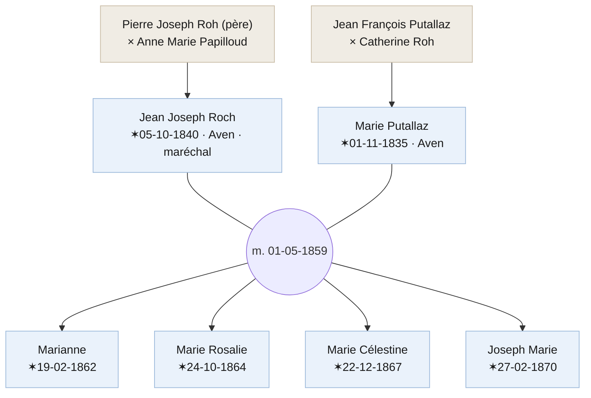

Ce que cela corrige et ce que cela ferme :

- **L'énigme des « deux filles en 1860 » était un fantôme.** Marianne est née en **1862** et Célestine en **1867** — toutes les deux après le mariage de 1859. Pas de belle-fille.
- **Célestine est née le 22 décembre 1867, pas en 1860.** Deux sources indépendantes (Antonin + recensement argentin de 1895) contre une seule lecture douteuse du recensement de 1870.
- **Jean Joseph est né le 5 octobre 1840 et était *maréchal*** — le métier qu'hériteraient ses fils José Luciano et Mauricio.
- **Apparaissent ses parents et ceux de sa femme.** Lui, fils de **Pierre Joseph Roh** et d'**Anne Marie Papilloud** (voir ci-dessous) ; elle, fille de **Jean François Putallaz** et **Catherine Roh**. Quatre ancêtres qui étaient des cases vides.

Le plus beau est d'où cela est sorti : un PDF gardé tout ce temps sans être lu. Parfois, la source qui manque est déjà à la maison. Mes remerciements à **Gabriel Antonin**.

### 14 juin 2026 (II) — Le recensement de 1850 et les frères et sœurs restés en Suisse

Le **recensement fédéral suisse de 1850** du village d'Aven montre le foyer des parents de Jean Joseph quand il avait dix ans.

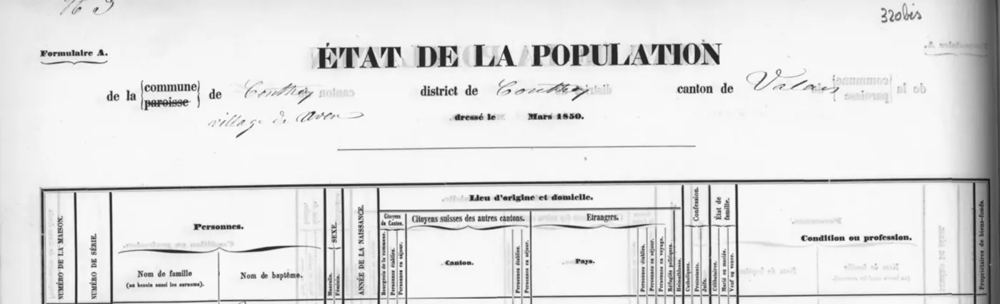
_État de la Population · commune de Conthey, village d'Aven · dressé le Mars 1850_

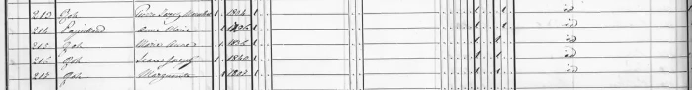
_Foyer nº 213 : Pierre Joseph Roh (forgeron, 1804) avec sa femme Anne Marie Papilloud et ses enfants_

| Série | Nom de famille | Prénom | Naissance |
|-------|----------------|--------|-----------|
| 213 | Roh | Pierre Joseph (dit Marechal) | 1804 |
| 214 | Papilloud | Anne Marie | 1806 |
| 215 | Roh | Marie Anne | 1836 |
| 216 | Roh | Jean Joseph | 1840 |
| 217 | Roh | Marguerite | avant 1846 |

**Le père de Jean Joseph s'appelle Pierre Joseph, pas Jean Joseph.** Antonin avait raison sur le nom de la mère — Anne Marie Papilloud —, mais s'est trompé sur celui du père. La source primaire de 1850 donne le nom correct.

**Et il y a des frères et sœurs qui n'ont pas émigré.** En 1850 vivaient dans la maison **Marie Anne** (née en 1836) et **Marguerite** (née avant 1846 — voir la section suivante). Aucune n'apparaît dans les registres argentins : elles sont probablement restées en Suisse.

### 15 juin 2026 — Le recensement de 1846

Quatre ans avant le recensement de 1850, il y en a un autre : le relevé de Conthey de **1846**, avec le même foyer, plus celui d'un voisin probablement parent.

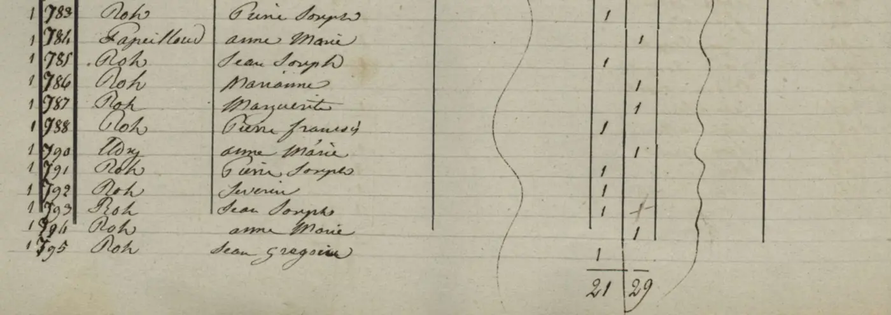
_Recensement de Conthey · 1846 · entrées 783–795_

Le bloc montre deux groupes. Le premier est sans équivoque :

| Série | Nom de famille | Prénom | Note |
|-------|----------------|--------|------|
| 783 | Roh | Pierre Joseph | père |
| 784 | Papilloud | Anne Marie | mère |
| 785 | Roh | Jean Joseph | fils (le futur émigrant, ~6 ans) |
| 786 | Roh | Marianne | fille (= « Marie Anne » dans le recensement de 1850) |
| 787 | Roh | Marguerite | fille |

Le deuxième groupe commence au 788 et est moins clair. L'entrée 788 est **Roh, Pierre François** ; ensuite, avec un saut de numérotation au 790 (probablement une erreur du copiste), apparaît une femme de nom différent — semble être **Aldy**, Anne Marie — suivie de plus de Roh : Pierre Joseph, Severin, Jean Joseph, Anne Marie, Jean Grégoire. L'hypothèse la plus cohérente est que Pierre François soit le **chef d'un second foyer**, avec Anne Marie Aldy comme sa femme. Ce serait un parent de la famille — oncle ou cousin de Jean Joseph, pas un frère.

Ce que ce recensement confirme avec certitude :

**Marguerite est née avant 1846**, probablement entre 1841 et 1845 — pas vers 1847 comme je l'avais estimé du recensement de 1850.

**« Marianne » et « Marie Anne » sont la même personne** : graphie différente dans chaque relevé.

**Le second groupe a un autre Jean Joseph Roh** né vers 1840 dans le même village. Cela explique pourquoi Antonin a pu confondre le père de l'émigrant : à Aven il y avait au moins deux familles Roh avec ce prénom dans la même génération.

