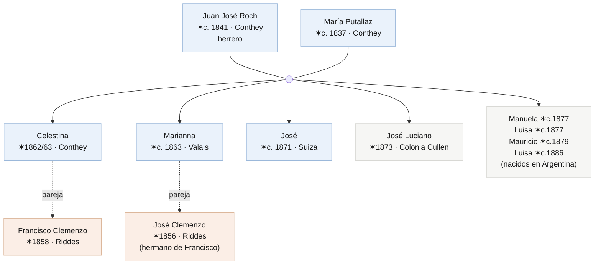
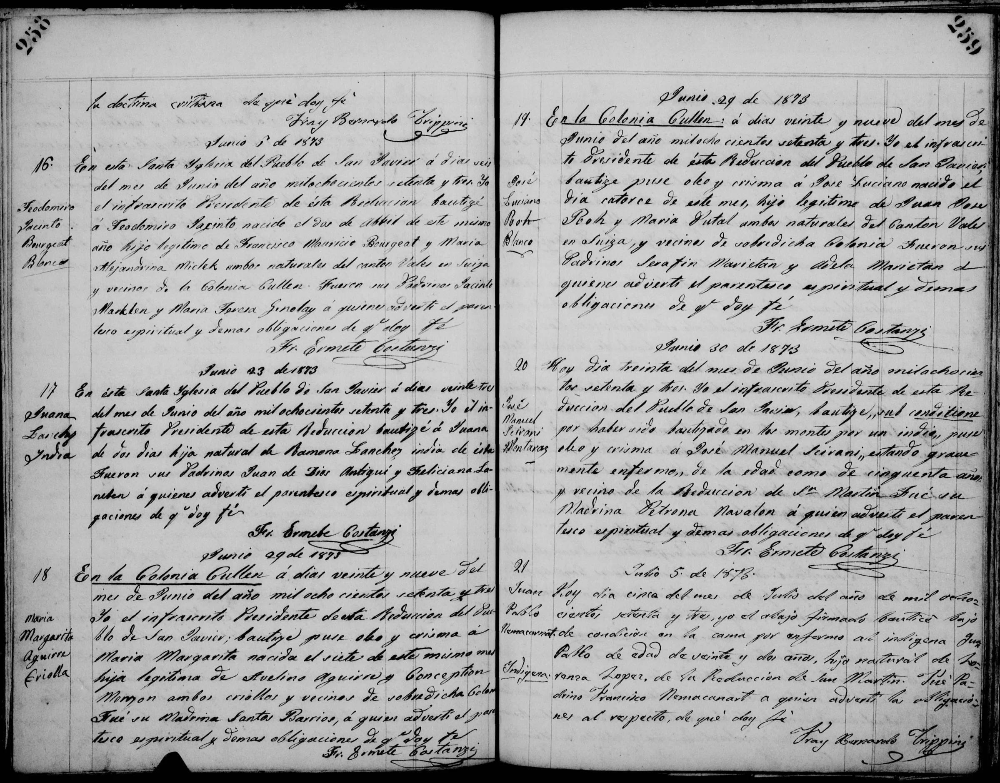
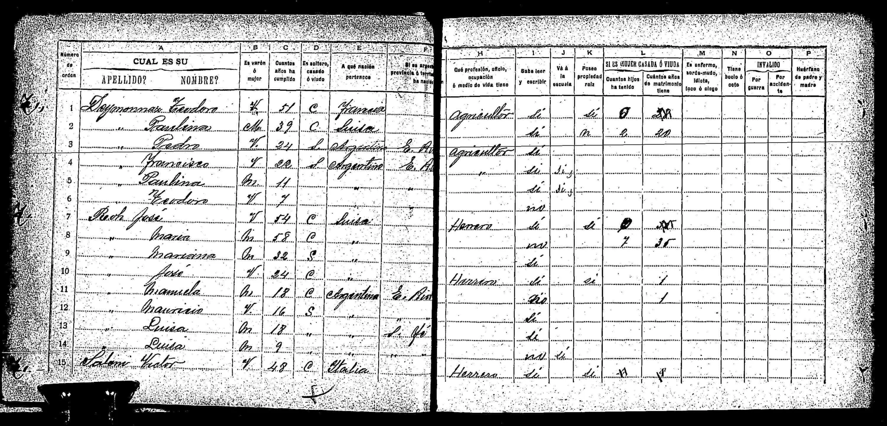

# Buscando a los Roh

Hay un momento en toda investigación en que conviene dejar de empujar la puerta que no abre y probar la de al lado. Llevo años persiguiendo a **Francisco Clemenzo** por el lado de los Clemenzo: sus padres en Riddes, su partida del Valais en 1873, su rastro en Entre Ríos. Y entre la emigración y su reaparición ya adulto y emparejado queda un hueco de trece años que no logro llenar por ese camino.

Este texto es sobre cambiar de lado. Si no encuentro a Francisco buscando a los Clemenzo, voy a buscar a la mujer con quien formó familia: **Celestina Roh**. Y para encontrarla a ella, a toda su familia.

## El cambio de enfoque: buscar a los hombres por sus mujeres

Hay un patrón en esta familia que tardé en ver porque lo tenía demasiado cerca. Desde François Clemenzo, nacido en 1809, y por generaciones, casi ningún hombre de la línea directa dejó de instalarse en la casa de su mujer. La excepción es reciente y a medias: mi abuelo compró un departamento con mi abuela mediante un préstamo hipotecario —y aun así, antes de eso, lo más probable es que también hayan vivido un tiempo con la madre de ella.

Eso tiene nombre. Los antropólogos lo llaman **residencia uxorilocal**: la pareja se establece en la casa o el pueblo de la familia de la esposa, no del marido. Lo contrario —que es lo que se esperaría en la Europa rural del siglo XIX— es la residencia patrilocal, donde la mujer entra a la casa del hombre. En los Clemenzo pasó al revés, una y otra vez.

No es una costumbre heredada: es lo que se hace cuando no hay patrimonio. El que tiene casa y tierra trae a la esposa; el que no tiene nada, se instala donde hay. François perdió la granja familiar en los remates de 1862. Su hijo Francisco emigró a los quince años con las manos vacías. Cada generación volvió a empezar de cero, y mientras no hubo nada propio que ofrecer, el patrón se repitió solo.

Para la investigación, esto deja de ser una curiosidad y se vuelve un método. Si los hombres se mudaban a lo de ellas:

- las **actas de matrimonio** hay que buscarlas en la parroquia de la novia, no del novio;
- las **direcciones y los pueblos** siguen a las mujeres, no a los hombres;
- y el **vacío de Francisco** entre 1873 y 1886 probablemente se resuelva no en los papeles de los Clemenzo, sino en los de los **Roh**.

De ahí este giro. Vamos a los Roh.

## El árbol de los Roh con el que parto

Reuniendo lo que ya estaba disperso en el archivo —un acta de bautismo de 1873, un censo de 1895, una licencia de inhumación de 1950— se arma una familia bastante completa. Y aparece la primera sorpresa: los Clemenzo y los Roh no se cruzaron una vez, sino **dos**. Dos hermanos Clemenzo formaron pareja con dos hermanas Roh.

El matrimonio fundador es **Juan José Roch** (herrero, nacido hacia 1841 en Conthey) y **María Putallaz** (hacia 1837, también de Conthey) — dos apellidos clásicos de esa comuna del Valais. Se casaron en Suiza y allí nacieron sus primeros hijos, entre ellos Celestina (hacia 1862) y Marianna (hacia 1863). Emigraron alrededor de **1872-1873**: el hijo José todavía nació en Suiza, pero José Luciano ya nació en **Colonia Cullen**, en el departamento San Javier de Santa Fe. El resto de los hijos nacieron en Argentina.

Y acá la trama se enreda, que es lo que vuelve interesante a esta familia: **Celestina formó pareja con Francisco, y su hermana Marianna con José, el hermano de Francisco.** Dos Clemenzo, dos Roh. Más adelante habrá que desenredar quién tuvo hijos con quién y cuándo —hay un par de nudos que todavía no resolví—, pero el esqueleto es ese.

## Los documentos con los que cuento

Cuatro piezas sostienen todo lo anterior. Ninguna es definitiva por sí sola; juntas dibujan la familia.

**El bautismo de José Luciano (Colonia Cullen, 29 de junio de 1873).** Es la pieza más valiosa, porque ancla a la familia en el tiempo y el lugar. El acta dice que José Luciano nació el 14 de junio de 1873, *hijo legítimo de Juan José Roch y María Putallaz, ambos naturales del Cantón Valais en Suiza, y vecinos de dicha Colonia*. Los padrinos —Serafín y Adela Marietan— son otra familia valesana de la misma colonia. Esto me da tres certezas: los Roch ya estaban en Santa Fe en 1873, estaban casados (hijo *legítimo*), y no llegaron solos sino dentro de un grupo de valesanos.

**El censo nacional de 1895 (Colón, Entre Ríos).** Más de veinte años después, la familia entera aparece junta en un mismo hogar: José Roch (54, suizo, herrero), María Putallaz (58, suiza) y siete hijos, desde Marianna hasta una Luisa de nueve años. Es la foto de grupo que confirma el árbol y revela el dato del oficio. También muestra que, entre 1873 y 1895, los Roch se mudaron de Santa Fe a Entre Ríos.

**La licencia de inhumación de Celestina (Santa Fe, 1950).** Celestina murió de neumonía el 2 de octubre de 1950, a los 87 años, en la calle Suipacha al 3900 de la ciudad de Santa Fe. El documento la nombra *Celestina Roch de Clemenceau* —el apellido familiar ya había mutado de Clemenzo a Clemence y de ahí a Clemenceau— y la declara *viuda*. Ese «viuda» es una de las cosas que habrá que mirar de cerca.

**El bautismo de María Celestina (1885).** Una nieta —o algo más enredado— que lleva el apellido Roh y abre preguntas que todavía no cierro.

## Por qué no los había encontrado

Vale anotar los errores, porque son la mitad del aprendizaje. Busqué a los Roh durante mucho tiempo sin éxito, y ahora entiendo por qué:

1. **Los buscaba en Entre Ríos, pero la familia aterrizó en Santa Fe.** El primer suelo argentino de los Roch fue Colonia Cullen, San Javier. Las actas más antiguas están ahí, no en Colón.
2. **El apellido cambia de forma**: Roh, Roch, Roz; y Putallaz, Puthallaz, Putalaz. Buscar una sola grafía deja afuera la mitad de los registros.
3. **En Suiza apuntaba al Valais en general**, cuando hay que clavar la parroquia de **Conthey**, donde Roh y Putallaz son apellidos densísimos.

## Próximos pasos concretos

El plan se parte en dos orillas.

**En Suiza, todo pasa por Conthey:**

- Buscar a la familia Roch en el **Registre des émigrés** del Valais (el documento de archivo *DI 358*, el mismo donde encontré a Francisco), filtrando por Conthey y por la ventana 1872-1873. Ese registro está reproducido e indexado en el libro de Alexandre y Christophe Carron, ***Nos cousins d'Amérique*** (Sierre, 1989-1990), y es consultable en línea a través de la plataforma [emigration-valais.ch](https://www.emigration-valais.ch). Es la pista más fuerte.
- Rastrear a la familia en los **censos del Valais de Conthey** (1829-1880, digitalizados en [recensements.vallesiana.ch](https://recensements.vallesiana.ch)): el hogar Roch-Putallaz *antes* de emigrar daría la composición completa, las edades y la confirmación de la comuna y el barrio exactos.
- El **acta de matrimonio de Juan José Roch y María Putallaz** en Conthey, hacia 1860-1862. Nombraría a los padres de ambos y subiría una generación de un solo golpe.
- Los **bautismos** de Celestina, Marianna y José en Conthey, para fijar fechas y filiación.

**En Argentina, Santa Fe primero:**

- La **parroquia de San Javier / Colonia Cullen**, entre 1872 y 1885: en el mismo libro donde está José Luciano deberían aparecer los bautismos de Manuela, Mauricio y las dos Luisas.
- Seguir la **pista Marietan**: los padrinos de 1873 viajaron en el mismo grupo de colonos. Su rastro puede revelar con quiénes emigraron los Roch.
- Reconstruir el **traslado de Santa Fe a Entre Ríos**: ¿cuándo se mudaron los Roch a Colón, y lo hicieron junto con Francisco? Si la respuesta es que sí, el vacío de trece años empieza a llenarse.

Si la teoría es correcta, no estoy yéndome por las ramas al dedicarle un esfuerzo entero a una familia que no lleva mi apellido. Estoy yendo justo al lugar donde la familia que sí lo lleva decidió, una y otra vez, ir a vivir.

---

## Actualizaciones

*Este post es un documento vivo. Lo de arriba es el punto de partida, escrito el **13 de junio de 2026**. A medida que la investigación avance, los hallazgos se irán sumando acá abajo, cada uno con su fecha.*
