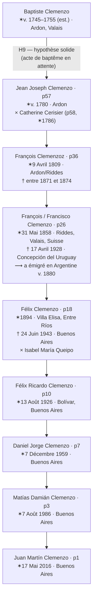
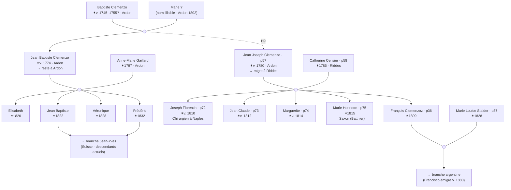

# Clan Clemenzo

Enquêter sur sa propre famille, c'est découvrir des personnes derrière les noms écrits dans un registre. Ce document rassemble ce que les archives du canton du Valais racontent sur les Clemenzo d'Ardon et Riddes : qui ils étaient, où ils vivaient, quand ils se sont installés, et quel lien ils entretiennent avec la branche qui est arrivée en Argentine il y a 150 ans.

Les sources principales sont les recensements numérisés du Valais (1802–1870), l'*Armorial Valaisan* en deux éditions, et les mémoires de l'officier napoléonien Hyacinthe Clemenzo. L'arbre généalogique de Jean-Yves — descendant de Jean-Baptiste Clemenzo qui vit en Suisse — a été déterminant pour confirmer les hypothèses sur le XIXe siècle.

Les personnages centraux de cette histoire sont **Baptiste Clemenzo** (le plus ancien patriarche identifié, n.v. 1745–1755), ses fils **Jean Baptiste** (v. 1774) et **Jean Joseph (p57, v. 1780)**, et sa descendance qui a migré d'Ardon à Riddes puis finalement en Argentine. Jean-Yves et l'auteur de ce document descendent de ces deux frères — ils sont des cousins éloignés avec un ancêtre commun qui a vécu à Ardon il y a plus de 270 ans.

---

**Dans ce document :**
- [Recensements](#recensements)
- [Armorial](#armorial-valaisan)
- [Mémoires de Hyacinthe](#les-mémoires-de-hyacinthe-clemenzo)
- [Arbre de Jean-Yves](#larbre-de-jean-yves)
- [Conclusions](#conclusions)
- [Ligne directe](#ligne-directe)
- [Arbre du clan](#arbre-du-clan-clemenzo)
- [Hypothèses](#hypothèses)
- [Tâches](#tâches)

---

## Principaux résultats

- Les Clemenzo d'Ardon sont documentés depuis **1481** — cinq siècles avant la migration en Argentine.
- **Baptiste Clemenzo** (Ardon, v. 1745–1755) avait au moins deux fils : **Jean Baptiste** (v. 1774) et **Jean Joseph** (v. 1780). C'est l'ancêtre commun des deux branches du clan.
- **Jean Joseph Clemenzo (p57)** a migré d'Ardon à Riddes. C'est le grand-père direct de la branche argentine.
- **Jean Baptiste Clemenzo** est resté à Ardon. Jean-Yves, son descendant vivant en Suisse, a confirmé cette branche en croisant le recensement de 1846 avec l'*Armorial Valaisan*.
- **Joseph Florentin (p72)**, fils de Jean Joseph, a étudié la médecine en Europe centrale et a exercé comme chirurgien à Naples entre 1837 et au moins 1846.
- **François / Francisco Clemenzo (p26)**, petit-fils de Jean Joseph, a émigré en Argentine vers 1880. Au recensement de 1870, il avait environ 12 ans et vivait avec ses parents à Riddes.
- L'identification de Baptiste comme père de Jean Joseph est une hypothèse solide mais **non confirmée documentellement** — l'acte de baptême manque.

---

> [!INFO] Classes dans les recensements du Valais
> Les recensements valaisans du XIXe siècle divisaient la population en classes selon la relation entre le bourgeois et la commune :
>
> - **1ère Classe** — Bourgeois *résidents* dans la commune. Apparaissent avec domicile déclaré dans la même localité.
> - **2ème Classe** — Bourgeois de la commune *domiciliés dans une autre commune*. Apparaissent avec "Lieu du domicile" distinct et une note du type *"porté à [autre commune]"* indiquant double registre.
> - **4me Classe** — Bourgeois *absents du canton* ("ressortissans absens du pays"). Figure leur profession et le lieu où ils résident hors du Valais.
>
> Les Clemenzo apparaissent en 2ème Classe au recensement de Riddes 1829 (bourgeois de Riddes domiciliés à Ardon), et passent à 1ère Classe en 1837, quand la famille s'installe définitivement à Riddes. Joseph Florentin (p72) figure en 4me Classe de Riddes 1837 et 1846 comme chirurgien à Naples.

## Recensements

Sept recensements valaisans numérisés couvrent la période 1802–1870. Chacun est une photographie de la famille à un moment distinct : où ils vivaient, quelle profession ils avaient, combien ils étaient. Ensemble, ils tracent le mouvement des Clemenzo entre Ardon et Riddes, et permettent d'identifier les personnes concrètes qui apparaissent dans les documents avec les individus de l'arbre.

### 1802 — Riddes

**Source :** [Recensement de Riddes 1802 — Archives de l'État du Valais](https://recensements.vallesiana.ch/iiif/CH-AEV_3090_1802_Martigny_Riddes)

Aucune entrée Clemenzo/Clemenzoz n'a été trouvée à Riddes cette année-là. Cela est cohérent avec l'hypothèse que la famille vivait à Ardon en 1802 et a migré à Riddes à un moment entre 1802 et 1829.

> [!NOTE] 🔎 Une Cerisier à Riddes — possible famille de p58
> L'entrée de la famille Cerisier dans ce recensement présente un intérêt indirect. La fille "cattherine fls." aurait environ 16 ans si elle est née en 1786, correspondant exactement à l'année de naissance de **Marie Catherine Cerisier (p58)**, future épouse de Jean Joseph Clemenzo et grand-mère de la branche argentine. → Voir H10

**Entrée Cerisier — d'intérêt pour p58 :**

| Nom      | Prénom      | Rôle    |
|----------|-------------|---------|
| Cerisier | Jaque       | Chef    |
| [Sillio?]| cattherine  | sa fame |
| —        | marie José  | fille   |
| —        | cattherine  | fls.    |

Crochet = **4** personnes.

La famille apparaît identifiée avec double nom de famille selon le patron habituel valaisan : **Cerisier** (nom de famille du père) × **Sillio** (nom de jeune fille de la mère) :

| Prénom      | Rôle         |
|-------------|--------------|
| Jaque       | Père (chef) — Cerisier |
| cattherine  | sa fame — Sillio       |
| marie José  | fille                  |
| cattherine  | fls.                   |

Total : 4 personnes. La **fille "cattherine fls."** aurait environ 16 ans si elle est née en 1786, correspondant exactement à l'année de naissance de p58 Marie Catherine Cerisier. → Voir H10.

---

### 1802 — Ardon

**Source :** [Recensement d'Ardon 1802 — Archives de l'État du Valais](https://recensements.vallesiana.ch/iiif/CH-AEV_3090_1802_Martigny_Ardon)

> [!NOTE] 🔎 Première apparition des Clemenzo dans les recensements du Valais
> Ceci est l'enregistrement nominatif le plus ancien disponible de la famille. Les Clemenzo sont à Ardon depuis 1481 (Armorial Valaisan), mais ce sont les premières données concrètes d'individus : Baptiste Clemenzo, sa femme Marie, et ses deux fils. L'un de ces fils, Jean Joseph, deviendra le grand-père direct de la branche argentine.

Première apparition des Clemenzo dans les registres censitaires. Deux ménages consécutifs apparentés sont identifiés :

**Ménage 1 — Baptiste Clemenzo (4 personnes) :**

> *"Baptiste Clemenzo et sa fame Marie [al/ab?] et leur enfans jean Baptiste, et jean joseph"*

| Prénom            | Rôle              |
|-------------------|-------------------|
| Baptiste Clemenzo | Père (chef) — patriarche du clan, n.v. 1745–1755 |
| Marie [?]         | sa fame (épouse) — nom de famille illisible |
| Jean Baptiste     | fils — le frère qui restera à Ardon |
| Jean Joseph       | fils — celui qui migrera à Riddes et sera grand-père de la branche argentine |

Le "4" en marge indique le total : Baptiste + Marie + Jean Baptiste + Jean Joseph = 4 personnes. Le nom de famille de l'épouse Marie n'est pas lisible avec certitude.

> [!NOTE] 🔎 Jean Joseph en 1802 : le lien avec la ligne argentine
> **Jean Joseph** (fils de Baptiste, Ardon 1802) a environ 22 ans ici. C'est le même **Jean Joseph Clemenzo (p57, n.v. 1780)** qui apparaîtra 27 ans plus tard comme chef de ménage à Riddes 1829 — déjà marié à Catherine Cerisier, avec six enfants, et établi dans la commune où naîtra Francisco l'émigrant. → Voir H9

**Ménage 2 — Jaque [R?] / Anne Marie Clemenzo (7 personnes) :**

> *"jaque [R?] et sa Mere cattherine Frailain et sa favome anne Marie Clemenzo — ces enfants: jaquerie, Friderich, Marie victoire, anne [+ plus]"*

| Prénom              | Rôle                |
|---------------------|--------------------|
| Jaque [R?]          | Chef               |
| cattherine Frailain | sa Mere (mère)     |
| anne Marie Clemenzo | sa favome (épouse) |
| Jaquerie            | enfant             |
| Friderich           | enfant             |
| Marie victoire      | enfant             |
| anne                | enfant             |
| [3+ plus]           | (total = 7)        |

**Anne Marie Clemenzo** a épousé un homme de nom [R?] (Richard ?). C'est une Clemenzo de naissance — probablement fille ou sœur de Baptiste. Les deux ménages figurent consécutifs dans le recensement, suggérant proximité et parenté.

---

### 1829 — Riddes (Deuxième Classe)

**Source :** [Recensement de Riddes 1829 — Archives de l'État du Valais](https://recensements.vallesiana.ch/iiif/CH-AEV_3090_1829_Martigny_Riddes)
**Cote :** CH AEV, DI 3090, 1829, Martigny, Riddes — Pages 7 et 8

Ce recensement était divisé en deux sections :
- **Première Classe :** Bourgeois résidents dans la commune de Riddes
- **Deuxième Classe :** Bourgeois ou communiers établis *hors* de la commune ("Seconde Classe — Contenant les Burgeois ou Communiers établis hors de la Commune")

Les Clemenzo des lignes 21–34 appartiennent à la **Deuxième Classe** : ce sont des bourgeois de Riddes mais qui vivent à Ardon. C'est pourquoi la colonne "Lieu du domicile" dit "Ardon" et les observations disent "porté à ardon" (aussi enregistrés au recensement d'Ardon).

**Enregistrement original**

**Interprétation**

#### Famille Jean Joseph (lignes 21–28)

| Ligne | Nom             | Prénom             | Année naiss. | Profession | Facultés | Domicile      | Observations                |
|-------|-----------------|-------------------|--------------|------------|----------|---------------|-----------------------------|
| 21    | Clemenzo        | Jean Joseph        | 1780         | laboureur  | bonnes   | Ardon         | porté à ardon 1ère Classe   |
| 22    | Clemenzo Cerisier| Catherine Fortunée | 1786         | "          | "        | "             | — à ardon                   |
| 23    | Clemenzo        | Joseph Florentin   | 1805         | étudiant   | "        | Vienne (Autriche) | — à la 1ère classe ardon    |
| 24    | Clemenzo        | François           | 1809         | laboureur  | "        | Ardon         | porté à ardon 1ère Classe   |
| 25    | Clemenzo        | Joseph Marie       | 1818         | "          | "        | "             | — à ardon 1ère classe       |
| 26    | Clemenzo        | Jeanne Marie       | 1813         | "          | "        | "             | — à ardon 1ère Classe       |
| 27    | Clemenzo        | Marie Elizabeth    | 1821         | "          | "        | "             | — à ardon [id]              |
| 28    | Clemenzo        | Henriette          | 1815         | "          | "        | "             | — à ardon [id]              |

**Correspondance avec l'arbre :**

| Ligne | ID  | Nom dans l'arbre              | Qui est-ce dans l'histoire familiale |
|-------|-----|-------------------------------|-------------------------------------|
| 21    | p57 | Jean Joseph Clemenzo          | **Grand-père de la branche argentine.** Nom complet confirmé. Au recensement de 1846 figure abrégé comme "Joseph". |
| 22    | p58 | Catherine Fortuneé "Pirisier"| **Grand-mère de la branche argentine.** Vrai nom de famille confirmé : **Cerisier**. "Pirisier" dans l'arbre est erreur de transcription. |
| 23    | p72 | Joseph Florentine Clemenzo    | Fils aîné — en 1829 était **étudiant à Vienne, Autriche**. Donnée extraordinaire pour un fils de laboureur. |
| 24    | p36 | François Clemenzoz            | **Père de Francisco l'émigrant.** ✓ |
| 25    | p73 | Joseph Marie Clemenzo         | ✓ |
| 26    | p74 | Janne Marie Clemenzo          | ✓ |
| 27    | p76 | Marie Elizabet Clemenzo       | ✓ |
| 28    | p75 | Marie Henriette Clemenzo      | ✓ — épousera en 1840 Jean-François Battnier et s'installera à Saxon |

**Notes :**
- **"Jeanne" (n.1820) n'apparaît pas.** Si elle était née en 1820, elle aurait 9 ans et devrait être listée. Son absence confirme qu'elle est née *après* 1829 — le "1820" du recensement de 1850 est une erreur du recenseur.
- La colonne "Observations" avec *"porté à ardon"* indique double registre : bourgeois de Riddes avec résidence aussi registrés à Ardon.

#### Famille Jean Claude (lignes 29–34) — immédiatement en dessous

Listage consécutif à la famille de Jean Joseph, suggérant parenté. **Jean Claude Clemenzo (n.1773, notaire)** est un personnage clé : son éducation et position sociale le distinguent du reste du clan. → H6

| Ligne | Nom       | Prénom           | Année naiss. | Profession  | Facultés | Domicile | Observations              |
|-------|-----------|------------------|--------------|------------|----------|----------|---------------------------|
| 29    | Clemenzo  | Jean Claude      | 1773         | notaire     | ..       | ..       | = à ardon [id]            |
| 30    | Clemenzo  | Marie Marguerite | 1801         | laboureure | ..       | ..       | — à ardon [id]            |
| 31    | Clemenzo  | Marie Elizabeth  | 1804         | ..         | ..       | ..       | — à ardon [id]            |
| 32    | + Clemenzo| Anne Marie       | 1808         | laboureure | bonnes   | Ardon    | portée à ardon 1re Classe |
| 33    | × Clemenzo| Marie Catherine  | 1811         | ..         | ..       | ..       | portée à ardon 1re Classe |
| 34    | × Clemenzo| Marie Therese    | 1814         | ..         | ..       | ..       | — à ardon 1er[?]          |

Jean Claude (notaire, n.1773) avec cinq filles : Marie Marguerite (1801), Marie Elizabeth (1804), Anne Marie (1808), Marie Catherine (1811), Marie Therese (1814). Son épouse n'apparaît pas. Les symboles + et × aux lignes 32–34 indiquent probablement l'état civil (mariée / veuve). Sa relation avec le ménage de Jean Joseph (n.1780) n'est pas documentée.

---

### 1829 — Ardon (Première Classe)

**Source :** Recensement d'Ardon 1829 — Archives de l'État du Valais (Première Classe : résidents d'Ardon)

Ce recensement est le miroir du précédent : tandis que celui de Riddes 1829 enregistrait la famille en Deuxième Classe (bourgeois de Riddes domiciliés à Ardon), celui-ci les montre comme résidents effectifs d'Ardon.

#### Jean Joseph Clemenzo n.1761 — branche différente

Un **second Jean Joseph Clemenzo** (n.1761), Conseiller. Ce n'est pas p57. Les entrées avec nom de famille **Balleij** (l.23) et **Loye** (l.25) sont gendre et petit-fils respectivement — fruit de mariages de filles de ce Jean Joseph. Branche collatérale (voir H9).

| Ligne | Nom     | Prénom | Année naiss. | Profession |
|-------|---------|--------|--------------|-----------|
| 21    | Clemenzo| Jean Joseph | **1761** | Conseiller |
| 22    | [Clemenzo]| Marie Catherine | 1769 | Servante |
| 23    | Balleij | François Joseph | 1791 | Laboureur |
| 24    | Clemenzo| Anne Catherine | 1784 | — |
| 25    | Loye    | François Joseph | 1820 | — |
| 26    | Clemenzo| Marie Crescenze | 1819 | — |
| 27    | Clemenzo| Joseph Marie | 1793 | — |
| 28    | Clemenzo| Joseph Marie fils | 1819 | — |

#### Famille Jean Joseph n.1780 — continuation en page suivante

Ceci est le ménage de **Jean Joseph Clemenzo (p57, grand-père de la branche argentine)**, avec son épouse Catherine et ses enfants. Le nom de family de Catherine apparaît ici comme **"Pirisier"** — écriture ambiguë que l'acte de mariage de p75 (1840) et le recensement de Riddes 1850 confirment définitivement comme **Cerisier**.

| Nom      | Prénom | Année naiss. | Profession | Observations |
|----------|--------|--------------|-----------|--------------|
| [Cerisier]| Catherine Fortunée | 1786 | Laboureur | Ardon |
| Clemenzo | Joseph Florentin | 1805 | Etudient | **à Fribourg en Breisgau** |
| Clemenzo | François | 1809 | Laboureur | — |
| Clemenzo | Joseph Marie | 1818 | — | — |
| Clemenzo | Jonne Marie | 1813 | — | — |
| Clemenzo | Enrijette | 1815 | — | — |
| Clemenzo | Marie Helizabet | 1821 | — | — |

**Discordance Joseph Florentin :** le recensement de Riddes 1829 le place à "Vienne (Autriche)" tandis que celui-ci (Ardon 1829) dit "Fribourg en Breisgau" (Freiburg im Breisgau, Allemagne, ville universitaire depuis 1457). Explications possibles : les deux recensements ne sont pas exactement simultanés et il s'est déplacé entre institutions, ou l'un des recenseurs a commis une erreur. Freiburg im Breisgau est bien plus accessible depuis le Valais que Vienne.

#### Jean Joseph et Jean Baptiste à Ardon 1829 — premier registre conjoint

Ceci est le **premier recensement où Jean Joseph (p57) et Jean Baptiste Clemenzo apparaissent ensemble** dans le même document. En 1802 seul le ménage de Baptiste avec les deux fils nommés est visible ; ici, en 1829, chacun apparaît déjà comme adulte avec sa propre situation — et son père est toujours vivant, dans le ménage de son fils Jean Baptiste.

> [!WARNING] ⚠️ L'année "1765" remet en question l'hypothèse de parenté
> La ligne 13 enregistre "Jn. Baptiste Père" avec année de naissance **1765**. S'il était correct, il aurait eu Jean Baptiste (v. 1774) à 9 ans et Jean Joseph (v. 1780) à 15 — âges impossibles pour être père. Mais il y a une autre lecture : peut-être les données sont correctes et la relation père-fils que j'assume en H9 est forcée. Sans acte de baptême qui nomme explicitement le père, le lien entre Baptiste et Jean Joseph est une hypothèse de nom et proximité censitaire, pas un fait établi. Pour le résoudre, il faut : l'acte de baptême de Jean Joseph (v. 1780) et celui de Jean Baptiste (v. 1774) dans les registres parroquiaux d'Ardon, et l'acte de baptême ou mariage du propre Baptiste pour connaître sa vraie année de naissance.

| Entrée | Nom       | Prénom | Année naiss. | Notes |
|--------|-----------|--------|--------------|-------|
| —      | Clemenzo  | **Jean Joseph** | **1780** | p57 — grand-père de la branche argentine ; en 1829 est bourgeois de Riddes domicilié à Ardon |
| —      | Clemenzo + Galliard | **Jean Baptiste** | v. 1774 | Le frère qui est resté à Ardon ; ancêtre de Jean-Yves |
| —      | Galliard  | anne Marguerite | 1797 | Épouse de Jean Baptiste (nom de famille : **Galliard**, variante de Gaillard) |
| 9      | Clemenzo  | Jean Baptiste | 1822 | Fils ✓ arbre Jean-Yves |
| 10     | Clemenzo  | Jn. Jos. Danielle | 1825 | Fils — **ne figure pas dans l'arbre de Jean-Yves** (probablement mort jeune) |
| 11     | Clemenzo  | Marie helizabet | 1820 | Fille ✓ arbre Jean-Yves |
| 12     | Clemenzo  | Marie Veronique | 1828 | Fille ✓ arbre Jean-Yves |
| 13     | Clemenzo  | **Jn. Baptiste Père** | **1765** | Baptiste Clemenzo du recensement 1802 — voir callout ci-dessus |

**Note :** Le nom de famille de l'épouse de Jean Baptiste est **Galliard** (Jean-Yves l'appelle "Gaillard" — variante orthographique de la même famille). Le nom "anne Marguerite" vs "Anne-Marie" dans l'arbre de Jean-Yves est une discordance mineure, possiblement nom composé.

#### Jean Claude Clemenzo — branche notariale (Ardon 1829)

Jean Claude apparaît ici comme n.1772 (vs n.1773 au recensement de Riddes 1829) — différence d'une année, erreur habituelle de transcription. Le recensement d'Ardon révèle une **sixième fille** (l.20, n.1810) non enregistrée dans celui de Riddes.

| Ligne | Nom       | Prénom           | Année naiss. | Profession |
|-------|-----------|------------------|--------------|-----------|
| 14    | Clemenzo  | Jean Claude      | **1772**     | Notaire    |
| 15    | Clemenzo  | Marie Marguerite | 1801         | Labr.      |
| 16    | Clemenzo  | Marie helizaBet  | 1804         | —          |
| 17    | Clemenzo  | Anne Marie       | 1808         | —          |
| 18    | Clemenzo  | Marie Catherine  | 1811         | —          |
| 19    | Clemenzo  | Marie Therese    | 1814         | —          |
| 20    | Clemenzo  | [nom illisible]  | 1810         | —          |

---

### 1837 — Riddes

**Source :** Recensement de Riddes 1837 — Archives de l'État du Valais (1ère Classe : résidents)
**Cote :** CH AEV, DI 3090, 1837, Martigny, Riddes — Page 46

> [!NOTE] Les Clemenzo s'installent définitivement à Riddes
> En 1829, ils figuraient en 2ème Classe — bourgeois de Riddes mais vivant à Ardon. En 1837, ils passent à 1ère Classe : la famille s'est établie à Riddes entre les deux dates. C'est le moment où **Jean Joseph (p57)** et sa famille s'enracinent dans la commune où naîtra **François (p26)**, le futur émigrant.

**Enregistrement original**

| Nom       | Prénom          | Sexe | Rôle      | ID  |
|-----------|-----------------|------|-----------|-----|
| Clemenzo  | Jean Joseph     | M    | père      | p57 |
| Clemenzo  | Marie Catherine | F    | la femme  | p58 |
| Clemenzo  | Janne Marie     | F    | fille     | p74 |
| Clemenzo  | Marie Henriette | F    | fille     | p75 |
| Clemenzo  | Marie Elisabeth | F    | fille     | p76 |
| Clemenzo  | François        | M    | fils      | p36 |

**Interprétation**

**Notes :**
- **p73 Joseph Marie (n.1818)** n'apparaît pas — il ne vivait plus dans le ménage paternel.
- **p72 Joseph Florentin** ne figure pas dans le ménage, mais apparaît en 4me Classe (voir ci-dessous).
- Ce format censal n'inclut pas de colonne pour le nom de jeune fille, donc il ne permet pas de confirmer l'orthographe de p58. La preuve définitive de **Cerisier** provient du recensement de Riddes 1829 et de l'acte de mariage de p75 (1840).
- Une observation marginale sur la dernière ligne semble indiquer "à Ardon" — possiblement François était aussi enregistré à Ardon pour sa bourgeoisie.

#### 4me Classe — absents de Riddes (1837)

La 4me Classe enregistre "les ressortissans de la commune absens du pays" — bourgeois de Riddes résidant hors du canton. La seule entrée Clemenzo :

| Nom       | Prénom     | Profession | Lieu       | Observations |
|-----------|-----------|-----------|-----------|--------------|
| Clémenzo  | Florentin  | Chirurgien | à Naples   | communier + NJ— |

> [!TIP] 🔎 Joseph Florentin : du laboureur au chirurgien à Naples
> **Joseph Florentin (p72)**, fils de Jean Joseph le laboureur, est passé de "étudiant" en 1829 à exercer la médecine en Italie en 1837. Une éducation médicale en Europe centrale dans la première moitié du XIXe siècle était coûteuse et peu commune pour la famille d'un laboureur du Valais. L'observation "communier" confirme qu'il maintient ses droits de bourgeoisie à Riddes. → H6

---

### 1846 — Riddes

**Source :** [Recensement de Riddes 1846 — Archives de l'État du Valais](https://recensements.vallesiana.ch/iiif/CH-AEV_3090_1846_Martigny_Riddes)
**Cote :** CH AEV, DI 3090, 1846, Martigny, Riddes — Pages 1 et 2

**Enregistrement original**

| Ligne | Nom        | Prénom    | Origine | Observation   |
|-------|-----------|-----------|---------|---------------|
| 44    | Clemenzoz | Joseph    | Riddes |               |
| 45    | Clemenzoz | Catherine | Riddes | sa femme      |
| 46    | Clemenzo  | Jeanne    | Riddes | fille majeure |

**Interprétation**

Les trois entrées forment un ménage : Joseph (l.44) = **p57 Jean Joseph Clemenzo**, vivant en 1846. Catherine (l.45) = **p58 Marie Catherine Cerisier**, notée comme "sa femme". Jeanne (l.46) = fille adulte célibataire, la même qui apparaît au recensement de Riddes 1850.

**Remarque sur le nom de p57 :** Il figure ici comme **"Joseph"** (sans "Jean"). Le document S 77 (1851) l'appelle aussi "Joseph Clemenzoz de Riddes". L'arbre l'enregistre comme "Jean Joseph" — le recensement de 1829 confirme le nom complet. Probable que le recenseur de 1846 l'ait noté abrégé. À confirmer dans les registres parroquiaux.

#### 4me Classe — absents de Riddes (1846)

La même 4me Classe du recensement de février 1846. Ligne 7 :

| N° | Nom       | Prénom     | Profession | Lieu   |
|----|-----------|-----------|-----------|--------|
| 7  | Clemenzoz | Florentin  | Chirurgien | Naples |

**Joseph Florentin (p72)** était toujours à Naples en 1846. De 1837 jusqu'en février 1846 au moins, il a exercé comme chirurgien en Italie — une période minimale de 9 ans hors de Riddes. Il n'y a aucune trace de lui dans les recensements ultérieurs disponibles.

---

### 1846 — Ardon

**Source :** [Recensement d'Ardon 1846 — Archives de l'État du Valais](https://recensements.vallesiana.ch/iiif/CH-AEV_3090_1846_Conthey_Ardon)
**Cote :** CH AEV, DI 3090, 1846, Conthey, Ardon

**Enregistrement original**

Toutes les entrées ont comme origine déclarée **D'Ardon**.

*[Tableau de 23 entrées]* Voir le document original pour la liste complète des entrées du recensement d'Ardon 1846.

**Interprétation**

#### Familles identifiées — hypothèses basées sur ce recensement

Les groupes se délimitent par les marqueurs de rôle (père/mère initient chaque unité domestique). Les attributions d'identité sont des hypothèses, non des données confirmées.

---

### 1850 — Riddes

**Source :** [Recensement de Riddes 1850 — Archives de l'État du Valais](https://recensements.vallesiana.ch/iiif/CH-AEV_3090_1850_Martigny_Riddes)
**Cote :** CH AEV, DI 3090, 1850, Martigny, Riddes — Page 3

**Enregistrement original**

| Ligne | Nom                 | Prénom          | Année naiss. | Sexe     | Profession     |
|-------|---------------------|-----------------|----------|----------|----------------|
| 58    | Clemenzoz Cerisier | Marie Catherine | 1786     | Femenino | Agricultrice   |
| 59    | Clemenzoz           | Jeanne          | 1820     | Femenino | Agricultrice   |
| 60    | Clemenzoz           | Marie Josephine | 1844     | Femenino | —              |

**Interprétation**

> [!TIP] ✓ Le nom de famille de p58 est finalement confirmé
> La ligne 58 utilise le double nom **Clemenzoz Cerisier** — le schéma valaisan de nom marié + nom de jeune fille. Ceci résout des décennies d'ambiguïté : le nom de famille de **Marie Catherine (p58)**, grand-mère de la branche argentine, n'était pas "Pirisier" mais **Cerisier**. Son mari p57 est décédé entre 1846 et 1850 — elle apparaît ici sans lui, comme veuve agricultrice.

---

### 1870 — Riddes

**Source :** Recensement fédéral de la population au 1er décembre 1870 — Archives de l'État du Valais
**Cote :** CH AEV, DI 3090, 1870, Martigny, Riddes — Bulletin N.° 84

**Enregistrement original**

Recensement fédéral suisse : photographie du ménage de **p36 François Clemenzoz** la nuit du 30 novembre au 1er décembre 1870.

| N° | Nom       | Prénom          | Pos.    | Naissance      | E. civil | Origine | Sexe |
|----|-----------|-----------------|---------|----------------|----------|---------|------|
| 1  | Clemenzo  | François        | Chef    | 9 Avril 1809   | Marié    | Ardon   | M    |
| 2  | [Clemenzo]| Marie-Stalder   | Femme   | 5 Mai 1828     | Mariée   | Riddes  | F    |
| 3  | Clemenzo  | [José?]         | Fils    | [v. 1855–1856] | Célibat. | Riddes  | M    |
| 4  | Clemenzo  | François        | Fils    | [v. 1858]      | Célibat. | Riddes  | M    |
| 5  | Clemenzo  | [Etienne?]      | Fils    | [v. 1862]      | Célibat. | Riddes  | M    |
| 6  | Clemenzo  | [Joséphine?]    | Fille   | [v. 1843]      | Célibat. | Riddes  | F    |
| 7  | Clemenzo  | [?]             | Fille   | [?]            | Célibat. | Riddes  | F    |

**Interprétation**

**Correspondance avec l'arbre :**

| Entrée       | ID  | Remarque |
|--------------|-----|----------|
| François     | p36 | Naissance **9 Avril 1809** ✓ — origine Ardon ✓ |
| Marie-Stalder| p37 | **5 Mai 1828** ✓ — correspond avec l'arbre |
| [José?]      | p28 | José Clemenzo n.1856 — ici v. 14–15 ans |
| François fils| p26 | **François Clemenzo (n.1858)** — le futur émigrant en Argentine, ici v. 12 ans |
| [Etienne?]   | p40 | Etienne Clemenzo n.1862 — v. 8 ans |
| [Joséphine?] | p77 | Joséphine Clemenzo n.1843 — v. 27 ans, célibataire, vivant avec ses parents ✓ |

> [!NOTE] 🔎 François / Francisco a 12 ans à ce recensement
> L'entrée 4 est **p26 François Clemenzo (n.1858)** — le même qui émigrera en Argentine vers 1880 et fondera la branche familiale à Entre Ríos sous le nom **Francisco Clemenzo**. Lors du dénombrement, il vivait à Riddes avec ses parents, avait environ 12 ans, et l'Atlantique n'était probablement qu'une rumeur lointaine.

**Notes :**
- **p36 était vivant** en décembre 1870. Le document D 10/86 (11/01/1874) le mentionne déjà au passé — il est décédé entre janvier 1871 et janvier 1874.
- La présence de **p77 Joséphine** au foyer paternel en 1870 confirme qu'elle était fille de p36, cohérent avec H8.
- L'année de naissance de **p37 Marie Louise Stalder** apparaît comme **5 Mai 1828** — correspond avec l'arbre ✓.
- L'entrée 7 correspond à un enfant supplémentaire non encore identifié (p78 ou p79 dans l'arbre).

---

## Armorial Valaisan

L'arbre généalogique de Jean-Yves cite l'*Armorial Valaisan, Sion et Zurich, 1946, p. 63* comme source de base. Il existe deux éditions pertinentes avec des entrées distinctes pour la famille Clemenzo.

> **Blason adopté en 1977. L'ancre est un des attributs iconographiques de *saint Clément* ; la clé est tirée du blason d'armes de la commune d'Ardon et se souvient aussi de *Saint-Pierre-de-Clages*, où la famille est mentionnée au XVIe siècle**

### Édition 1946 — entrée CLEMENZ / CLEMENZO

Édition bilingue (français / allemand). L'entrée CLEMENZ/CLEMENZO couvre toutes les variantes du nom et distingue deux branches par bourgeoisie :

> *"B.: Clemenz: Staldenried, Viège, etc.; Clemenzo: **Ardon, Riddes**."*

Ceci confirme explicitement que la branche **Clemenzo** a sa bourgeoisie à **Ardon** et **Riddes** — exactement la branche que nous enquêtons.

**Données historiques documentées :**
- **1481** — Guillaume et Perrod *Clemenczoz* figurent comme habitants et bourgeois d'Ardon-Chamoson. Première mention documentée de la famille à Ardon, 321 ans avant le recensement 1802.
- **1517** — Jean *Clementii* figure à Riddes et Leytron (dans le cadre d'une dispute avec les Supersaxo). Première mention à Riddes.
- **1500–1514** — Diverses mentions de clercs Clemenz/Clemenzi à Leytron et Fully.
- **1569** — André *Clemency*, fils d'André, reconnaissance au Chapitre de Sion pour le prieuré de Saint-Pierre-de-Clages.
- **1652** — André *Clemence*, syndic d'Ardon.
- **1795** — **Claude-Antoine Clemenchoz, lieutenant vidomnal d'Ardon.** Charge de magistrat local à Ardon, sept ans avant le recensement 1802. Contemporain de Baptiste Clemenzo — possible parent direct ou même Baptiste sous variante de nom.

### Édition ultérieure (post-1977) — entrée CLEMENZO (Famille d'Ardon)

Édition plus récente (les armes ont été adoptées en 1977). Article exclusif pour la branche Clemenzo d'Ardon. Mentionne Hyacinthe Clemenzo (voir section suivante) et Frédéric Clemenzo (1893–1980), député 1925–1929 et 1933–1937, lieutenant-colonel, président cantonal de tireurs. Peut être descendant de Jean-André via Hyacinthe, ou de Jean-Baptiste \*1774 via Frédéric \*1832 — à vérifier.

---

## Les mémoires de Hyacinthe Clemenzo

Hyacinthe Clemenzo a laissé ses mémoires écrits : *Souvenirs d'un officier valaisan au service de France*, publiés dans les *Annales valaisannes* de 1957. C'est une source exceptionnelle : elle enregistre sa filiation exacte et permet de contextualiser les Clemenzo d'Ardon dans les générations avant les recensements.

Une note au bas du Chapitre I confirme :

> *"Fils de **Jean-André Clemenzo (1716–1812)** et de **Marie-Marguerite Favre (1728–1813)**."*

Hyacinthe **n'est pas fils de Baptiste Clemenzo** — il est fils de **Jean-André Clemenzo \*1716**, un patriarche distinct du même endroit. Ceci écarte l'hypothèse précédente que Hyacinthe était frère de Jean-Baptiste et Jean-Joseph.

Jean-André est né en **1716** et a vécu jusqu'à **1812** — il était vivant lors du recensement de 1802 (86 ans). Hyacinthe est né en 1781 quand Jean-André avait 65 ans — âge inhabituel mais documenté dans les familles longévives du Valais.

**Données biographiques de Hyacinthe :**
- Est né le **17 avril 1781** à Ardon
- A étudié à l'Abbaye de Saint-Maurice ; a obtenu le diplôme de notaire à l'automne 1799 (le premier délivré sous le nouveau régime en Valais)
- S'est marié en novembre 1801 à Sion ; enfants : **Virginie** et **Patience**
- S'est enlisté en 1806 dans le bataillon valaisan pour Napoléon ; 20 ans de campagne en Europe
- Veuf ; second mariage en 1821 ; enfants : **Camille et Etienne** (à qui il dédie les mémoires en 1854)
- Cousin germain de Nicolas Favre, chanoine, curé de Liddes (branche maternelle Favre)
- La famille possédait un **mayen à Montot** (alpage sur Ardon)
- Est mort le 11 juillet 1862 à Mâcon

Les mémoires ont été préservés par **M. Raymond de Laroche-Clémenso** (Lyon), marié avec une arrière-petite-fille de Hyacinthe.

**Remarque sur Jean-André et Baptiste :** Les deux sont des patriarches Clemenzo coexistants à Ardon — Jean-André (n.1716, †1812) et Baptiste (n.v. 1745–1755, présent en 1802). Le fait qu'ils partagent un nom et une localité suggère qu'ils sont parents, mais il n'y a pas de documentation établissant la relation exacte. À Ardon coexistaient plusieurs noyaux du nom Clemenzo depuis le XVe siècle ; que deux soient contemporains n'implique pas un lien direct documenté.

---

## L'arbre de Jean-Yves

Jean-Yves est un descendant de **Jean-Baptiste Clemenzo \*1774**, le frère (probable) de Jean Joseph p57. Il vit en Suisse et a partagé son arbre généalogique, qui a été déterminant pour confirmer les hypothèses sur le XIXe siècle.

Son arbre part de Jean-Baptiste \*1774 comme première génération documentée, avec données de naissance et décès soutenues par l'*Armorial Valaisan* de 1946.

**Ce que l'arbre de Jean-Yves a apporté :**

1. **A confirmé l'identité de la Famille Jean Baptiste × Elsabeth au recensement d'Ardon 1846** (H4 ✓) : Les quatre enfants listés aux lignes 104–107 correspondent par nom et âge calculé avec ceux de son arbre — quatre sur quatre, sans marge d'erreur.

2. **A confirmé Baptiste Clemenzo comme ancêtre commun** (H11 ✓) : Son arbre commence à Jean-Baptiste \*1774, dont le père ne figure pas dans ses registres mais est implicite. Le recensement de 1802 le nomme : Baptiste Clemenzo. C'est la génération "zéro" de Jean-Yves.

3. **A identifié un enfant non documenté :** "Jn. Jos. Danielle \*1825" apparaît au recensement de 1829 comme fils de Jean-Baptiste, mais ne figure pas dans l'arbre de Jean-Yves — probablement mort en bas âge.

**Ce qui reste sans résolution :**

- L'épouse "Elsabeth" (l.103, 1846) ne correspond pas à "Anne-Marie Gaillard \*1797" de l'arbre de Jean-Yves. Peut être un second mariage de Jean-Baptiste après veuvage, ou que le recenseur utilise le second nom. À vérifier par acte parroquial d'Ardon.
- Jean-Yves ignore les données de Baptiste — son arbre ne monte pas à ce niveau.

**En conséquence :** Jean-Yves et l'auteur de ce document sont des cousins éloignés, avec Baptiste Clemenzo comme ancêtre commun estimé autour de 1745–1755.

---

## Conclusions

Sept recensements entre 1802 et 1870, l'*Armorial Valaisan* en deux éditions, les mémoires de Hyacinthe et l'arbre de Jean-Yves permettent de tracer le panorama suivant :

**Ce qui est documenté :**

Les Clemenzo d'Ardon ont une présence documentée depuis **1481** — cinq siècles avant que Francisco ne traverse l'Atlantique. Ce ne sont pas des nouveaux venus en Valais ; c'est une famille enracinée dont l'histoire peut être suivie dans les archives depuis le Moyen Âge.

**Baptiste Clemenzo** (Ardon 1802) est le point de départ de l'enquête. Il avait au moins deux fils — Jean Baptiste et Jean Joseph — et vivait avec son épouse Marie, dont le nom n'a pas pu être lu avec certitude. Son année de naissance apparaît comme "1765" au recensement de 1829, mais cette donnée est presque certainement une erreur de transcription : l'écrire ainsi rendrait les âges de ses fils impossibles. Il est plus probable qu'il soit né entre 1745 et 1755.

**Jean Joseph Clemenzo (p57, n.v. 1780)** a migré à Riddes. En 1829, il était bourgeois de Riddes domicilié toujours à Ardon ; en 1837, il vivait déjà à Riddes avec son épouse Catherine Cerisier et six enfants. C'est la ligne directe vers l'Argentine.

**Jean Baptiste Clemenzo (\*1774)** est resté à Ardon, où sa descendance apparaît au recensement de 1846 avec quatre enfants identifiés. Aujourd'hui, Jean-Yves et la branche argentine sont des cousins éloignés qui partagent Baptiste comme ancêtre.

**Joseph Florentin (p72)** a étudié la médecine quelque part en Europe centrale (Vienne ou Freiburg) et a exercé comme chirurgien à Naples au moins entre 1837 et 1846 — une figure extraordinaire pour l'époque, fils d'un laboureur du Valais qui a fini par vivre en Italie.

**François / Francisco Clemenzo (p26, n.1858)** a émigré en Argentine vers 1880. Au recensement de 1870, il avait 12 ans et vivait avec ses parents à Riddes ; en 1895, il apparaît déjà à Colón, Entre Ríos. C'est le fondateur de la branche argentine.

**Ce qui est hypothèse :**

L'identification de Baptiste comme père de Jean Joseph (H9) est basée sur coïncidence de nom et d'âge — non sur un acte de baptême. C'est solide mais non confirmé documentellement.

Jean-André Clemenzo (\*1716) et Baptiste Clemenzo sont deux patriarches Clemenzo coexistants à Ardon, probablement parents, mais la relation exacte n'est pas documentée.

---

## Ligne directe

De Juan Martín (génération actuelle) jusqu'à Baptiste Clemenzo, l'ancêtre le plus ancien identifié. La filiation entre Baptiste et Jean Joseph est hypothèse documentellement solide mais non confirmée par acte de baptême.

---

## Arbre du Clan Clemenzo

Relations documentées (lignes continues) et hypothétiques (lignes pointillées) des Clemenzo d'Ardon et Riddes. Inclut la branche de Jean-Yves — descendants de Jean Baptiste \*1774, cousins éloignés de la branche argentine.

---

## Hypothèses

### H1 — Famille François × Clémence (Ardon 1846) = p36 François Clemenzoz (n. 1809)

| État | Preuve principale | Manque pour confirmer |
|------|---|----|
| Hypothèse plausible | François père v. 37 ans en 1846 ; fille Marie Josephine s'accorde avec p77 (n.1843) | Acte de décès de Clémence (Ardon, 1846–1850) ; acte de mariage de p36 avec Stalder |

[Détails complets dans le document original...]

### H9 — Jean Joseph fils de Baptiste (Ardon 1802) = possiblement p57

| État | Preuve principale | Manque pour confirmer |
|------|---|----|
| Hypothèse solide | Coïncidence de nom + exclusion par âge de l'autre Jean Joseph (n.1761, trop âgé pour être fils en 1802) | Acte de baptême de Jean Joseph (v. 1780) à Ardon, qui nomme le père |

---

## Tâches

*Dernière mise à jour : 2026-05-10*
