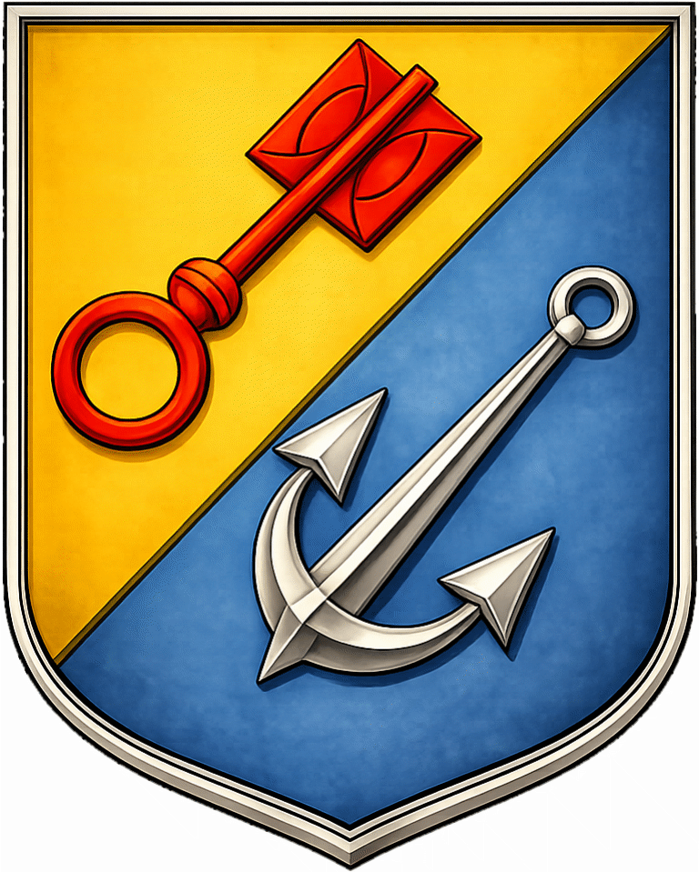
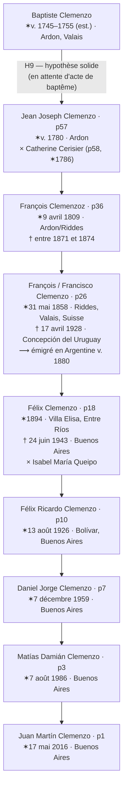
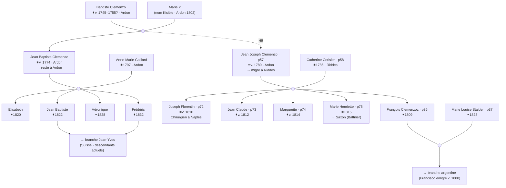

# Clan Clemenzo

Enquêter sur sa propre famille, c'est trouver des personnes derrière les noms inscrits sur un registre. Ce document rassemble ce que les archives du canton du Valais racontent sur les Clemenzo d'Ardon et de Riddes : qui ils étaient, où ils vivaient, quand ils se sont déplacés, et quel lien ils ont avec la branche arrivée en Argentine il y a 150 ans.

Les sources principales sont les recensements numérisés du Valais (1802–1870), l'*Armorial Valaisan* dans ses deux éditions, et les mémoires de l'officier napoléonien Hyacinthe Clemenzo. L'arbre généalogique de Jean-Yves — descendant de Jean-Baptiste Clemenzo, qui vit en Suisse — a été utile pour orienter les hypothèses sur le XIXe siècle, même si son arbre n'est pas un document primaire et ne confirme rien à lui seul.

Les personnages centraux de cette histoire sont **Baptiste Clemenzo** (le patriarche le plus ancien identifié, n. v. 1745–1755), ses fils **Jean Baptiste** (v. 1774) et **Jean Joseph (p57, v. 1780)**, et la descendance de ce dernier, qui a migré d'Ardon à Riddes et, finalement, en Argentine. Jean-Yves et l'auteur de ce document descendent de ces deux frères — ils sont des cousins éloignés avec un ancêtre commun qui a vécu à Ardon il y a plus de 270 ans.

---

_En-tête du recensement valaisan_

**Dans ce document :**
- [Recensements](#recensements)
- [Armorial](#armorial-valaisan)
- [Mémoires de Hyacinthe](#les-mémoires-de-hyacinthe-clemenzo)
- [Arbre de Jean-Yves](#larbre-de-jean-yves)
- [Conclusions](#conclusions)
- [Lignée directe](#lignée-directe)
- [Arbre du clan](#arbre-du-clan-clemenzo)
- [Hypothèses](#hypothèses)
- [Tâches](#tâches)

---

## Principales découvertes

- Les Clemenzo d'Ardon sont documentés depuis **1481** — cinq siècles avant l'émigration en Argentine.
- **Baptiste Clemenzo** (Ardon, v. 1745–1755) avait au moins deux fils : **Jean Baptiste** (v. 1774) et **Jean Joseph** (v. 1780). Il est l'ancêtre commun des deux branches du clan.
- **Jean Joseph Clemenzo (p57)** a migré d'Ardon à Riddes. Il est le grand-père direct de la branche argentine.
- **Jean Baptiste Clemenzo** est resté à Ardon. Jean-Yves, son descendant qui vit en Suisse, a orienté l'identification de cette branche en croisant le recensement de 1846 avec l'*Armorial Valaisan* — mais sans actes de baptême pour l'appuyer, cela reste une hypothèse.
- **Joseph Florentin (p72)**, fils de Jean Joseph, a étudié la médecine en Europe centrale et a exercé comme chirurgien à Naples entre 1837 et au moins 1846.
- **François / Francisco Clemenzo (p26)**, petit-fils de Jean Joseph, a émigré en Argentine vers 1880. Au recensement de 1870 il avait env. 12 ans et vivait avec ses parents à Riddes.
- L'identification de Baptiste comme père de Jean Joseph est une hypothèse solide mais **non confirmée par les documents** — l'acte de baptême manque.

---

> [!INFO] Classes dans les recensements du Valais
> Les recensements valaisans du XIXe siècle divisaient la population en classes selon le rapport entre le bourgeois et la commune :
>
> - **1ère Classe** — Bourgeois *résidant* dans la commune. Ils apparaissent avec un domicile déclaré dans la même localité.
> - **2ème Classe** — Bourgeois de la commune *domiciliés dans une autre commune*. Ils apparaissent avec un "Lieu du domicile" différent et une note du type *"porté à [autre commune]"* indiquant un double enregistrement.
> - **4me Classe** — Bourgeois *absents du canton* ("ressortissans absens du pays"). On y trouve leur profession et le lieu où ils résident hors du Valais.
>
> Les Clemenzo apparaissent en 2ème Classe au recensement de Riddes 1829 (bourgeois de Riddes domiciliés à Ardon), et passent en 1ère Classe en 1837, quand la famille s'établit définitivement à Riddes. Joseph Florentin (p72) figure dans la 4me Classe de Riddes 1837 et 1846 comme chirurgien à Naples.

## Recensements

Sept recensements valaisans numérisés couvrent la période 1802–1870. Chacun est une photographie de la famille à un moment différent : où ils vivaient, quelle profession ils exerçaient, combien ils étaient. Ensemble, ils tracent le déplacement des Clemenzo entre Ardon et Riddes, et permettent d'identifier les personnes concrètes qui apparaissent dans les documents avec les individus de l'arbre.

### 1802 — Riddes

**Source :** [Recensement de Riddes 1802 — Archives de l'État du Valais](https://recensements.vallesiana.ch/iiif/CH-AEV_3090_1802_Martigny_Riddes)

_Recensement de Riddes de 1802_

Aucune entrée Clemenzo/Clemenzoz n'a été trouvée à Riddes cette année-là. Cohérent avec l'hypothèse selon laquelle la famille vivait à Ardon en 1802 et a migré à Riddes à un moment entre 1802 et 1829.

> [!NOTE] 🔎 Une Cerisier à Riddes — possible famille de p58
> L'entrée de la famille Cerisier dans ce recensement présente un intérêt indirect. La fille "cattherine fls." aurait env. 16 ans si elle est née en 1786, coïncidant exactement avec l'année de naissance de **Marie Catherine Cerisier (p58)**, future épouse de Jean Joseph Clemenzo et grand-mère de la branche argentine. → Voir H10

**Entrée Cerisier — d'intérêt pour p58 :**

| Nom de famille | Prénom | Rôle |
|-----------|-------------|----------|
| Cerisier  | Jaque       | Chef     |
| [Sillio?] | cattherine  | sa fame  |
| —         | marie José  | fille    |
| —         | cattherine  | fls.     |

Accolade = **4** personnes.

La famille apparaît identifiée par un double nom de famille selon le schéma valaisan habituel : **Cerisier** (nom du père) × **Sillio** (nom de jeune fille de la mère) :

| Prénom      | Rôle        |
|-------------|-------------|
| Jaque       | Père (chef) — Cerisier |
| cattherine  | sa fame — Sillio       |
| marie José  | fille                  |
| cattherine  | fls.                   |

Total : 4 personnes. La **fille "cattherine fls."** aurait env. 16 ans si elle est née en 1786, coïncidant exactement avec l'année de naissance de p58 Marie Catherine Cerisier. → Voir H10.

---

### 1802 — Ardon

**Source :** [Recensement d'Ardon 1802 — Archives de l'État du Valais](https://recensements.vallesiana.ch/iiif/CH-AEV_3090_1802_Martigny_Ardon)

_Recensement de 1802 à Ardon_
> [!NOTE] 🔎 Première apparition des Clemenzo dans les recensements du Valais
> C'est le registre nominatif le plus ancien disponible pour la famille. Les Clemenzo sont à Ardon depuis 1481 (Armorial Valaisan), mais ce sont ici les premières données concrètes sur des individus : Baptiste Clemenzo, son épouse Marie, et leurs deux fils. L'un de ces fils, Jean Joseph, deviendra le grand-père direct de la branche argentine.

Première apparition des Clemenzo dans les registres de recensement. On identifie deux foyers consécutifs apparentés :

**Foyer 1 — Baptiste Clemenzo (4 personnes) :**

> *"Baptiste Clemenzo et sa fame Marie [al/ab?] et leur enfans jean Baptiste, et jean joseph"*

| Prénom            | Rôle             |
|-------------------|------------------|
| Baptiste Clemenzo | Père (chef) — patriarche du clan, n. v. 1745–1755 |
| Marie [?]         | sa fame (épouse) — nom de famille illisible |
| Jean Baptiste     | fils — le frère qui restera à Ardon |
| Jean Joseph       | fils — celui qui migrera à Riddes et sera le grand-père de la branche argentine |

Le "4" en marge indique le décompte total : Baptiste + Marie + Jean Baptiste + Jean Joseph = 4 personnes. Le nom de famille de l'épouse Marie n'est pas lisible avec certitude.

> [!NOTE] 🔎 Jean Joseph en 1802 : le lien avec la lignée argentine
> **Jean Joseph** (fils de Baptiste, Ardon 1802) a ici env. 22 ans. C'est le même **Jean Joseph Clemenzo (p57, n. v. 1780)** qui apparaîtra 27 ans plus tard comme chef de foyer à Riddes 1829 — déjà marié à Catherine Cerisier, avec six enfants, et établi dans la commune où naîtra François l'émigrant. → Voir H9

**Foyer 2 — Jaque [R?] / Anne Marie Clemenzo (7 personnes) :**

> *"jaque [R?] et sa Mere cattherine Frailain et sa favome anne Marie Clemenzo — ces enfants: jaquerie, Friderich, Marie victoire, anne [+ d'autres]"*

| Prénom              | Rôle               |
|---------------------|--------------------|
| Jaque [R?]          | Chef               |
| cattherine Frailain | sa Mere (mère)     |
| anne Marie Clemenzo | sa favome (épouse) |
| Jaquerie            | enfant             |
| Friderich           | enfant             |
| Marie victoire      | enfant             |
| anne                | enfant             |
| [3 de plus]         | (total = 7)        |

**Anne Marie Clemenzo** a épousé un homme au nom de famille [R?] (Richard ?). C'est une Clemenzo de naissance — peut-être fille ou sœur de Baptiste. Les deux foyers figurent consécutivement dans le recensement, ce qui suggère proximité et parenté.

---

### 1829 — Riddes (Deuxième Classe)

**Source :** [Recensement de Riddes 1829 — Archives de l'État du Valais](https://recensements.vallesiana.ch/iiif/CH-AEV_3090_1829_Martigny_Riddes)
**Cote :** CH AEV, DI 3090, 1829, Martigny, Riddes — Pages 7 et 8

Ce recensement était divisé en deux sections :
- **Première Classe :** Bourgeois résidant dans la commune de Riddes
- **Seconde Classe :** Bourgeois ou communiers établis *hors* de la commune ("Seconde Classe — Contenant les Burgeois ou Communiers établis hors de la Commune")

Les Clemenzo des lignes 21–34 appartiennent à la **Seconde Classe** : ils sont bourgeois de Riddes mais vivent à Ardon. C'est pourquoi la colonne "Lieu du domicile" indique "Ardon" et les observations disent "porté à ardon" (également enregistrés au recensement d'Ardon).

**Registre original**

_Recensement de Riddes 1829 — 2ème Classe, lignes 21–31_
_Recensement de Riddes 1829 — 2ème Classe, lignes 32–34_
**Interprétation**

#### Famille Jean Joseph (lignes 21–28)

| Ligne | Nom de famille      | Prénom             | Année nais. | Profession | Facultés   | Domicile          | Observations                |
|-------|---------------------|--------------------|----------|------------|------------|-------------------|-----------------------------|
| 21    | Clemenzo            | Jean Joseph        | 1780     | laboureur  | bonnes     | Ardon             | porté à ardon 1ère Classe   |
| 22    | Clemenzo Cerisier   | Catherine Fortunée | 1786     | "          | "          | "                 | — à ardon                   |
| 23    | Clemenzo            | Joseph Florentin   | 1805     | étudiant   | "          | Vienne (Autriche) | — à la 1ère classe ardon    |
| 24    | Clemenzo            | François           | 1809     | laboureur  | "          | Ardon             | porté à ardon 1ère Classe   |
| 25    | Clemenzo            | Joseph Marie       | 1818     | "          | "          | "                 | — à ardon 1ère classe       |
| 26    | Clemenzo            | Jeanne Marie       | 1813     | "          | "          | "                 | — à ardon 1ère Classe       |
| 27    | Clemenzo            | Marie Elizabeth    | 1821     | "          | "          | "                 | — à ardon [id]              |
| 28    | Clemenzo            | Henriette          | 1815     | "          | "          | "                 | — à ardon [id]              |

**Correspondance avec l'arbre :**

| Ligne | ID   | Nom dans l'arbre              | Qui est-ce dans l'histoire familiale |
|-------|------|-------------------------------|----------------------------------|
| 21    | p57  | Jean Joseph Clemenzo          | **Grand-père de la branche argentine.** Le recensement de 1829 l'enregistre comme "Jean Joseph". Au recensement de 1846 il figure abrégé en "Joseph". |
| 22    | p58  | Catherine Fortuneé "Pirisier" | **Grand-mère de la branche argentine.** Le recensement de 1829 l'enregistre comme **Cerisier** ; l'arbre le portait comme "Pirisier", probable erreur de transcription. |
| 23    | p72  | Joseph Florentine Clemenzo    | Fils aîné — en 1829 il était **étudiant à Vienne, Autriche**. Donnée extraordinaire pour un fils de laboureur. |
| 24    | p36  | François Clemenzoz            | **Père de François l'émigrant.** ✓ |
| 25    | p73  | Joseph Marie Clemenzo         | ✓ |
| 26    | p74  | Janne Marie Clemenzo          | ✓ |
| 27    | p76  | Marie Elizabet Clemenzo       | ✓ |
| 28    | p75  | Marie Henriette Clemenzo      | ✓ — elle épousera en 1840 Jean-François Battnier et s'installera à Saxon |

**Notes :**
- **"Jeanne" (n.1820) n'apparaît pas.** Si elle était née en 1820, elle aurait 9 ans et devrait être listée. Son absence appuie l'idée qu'elle est née *après* 1829 — le "1820" du recensement de 1850 est probablement une erreur du recenseur.
- La colonne "Observations" avec *"porté à ardon"* indique un double enregistrement : bourgeois de Riddes avec résidence et enregistrement aussi à Ardon.

#### Famille Jean Claude (lignes 29–34) — immédiatement en dessous

Listée juste après la famille de Jean Joseph, ce qui suggère une parenté. **Jean Claude Clemenzo (n.1773, notaire)** est un personnage clé : son éducation et sa position sociale le distinguent du reste du clan. → H6

| Ligne | Nom de famille | Prénom           | Année nais. | Profession | Facultés   | Domicile  | Observations               |
|-------|--------------|------------------|----------|------------|------------|-----------|----------------------------|
| 29    | Clemenzo     | Jean Claude      | 1773     | notaire    | ..         | ..        | = à ardon [id]             |
| 30    | Clemenzo     | Marie Marguerite | 1801     | laboureure | ..         | ..        | — à ardon [id]             |
| 31    | Clemenzo     | Marie Elizabeth  | 1804     | ..         | ..         | ..        | — à ardon [id]             |
| 32    | + Clemenzo   | Anne Marie       | 1808     | laboureure | bonnes     | Ardon     | portée à ardon 1re Classe  |
| 33    | × Clemenzo   | Marie Catherine  | 1811     | ..         | ..         | ..        | portée à ardon 1re Classe  |
| 34    | × Clemenzo   | Marie Therese    | 1814     | ..         | ..         | ..        | — à ardon 1er[?]           |

Jean Claude (notaire, n.1773) avec cinq filles : Marie Marguerite (1801), Marie Elizabeth (1804), Anne Marie (1808), Marie Catherine (1811), Marie Therese (1814). Son épouse n'apparaît pas. Les symboles + et × aux lignes 32–34 indiquent probablement l'état civil (mariée / veuve). Son lien avec le foyer de Jean Joseph (n.1780) n'est pas documenté.

---

### 1829 — Ardon (Première Classe)

**Source :** Recensement d'Ardon 1829 — Archives de l'État du Valais (Première Classe : résidents d'Ardon)

Ce recensement est le miroir du précédent : tandis que celui de Riddes 1829 enregistrait la famille en Seconde Classe (bourgeois de Riddes domiciliés à Ardon), celui-ci les montre comme résidents effectifs d'Ardon.

_Recensement d'Ardon 1829 — 1ère Classe, bloc Jean Joseph *1761 et Jean Joseph *1780_
#### Jean Joseph Clemenzo n.1761 — branche différente

Un **second Jean Joseph Clemenzo** (n.1761), Conseiller. Ce n'est pas p57. Les entrées au nom de **Balleij** (l.23) et **Loye** (l.25) sont respectivement gendre et petit-fils — issus des mariages des filles de ce Jean Joseph. Branche collatérale (voir H9).

| Ligne | Nom de famille | Prénom | Année nais. | Profession |
|---|---|---|---|---|
| 21 | Clemenzo | Jean Joseph | **1761** | Conseiller |
| 22 | [Clemenzo] | Marie Catherine | 1769 | Servante |
| 23 | Balleij | François Joseph | 1791 | Laboureur |
| 24 | Clemenzo | Anne Catherine | 1784 | — |
| 25 | Loye | François Joseph | 1820 | — |
| 26 | Clemenzo | Marie Crescenze | 1819 | — |
| 27 | Clemenzo | Joseph Marie | 1793 | — |
| 28 | Clemenzo | Joseph Marie fils | 1819 | — |

#### Famille Jean Joseph n.1780 — suite à la page suivante

Voici le foyer de **Jean Joseph Clemenzo (p57, grand-père de la branche argentine)**, avec son épouse Catherine et leurs enfants. Le nom de famille de Catherine apparaît ici comme **"Pirisier"** — graphie ambiguë. L'acte de mariage de p75 (1840) l'établit comme **Cerisier** ; le recensement de Riddes 1850 le corrobore.

| Nom de famille | Prénom | Année nais. | Profession | Observations |
|---|---|---|---|---|
| [Cerisier] | Catherine Fortunée | 1786 | Laboureur | Ardon |
| Clemenzo | Joseph Florentin | 1805 | Etudient | **à Fribourg en Breisgau** |
| Clemenzo | François | 1809 | Laboureur | — |
| Clemenzo | Joseph Marie | 1818 | — | — |
| Clemenzo | Jonne Marie | 1813 | — | — |
| Clemenzo | Enrijette | 1815 | — | — |
| Clemenzo | Marie Helizabet | 1821 | — | — |

**Divergence Joseph Florentin :** le recensement de Riddes 1829 le situe à "Vienne (Autriche)" alors que celui d'Ardon 1829 dit "Fribourg en Breisgau" (Freiburg im Breisgau, Allemagne, ville universitaire depuis 1457). Explications possibles : les deux recensements ne sont pas exactement simultanés et il a changé d'institution, ou l'un des recenseurs a commis une erreur. Freiburg im Breisgau est beaucoup plus accessible depuis le Valais que Vienne.

#### Jean Joseph et Jean Baptiste à Ardon 1829 — premier enregistrement conjoint

_Recensement d'Ardon 1829 — 1ère Classe : Jean Joseph, Jean Baptiste et Baptiste Père_
C'est le **premier recensement où Jean Joseph (p57) et Jean Baptiste Clemenzo apparaissent ensemble** dans le même document. En 1802 on ne voit que le foyer de Baptiste avec les deux fils nommés ; ici, en 1829, chacun apparaît déjà adulte avec sa propre situation — et leur père est toujours vivant, dans le foyer de son fils Jean Baptiste.

> [!WARNING] ⚠️ L'année "1765" met en doute l'hypothèse de parenté
> La ligne 13 enregistre "Jn. Baptiste Père" avec l'année de naissance **1765**. Si elle était correcte, il aurait eu Jean Baptiste (v. 1774) à 9 ans et Jean Joseph (v. 1780) à 15 ans — âges impossibles pour être père. Mais il y a une autre lecture : peut-être que les données sont correctes et que la relation père-fils que je suppose en H9 est forcée. Sans acte de baptême nommant explicitement le père, le lien entre Baptiste et Jean Joseph est une hypothèse fondée sur le nom et la proximité censitaire, pas un fait établi. Pour le résoudre, il faut : l'acte de baptême de Jean Joseph (v. 1780) et celui de Jean Baptiste (v. 1774) dans les registres paroissiaux d'Ardon, et l'acte de baptême ou de mariage de Baptiste lui-même pour connaître son année de naissance réelle.

| Entrée | Nom de famille | Prénom | Année nais. | Notes |
|---|---|---|---|---|
| — | Clemenzo | **Jean Joseph** | **1780** | p57 — grand-père de la branche argentine ; en 1829 il est bourgeois de Riddes domicilié à Ardon |
| — | Clemenzo + Galliard | **Jean Baptiste** | v. 1774 | Le frère resté à Ardon ; ancêtre de Jean-Yves |
| — | Galliard | anne Marguerite | 1797 | Épouse de Jean Baptiste (nom : **Galliard**, variante de Gaillard) |
| 9 | Clemenzo | Jean Baptiste | 1822 | Fils ✓ arbre Jean-Yves |
| 10 | Clemenzo | Jn. Jos. Danielle | 1825 | Fils — **ne figure pas dans l'arbre de Jean-Yves** (probablement mort jeune) |
| 11 | Clemenzo | Marie helizabet | 1820 | Fille ✓ arbre Jean-Yves |
| 12 | Clemenzo | Marie Veronique | 1828 | Fille ✓ arbre Jean-Yves |
| 13 | Clemenzo | **Jn. Baptiste Père** | **1765** | Baptiste Clemenzo du recensement 1802 — voir l'encadré ci-dessus |

**Note :** Le nom de famille de l'épouse de Jean Baptiste est **Galliard** (Jean-Yves l'appelle "Gaillard" — variante orthographique de la même famille). Le prénom "anne Marguerite" vs "Anne-Marie" dans l'arbre de Jean-Yves est une divergence mineure, peut-être un prénom composé.

#### Jean Claude Clemenzo — branche notariale (Ardon 1829)

_Recensement d'Ardon 1829 — 1ère Classe, famille Jean Claude Clemenzo_
Jean Claude apparaît ici comme n.1772 (vs n.1773 au recensement de Riddes 1829) — différence d'un an, erreur habituelle de transcription. Le recensement d'Ardon révèle une **sixième fille** (l.20, n.1810) non enregistrée dans celui de Riddes.

| Ligne | Nom de famille | Prénom | Année nais. | Profession |
|---|---|---|---|---|
| 14 | Clemenzo | Jean Claude | **1772** | Notaire |
| 15 | Clemenzo | Marie Marguerite | 1801 | Labr. |
| 16 | Clemenzo | Marie helizaBet | 1804 | — |
| 17 | Clemenzo | Anne Marie | 1808 | — |
| 18 | Clemenzo | Marie Catherine | 1811 | — |
| 19 | Clemenzo | Marie Therese | 1814 | — |
| 20 | Clemenzo | [prénom illisible] | 1810 | — |

---

### 1837 — Riddes

**Source :** Recensement de Riddes 1837 — Archives de l'État du Valais (1ère Classe : résidents)
**Cote :** CH AEV, DI 3090, 1837, Martigny, Riddes — P. 46

> [!NOTE] Les Clemenzo s'installent définitivement à Riddes
> En 1829 ils figuraient en 2ème Classe — bourgeois de Riddes, mais vivant à Ardon. En 1837 ils passent en 1ère Classe : la famille s'est établie à Riddes entre les deux dates. C'est le moment où **Jean Joseph (p57)** et sa famille s'enracinent dans la commune où naîtra **François (p26)**, le futur émigrant.

**Registre original**

_Recensement de Riddes 1837_
| Nom de famille | Prénom          | Sexe | Rôle      | ID  |
|-----------|-----------------|------|-----------|-----|
| Clemenzo  | Jean Joseph     | M    | père      | p57 |
| Clemenzo  | Marie Catherine | F    | la femme  | p58 |
| Clemenzo  | Janne Marie     | F    | fille     | p74 |
| Clemenzo  | Marie Henriette | F    | fille     | p75 |
| Clemenzo  | Marie Elisabeth | F    | fille     | p76 |
| Clemenzo  | François        | M    | fils      | p36 |

**Interprétation**

**Notes :**
- **p73 Joseph Marie (n.1818)** n'apparaît pas — il ne vivait plus dans le foyer paternel.
- **p72 Joseph Florentin** ne figure pas dans le foyer, mais apparaît dans la 4me Classe (voir plus bas).
- Ce format de recensement n'inclut pas de colonne pour le nom de jeune fille. La preuve la plus solide de **Cerisier** provient de l'acte de mariage de p75 (1840) — qui est, lui, un registre formel — ; le recensement de Riddes 1829 le corrobore.
- Une observation marginale à la dernière ligne semble indiquer "à Ardon" — François était peut-être lui aussi enregistré à Ardon au titre de sa bourgeoisie.

#### 4me Classe — absents de Riddes (1837)

_Recensement de Riddes 1837 — 4me Classe, absents_
La 4me Classe enregistre "les ressortissans de la commune absens du pays" — bourgeois de Riddes résidant hors du canton. La seule entrée Clemenzo :

| Nom de famille | Prénom | Profession | Lieu | Observations |
|---|---|---|---|---|
| Clémenzo | Florentin | Chirurgien | à Naples | communier + NJ— |

> [!TIP] 🔎 Joseph Florentin : de laboureur à chirurgien à Naples
> **Joseph Florentin (p72)**, fils de Jean Joseph le laboureur, est passé d'"étudiant" en 1829 à l'exercice de la médecine en Italie en 1837. Une formation médicale en Europe centrale dans la première moitié du XIXe siècle était coûteuse et peu courante pour la famille d'un laboureur du Valais. L'observation "communier" indique qu'il conservait ses droits de bourgeoisie à Riddes. → H6

---

### 1846 — Riddes

**Source :** [Recensement de Riddes 1846 — Archives de l'État du Valais](https://recensements.vallesiana.ch/iiif/CH-AEV_3090_1846_Martigny_Riddes)
**Cote :** CH AEV, DI 3090, 1846, Martigny, Riddes — Pages 1 et 2

**Registre original**

_Recensement de Riddes 1846 — lignes 44–45_
_Recensement de Riddes 1846 — ligne 46_
| Ligne | Nom de famille | Prénom    | Origine | Observation   |
|-------|-----------|-----------|--------|---------------|
| 44    | Clemenzoz | Joseph    | Riddes |               |
| 45    | Clemenzoz | Catherine | Riddes | sa femme      |
| 46    | Clemenzo  | Jeanne    | Riddes | fille majeure |

**Interprétation**

Les trois entrées forment un foyer : Joseph (l.44) = **p57 Jean Joseph Clemenzo**, vivant en 1846. Catherine (l.45) = **p58 Marie Catherine Cerisier**, notée "sa femme". Jeanne (l.46) = fille adulte célibataire, la même qui apparaît au recensement de Riddes 1850.

**Note sur le prénom de p57 :** Il figure ici comme **"Joseph"** (sans "Jean"). Le document S 77 (1851) l'appelle aussi "Joseph Clemenzoz de Riddes". L'arbre l'enregistre comme "Jean Joseph" — le recensement de 1829 aussi. Le recenseur de 1846 l'a probablement noté en abrégé. À vérifier dans les registres paroissiaux.

#### 4me Classe — absents de Riddes (1846)

_Recensement de Riddes 1846 — 4me Classe, absents_
La même 4me Classe du recensement de février 1846. Ligne 7 :

| N° | Nom de famille | Prénom | Profession | Lieu |
|---|---|---|---|---|
| 7 | Clemenzoz | Florentin | Chirurgien | Naples |

**Joseph Florentin (p72)** était toujours à Naples en 1846. De 1837 jusqu'à au moins février 1846, il a exercé comme chirurgien en Italie — une période minimale de 9 ans hors de Riddes. Aucune trace de lui dans les recensements postérieurs disponibles.

---

### 1846 — Ardon

**Source :** [Recensement d'Ardon 1846 — Archives de l'État du Valais](https://recensements.vallesiana.ch/iiif/CH-AEV_3090_1846_Conthey_Ardon)
**Cote :** CH AEV, DI 3090, 1846, Conthey, Ardon

**Registre original**

_Recensement d'Ardon 1846_
_Recensement d'Ardon 1846_
Toutes les entrées ont pour origine déclarée **D'Ardon**.

| Ligne | Nom de famille | Prénom          | Origine | Sexe      | Rôle / Profession |
|-------|----------|-----------------|---------|-----------|-------------------|
| 92    | Clemenzo | François        | D'Ardon | Masculin  | Père — Conseiller |
| 93    | Clemenzo | Anne Catrin     | D'Ardon | Féminin   | Mère              |
| 94    | Clemenzo | François        | D'Ardon | Masculin  | Fils              |
| 95    | Clemenzo | Chrisenge       | D'Ardon | Féminin   | Fille             |
| 96    | Clemenzo | Joseph Marie    | D'Ardon | Masculin  | Père              |
| 97    | Clemenzo | Marie Josephe   | D'Ardon | Féminin   | Mère              |
| 98    | Clemenzo | Catherine       | D'Ardon | Féminin   | Fille             |
| 99    | Clemenzo | Joseph Marie    | D'Ardon | Masculin  | Fils              |
| 100   | Clemenzo | Jenerique       | D'Ardon | Féminin   | Fille             |
| 101   | Clemenzo | Baptiste        | D'Ardon | Masculin  | Père              |
| 102   | Clemenzo | Jean Baptiste   | D'Ardon | Masculin  | Père              |
| 103   | Clemenzo | Elsabeth        | D'Ardon | Féminin   | Mère              |
| 104   | Clemenzo | Jean Baptiste   | D'Ardon | Masculin  | Fils              |
| 105   | Clemenzo | Frédérich       | D'Ardon | Masculin  | Fils              |
| 106   | Clemenzo | Elsabeth        | D'Ardon | Féminin   | Fille             |
| 107   | Clemenzo | Véronique       | D'Ardon | Féminin   | Fille             |
| 108   | Clemenzo | Margueritte     | D'Ardon | Féminin   | Fille             |
| 109   | Clemenzo | François        | D'Ardon | Masculin  | Père              |
| 110   | Clemenzo | Clémence        | D'Ardon | Féminin   | Mère              |
| 111   | Clemenzo | Adolphe         | D'Ardon | Masculin  | Fils              |
| 112   | Clemenzo | Marie Josephine | D'Ardon | Féminin   | Fille             |
| 113   | Clemenzo | [illisible]     | D'Ardon | Féminin   | Fille             |

**Interprétation**

#### Familles identifiées — hypothèses fondées sur ce recensement

Les groupes se délimitent par les marqueurs de rôle (père/mère ouvrent chaque unité domestique). Les attributions d'identité sont des hypothèses, pas des données confirmées. À Ardon coexistaient plusieurs noyaux Clemenzo, tous du même nom — la différenciation par le prénom de l'épouse est la façon la plus pratique de les identifier.

---

**Famille François Clemenzo × Anne Catrin — lignes 92–95** *(H3)*

| Ligne | Prénom        | Rôle              |
|-------|---------------|-------------------|
| 92    | François      | Père (Conseiller) |
| 93    | Anne Catrin   | Mère              |
| 94    | François      | Fils              |
| 95    | Chrisenge     | Fille             |

*H3 :* François Conseiller (l.92) est probablement le **François-Joseph Clemenzoz d'Ardon** du document AC Riddes D 10/40 (1854), identifié comme un Clemenzoz distinct de p36. Branche collatérale non confirmée.

---

Plus bas, un autre noyau familial, hypothétiquement identifié comme le frère de p36 :

**Famille Joseph Marie Clemenzo × Marie Josephe — lignes 96–100** *(H2)*

| Ligne | Prénom        | Rôle  |
|-------|---------------|-------|
| 96    | Joseph Marie  | Père  |
| 97    | Marie Josephe | Mère  |
| 98    | Catherine     | Fille |
| 99    | Joseph Marie  | Fils  |
| 100   | Jenerique     | Fille |

*H2 :* Le Joseph Marie père (l.96) aurait env. 18 ans en 1846, cohérent avec **p73 Joseph Marie Clemenzo (n.1818, frère de p36 et de Jean Joseph)**. Sa famille n'est pas dans l'arbre.

---

Le groupe suivant est le plus important du bloc : celui qu'on peut le mieux identifier à partir de l'arbre de Jean-Yves, même si, sans actes pour l'appuyer, cela reste une hypothèse. Ici apparaît le patriarche Baptiste, déjà âgé, dans le foyer de son fils :

**Famille Jean Baptiste Clemenzo × Elsabeth — lignes 101–108** *(H4 — hypothèse très solide)*

| Ligne | Prénom        | Rôle        | Identité (arbre Jean-Yves)                     | Âge 1846 |
|-------|---------------|-------------|------------------------------------------------|-----------|
| 101   | Baptiste      | Père        | **Baptiste Clemenzo** — le patriarche du recensement 1802, env. 90 ans, vieillard cohabitant | env. 90+  |
| 102   | Jean Baptiste | Père        | **Jean-Baptiste Clemenzo \*1774 †1859** — le frère resté à Ardon | 72 ✓      |
| 103   | Elsabeth      | Mère        | [épouse de Jean-Baptiste — voir note]          | —         |
| 104   | Jean Baptiste | Fils        | Jean-Baptiste \* **1822** † 1908               | 24 ✓      |
| 105   | Frédérich     | Fils        | Frédéric \* **1832** † 1885                    | 14 ✓      |
| 106   | Elsabeth      | Fille       | Anne-Marie-**Elisabeth** \* **1820** † 1890    | 26 ✓      |
| 107   | Véronique     | Fille       | Anne-Marie-**Véronique** \* **1828**           | 18 ✓      |
| 108   | Margueritte   | Fille       | Marguerite (ne figure pas dans l'arbre de Jean-Yves) | —    |

**Note :** Les données de l'arbre de Jean-Yves coïncident remarquablement avec cette famille — quatre enfants en nom et âge calculé —, ce qui rend l'hypothèse très solide. Mais l'arbre de Jean-Yves n'est pas un document primaire : ce sont les actes paroissiaux d'Ardon qui pourraient la confirmer. L'"Elsabeth" de la l.103 ne coïncide pas avec "Anne-Marie Gaillard \*1797" que Jean-Yves enregistre comme épouse de Jean-Baptiste : possible second mariage de Jean-Baptiste devenu veuf, ou "Elsabeth" serait son deuxième prénom. En attente d'éclaircissement par les actes paroissiaux d'Ardon.

**Source :** Arbre généalogique de Jean-Yves (descendant de Jean-Baptiste), fondé sur l'*Armorial Valaisan, Sion et Zurich, 1946, p. 63*. → Voir H4 et H11.

---

Le dernier groupe ouvre une question directe sur la lignée principale vers l'Argentine : qui était la femme de p36 avant Marie Louise Stalder ?

**Famille François Clemenzo × Clémence — lignes 109–113** *(H1)*

| Ligne | Prénom          | Rôle  |
|-------|-----------------|-------|
| 109   | François        | Père  |
| 110   | Clémence        | Mère  |
| 111   | Adolphe         | Fils  |
| 112   | Marie Josephine | Fille |
| 113   | [illisible]     | Fille |

*H1 :* François (l.109) serait **p36 François Clemenzoz (n.1809, père de François l'émigrant)**, avec env. 37 ans en 1846. L'épouse "Clémence" ne correspond pas à Marie Louise Stalder (p37), qui figure au recensement de 1870 comme sa femme : le plus probable est que Clémence ait été une **première épouse**, décédée entre 1846 et 1850. Voir H1 dans la section Hypothèses.

---

### 1850 — Riddes

**Source :** [Recensement de Riddes 1850 — Archives de l'État du Valais](https://recensements.vallesiana.ch/iiif/CH-AEV_3090_1850_Martigny_Riddes)
**Cote :** CH AEV, DI 3090, 1850, Martigny, Riddes — Page 3

**Registre original**

_Recensement de Riddes 1850 — lignes 58–60_
| Ligne | Nom de famille     | Prénom          | Année nais. | Sexe    | Profession   |
|-------|--------------------|-----------------|----------|----------|-------------|
| 58    | Clemenzoz Cerisier | Marie Catherine | 1786     | Féminin  | Agricultrice |
| 59    | Clemenzoz          | Jeanne          | 1820     | Féminin  | Agricultrice |
| 60    | Clemenzoz          | Marie Josephine | 1844     | Féminin  |             |

**Interprétation**

> [!TIP] Le nom de p58 apparaît comme Cerisier — corroboré par acte et recensement
> La ligne 58 utilise le double nom **Clemenzoz Cerisier** — le schéma valaisan du nom d'épouse + nom de jeune fille. L'acte de mariage de p75 (1840) est la source primaire qui l'établit ; le recensement de 1850 le corrobore. L'arbre le portait comme "Pirisier", qui est une erreur de transcription. Son mari p57 est décédé entre 1846 et 1850 — elle apparaît ici sans lui, comme veuve agricultrice.

---

### 1870 — Riddes

**Source :** Recensement fédéral de la population au 1er Décembre 1870 — Archives de l'État du Valais
**Cote :** CH AEV, DI 3090, 1870, Martigny, Riddes — Bulletin N° 84

**Registre original**

_Recensement de Riddes 1870_
Recensement fédéral suisse : photographie du foyer de **p36 François Clemenzoz** dans la nuit du 30 novembre au 1er décembre 1870.

| N° | Nom de famille | Prénom          | Pos.      | Naissance      | État civil | Origine | Sexe |
|----|-----------|-----------------|-----------|----------------|-----------|--------|------|
| 1  | Clemenzo  | François        | Chef      | 9 Avril 1809   | Marié     | Ardon  | M    |
| 2  | [Clemenzo]| Marie-Stalder   | Femme     | 5 Mai 1828     | Mariée    | Riddes | F    |
| 3  | Clemenzo  | [José?]         | Fils      | [v. 1855–1856] | Célibat.  | Riddes | M    |
| 4  | Clemenzo  | François        | Fils      | [v. 1858]      | Célibat.  | Riddes | M    |
| 5  | Clemenzo  | [Etienne?]      | Fils      | [v. 1862]      | Célibat.  | Riddes | M    |
| 6  | Clemenzo  | [Joséphine?]    | Fille     | [v. 1843]      | Célibat.  | Riddes | F    |
| 7  | Clemenzo  | [?]             | Fille     | [?]            | Célibat.  | Riddes | F    |

**Interprétation**

**Correspondance avec l'arbre :**

| Entrée        | ID  | Note |
|---------------|-----|------|
| François      | p36 | Naissance **9 Avril 1809** ✓ — origine Ardon ✓ |
| Marie-Stalder | p37 | **5 Mai 1828** ✓ — coïncide avec l'arbre |
| [José?]       | p28 | José Clemenzo n.1856 — ici env. 14–15 ans |
| François fils | p26 | **François Clemenzo (n.1858)** — le futur émigrant en Argentine, ici env. 12 ans |
| [Etienne?]    | p40 | Etienne Clemenzo n.1862 — env. 8 ans |
| [Joséphine?]  | p77 | Joséphine Clemenzo n.1843 — env. 27 ans, célibataire, vivant chez ses parents ✓ |

> [!NOTE] 🔎 François / Francisco a 12 ans dans ce recensement
> L'entrée 4 est **p26 François Clemenzo (n.1858)** — le même qui émigrera en Argentine vers 1880 et fondera la branche familiale d'Entre Ríos sous le nom de **Francisco Clemenzo**. Quand ce recensement a été pris, il vivait à Riddes avec ses parents, avait env. 12 ans, et l'Atlantique n'était probablement qu'une rumeur lointaine.

**Notes :**
- **p36 était vivant** en décembre 1870. Le document D 10/86 (11/01/1874) le mentionne déjà au passé — il est mort entre janvier 1871 et janvier 1874.
- La présence de **p77 Joséphine** dans le foyer paternel en 1870 appuie l'idée qu'elle était fille de p36, cohérente avec H8.
- L'année de naissance de **p37 Marie Louise Stalder** apparaît comme **5 Mai 1828** — coïncide avec l'arbre ✓.
- L'entrée 7 correspond à un enfant supplémentaire pas encore identifié (p78 ou p79 dans l'arbre).

---

## Armorial Valaisan

L'arbre généalogique de Jean-Yves cite l'*Armorial Valaisan, Sion et Zurich, 1946, p. 63* comme source de base. Il existe deux éditions pertinentes avec des entrées distinctes pour la famille Clemenzo.

_Armorial valaisan de la famille Clemenzo_

> **Écusson adopté en 1977. L'ancre est l'un des attributs iconographiques de *saint Clément* ; la clef est reprise des armoiries de la commune d'Ardon et rappelle aussi *Saint-Pierre-de-Clages*, où la famille est mentionnée au XVIe siècle**

### Édition 1946 — entrée CLEMENZ / CLEMENZO

_Armorial Valaisan 1946 — entrée Clemenz/Clemenzo_
Édition bilingue (français / allemand). L'entrée CLEMENZ/CLEMENZO couvre toutes les variantes du nom et distingue deux branches par bourgeoisie :

> *"B.: Clemenz: Staldenried, Viège, etc.; Clemenzo: **Ardon, Riddes**."*

L'Armorial enregistre explicitement que la branche **Clemenzo** a sa bourgeoisie à **Ardon** et **Riddes** — exactement la branche que nous étudions.

**Données historiques documentées :**
- **1481** — Guillaume et Perrod *Clemenczoz* figurent comme habitants et bourgeois d'Ardon-Chamoson. Première mention documentée de la famille à Ardon, 321 ans avant le recensement de 1802.
- **1517** — Jean *Clementii* figure à Riddes et Leytron (dans le cadre d'un différend avec les Supersaxo). Première mention à Riddes.
- **1500–1514** — Diverses mentions de clercs Clemenz/Clemenzi à Leytron et Fully.
- **1569** — André *Clemency*, fils d'André, reconnaissance au Chapitre de Sion pour le prieuré de Saint-Pierre-de-Clages.
- **1652** — André *Clemence*, syndic d'Ardon.
- **1795** — **Claude-Antoine Clemenchoz, lieutenant vidomnal d'Ardon.** Charge de magistrat local à Ardon, sept ans avant le recensement de 1802. Contemporain de Baptiste Clemenzo — possible parent direct, voire le même Baptiste sous une variante du nom.

### Édition ultérieure (post-1977) — entrée CLEMENZO (Famille d'Ardon)

_Armorial Valaisan — entrée Clemenzo, Famille d'Ardon_
Édition plus récente (les armes ont été adoptées en 1977). Article exclusivement consacré à la branche Clemenzo d'Ardon. Elle mentionne Hyacinthe Clemenzo (voir section suivante) et Frédéric Clemenzo (1893–1980), député 1925–1929 et 1933–1937, lieutenant-colonel, président cantonal des tireurs. Il peut descendre de Jean-André via Hyacinthe, ou de Jean-Baptiste \*1774 via Frédéric \*1832 — vérification en attente.

---

## Les mémoires de Hyacinthe Clemenzo

Hyacinthe Clemenzo a laissé ses mémoires écrites : *Souvenirs d'un officier valaisan au service de France*, publiées dans les *Annales valaisannes* de 1957. C'est une source exceptionnelle : elles enregistrent sa filiation exacte et permettent de contextualiser les Clemenzo d'Ardon dans les générations antérieures aux recensements.

Une note de bas de page du Chapitre I indique :

> *"Fils de **Jean-André Clemenzo (1716–1812)** et de **Marie-Marguerite Favre (1728–1813)**."*

Hyacinthe **n'est pas fils de Baptiste Clemenzo** — il est fils de **Jean-André Clemenzo \*1716**, un patriarche différent de la même localité. Cela écarte l'hypothèse antérieure selon laquelle Hyacinthe aurait été frère de Jean-Baptiste et de Jean-Joseph.

Jean-André est né en **1716** et a vécu jusqu'en **1812** — il était vivant lors du recensement de 1802 (86 ans). Hyacinthe est né en 1781 quand Jean-André avait 65 ans — âge inhabituel mais documenté dans les familles longévives du Valais.

**Données biographiques de Hyacinthe :**
- Né le **17 avril 1781** à Ardon
- A étudié à l'Abbaye de Saint-Maurice ; a obtenu le diplôme de notaire à l'automne 1799 (le premier délivré sous le nouveau régime en Valais)
- Marié en novembre 1801 à Sion ; enfants : **Virginie** et **Patience**
- S'est engagé en 1806 dans le bataillon valaisan pour Napoléon ; 20 ans de campagne en Europe
- Devenu veuf ; second mariage en 1821 ; enfants : **Camille et Etienne** (à qui il dédie ses mémoires en 1854)
- Cousin germain de Nicolas Favre, chanoine, curé de Liddes (branche maternelle Favre)
- La famille possédait un **mayen à Montot** (alpage au-dessus d'Ardon)
- Mort le 11 juillet 1862 à Mâcon

Les mémoires ont été préservées par **M. Raymond de Laroche-Clémenso** (Lyon), marié à une arrière-petite-fille de Hyacinthe.

**Note sur Jean-André et Baptiste :** Tous deux sont des patriarches Clemenzo coexistant à Ardon — Jean-André (n.1716, †1812) et Baptiste (n. v. 1745–1755, présent en 1802). Le fait qu'ils partagent nom et localité suggère une parenté, mais aucune documentation n'établit la relation exacte. À Ardon coexistaient plusieurs noyaux du nom Clemenzo depuis le XVe siècle ; que deux soient contemporains n'implique pas un lien direct documenté.

---

## L'arbre de Jean-Yves

Jean-Yves est un descendant de **Jean-Baptiste Clemenzo \*1774**, le frère (probable) de Jean Joseph p57. Il vit en Suisse et a partagé son arbre généalogique, qui a été utile pour orienter les hypothèses sur le XIXe siècle. Son arbre n'est pas un document primaire — ce sont les actes paroissiaux d'Ardon qui pourraient les confirmer.

Son arbre part de Jean-Baptiste \*1774 comme première génération documentée, avec des données de naissance et de décès appuyées par l'*Armorial Valaisan* de 1946.

**Ce que l'arbre de Jean-Yves a apporté :**

1. **Il a renforcé l'hypothèse d'identité de la Famille Jean Baptiste × Elsabeth dans le recensement d'Ardon 1846** (H4) : Les quatre enfants listés aux lignes 104–107 coïncident en nom et âge calculé avec ceux de son arbre — quatre sur quatre. C'est une coïncidence très solide, mais sans actes paroissiaux elle reste une hypothèse.

2. **Il a désigné Baptiste Clemenzo comme probable ancêtre commun** (H11) : Son arbre commence à Jean-Baptiste \*1774, dont le père ne figure pas dans ses registres mais est implicite. Le recensement de 1802 le nomme : Baptiste Clemenzo. C'est la génération "zéro" de Jean-Yves — hypothèse plausible, non documentée.

3. **Il a identifié un fils non documenté :** "Jn. Jos. Danielle \*1825" apparaît au recensement de 1829 comme fils de Jean-Baptiste, mais ne figure pas dans l'arbre de Jean-Yves — il est probablement mort en bas âge.

**Ce qui reste à résoudre :**

- L'épouse "Elsabeth" (l.103, 1846) ne coïncide pas avec "Anne-Marie Gaillard \*1797" de l'arbre de Jean-Yves. Ce peut être un second mariage de Jean-Baptiste devenu veuf, ou le recenseur a utilisé le deuxième prénom. En attente de l'acte paroissial d'Ardon.
- Jean-Yves ne connaît pas de données sur Baptiste — son arbre ne remonte pas jusqu'à ce niveau.

**En conséquence :** Jean-Yves et l'auteur de ce document sont probablement des cousins éloignés, avec Baptiste Clemenzo comme probable ancêtre commun estimé autour de 1745–1755. L'hypothèse est solide, mais la documentation primaire manque pour l'établir.

---

## Conclusions

Sept recensements entre 1802 et 1870, l'*Armorial Valaisan* dans deux éditions, les mémoires de Hyacinthe et l'arbre de Jean-Yves permettent de tracer le panorama suivant :

**Ce qui est documenté :**

Les Clemenzo d'Ardon ont une présence documentée depuis **1481** — cinq siècles avant que François ne traverse l'Atlantique. Ce ne sont pas de nouveaux venus dans le Valais ; c'est une famille enracinée dont l'histoire peut être suivie dans les archives depuis le Moyen Âge.

**Baptiste Clemenzo** (Ardon 1802) est le point de départ de l'enquête. Il avait au moins deux fils — Jean Baptiste et Jean Joseph — et vivait avec son épouse Marie, dont le nom de famille n'a pas pu être lu avec certitude. Son année de naissance apparaît comme "1765" au recensement de 1829, mais cette donnée est presque sûrement une erreur de transcription : l'écrire ainsi rendrait impossibles les âges de ses fils. Le plus probable est qu'il soit né entre 1745 et 1755.

**Jean Joseph Clemenzo (p57, n. v. 1780)** a migré à Riddes. En 1829 il était bourgeois de Riddes encore domicilié à Ardon ; en 1837 il vivait déjà à Riddes avec son épouse Catherine Cerisier et six enfants. C'est la lignée directe vers l'Argentine.

**Jean Baptiste Clemenzo (\*1774)** est resté à Ardon, où le recensement de 1846 montre une famille qui coïncide avec les données de l'arbre de Jean-Yves. Si l'hypothèse est correcte, Jean-Yves et la branche argentine seraient des cousins éloignés partageant Baptiste comme ancêtre — mais l'acte de baptême manque pour l'établir.

**Joseph Florentin (p72)** a étudié la médecine quelque part en Europe centrale (Vienne ou Fribourg) et a exercé comme chirurgien à Naples au moins entre 1837 et 1846 — une figure extraordinaire pour l'époque, fils d'un laboureur du Valais qui a fini par vivre en Italie.

**François / Francisco Clemenzo (p26, n.1858)** a émigré en Argentine vers 1880. Au recensement de 1870 il avait 12 ans et vivait avec ses parents à Riddes ; en 1895 il apparaît déjà à Colón, Entre Ríos. C'est le fondateur de la branche argentine.

**Ce qui est hypothèse :**

L'identification de Baptiste comme père de Jean Joseph (H9) repose sur une coïncidence de nom et d'âge — pas sur un acte de baptême. Elle est solide mais non confirmée par les documents.

Jean-André Clemenzo (\*1716) et Baptiste Clemenzo sont deux patriarches Clemenzo coexistant à Ardon, probablement parents, mais la relation exacte n'est pas documentée.

---

## Lignée directe

De Juan Martín (génération actuelle) jusqu'à Baptiste Clemenzo, l'ancêtre le plus ancien identifié. La filiation entre Baptiste et Jean Joseph est une hypothèse documentairement solide mais non confirmée par acte de baptême.

---

## Arbre du Clan Clemenzo

Relations documentées (lignes continues) et hypothétiques (lignes pointillées) des Clemenzo d'Ardon et de Riddes. On inclut la branche de Jean-Yves — descendants de Jean Baptiste \*1774, cousine éloignée de la branche argentine.

---

## Hypothèses

### H1 — Famille François × Clémence (Ardon 1846) = p36 François Clemenzoz (n. 1809) `rama-directa`

| État | Preuve principale | Manque pour confirmer |
|--------|---------------------|----------------------|
| Hypothèse plausible | François père env. 37 ans en 1846 ; la fille Marie Josephine s'accorde avec p77 (n.1843) | Acte de décès de Clémence (Ardon, 1846–1850) ; acte de mariage de p36 avec Stalder |

Le François père des lignes 109–113 (recensement Ardon 1846) aurait env. 37 ans, coïncidant avec p36. La fille "Marie Josephine" (l.112) s'accorde avec **p77 Joséphine Clemenzo** (née en 1843), qui aurait 3 ans dans ce recensement. "Adolphe" serait un fils aîné non enregistré dans l'arbre (mort jeune ou émigré).

La difficulté : l'arbre enregistre **Marie Louise Stalder (p37, n.1828)** comme épouse de p36, mais au recensement figure **Clémence**. Deux explications possibles :
- p36 a eu un **premier mariage avec une Clémence** décédée entre 1846 et 1850. Marie Louise Stalder serait sa seconde épouse, ce qui explique que les fils José (n.1856), François (n.1858) et Etienne (n.1862) naissent de nombreuses années plus tard.
- L'**année 1828 de Marie Louise Stalder est erronée** dans l'arbre.

---

### H2 — Famille Joseph Marie × Marie Josephe (Ardon 1846) = p73 Joseph Marie Clemenzo (n. 1818)

| État | Preuve principale | Manque pour confirmer |
|--------|---------------------|----------------------|
| Hypothèse plausible | Joseph Marie père env. 18 ans en 1846, cohérent avec p73 (frère de p36) | Acte de mariage dans les registres paroissiaux d'Ardon |

Le Joseph Marie père (lignes 96–100) aurait env. 18 ans en 1846, cohérent avec **p73 Joseph Marie Clemenzo (n.1818, frère de p36 et de Jean Joseph)**. Son épouse "Marie Josephe" et ses enfants Catherine, Joseph Marie et Jenerique ne sont pas enregistrés dans l'arbre.

---

### H3 — Famille François × Anne Catrin (Ardon 1846) = François-Joseph Clemenzoz d'Ardon

| État | Preuve principale | Manque pour confirmer |
|--------|---------------------|----------------------|
| Hypothèse tentative | Le document AC Riddes D 10/40 (1854) identifie un "François-Joseph Clemenzoz d'Ardon" distinct de p36 | Identification directe dans les registres paroissiaux ou notariaux |

Le François Conseiller (lignes 92–95) est probablement le **François-Joseph Clemenzoz d'Ardon** du document AC Riddes D 10/40 (1854), identifié comme un Clemenzoz différent de p36. Son fils également prénommé François (l.94) suggère deux générations à Ardon.

---

### H4 — Famille Jean Baptiste × Elsabeth (Ardon 1846) = branche Jean-Yves — HYPOTHÈSE TRÈS SOLIDE

| État | Preuve principale | En attente |
|--------|---------------------|-----------|
| Hypothèse très solide | 4/4 enfants coïncident par nom et âge calculé avec l'arbre de Jean-Yves | Identifier "Elsabeth" (l.103) : deuxième prénom d'Anne-Marie Gaillard ou second mariage ? Actes paroissiaux d'Ardon pour confirmer |

L'arbre généalogique de Jean-Yves, descendant de cette branche, coïncide remarquablement avec l'identification :

- **Jean-Baptiste Clemenzo** \* 1774 † 1859 — le "Jean Baptiste" de la l.102, avec 72 ans en 1846
- Ses enfants : Anne-Marie-Elisabeth \*1820, Jean-Baptiste \*1822, Anne-Marie-Véronique \*1828, Frédéric \*1832
  - Les quatre croisés avec le recensement : **4/4 coïncidences de nom et d'âge calculé**
- L'"Elisabeth" de la l.103 (Mère) ne coïncide pas avec le nom "Anne-Marie Gaillard" que Jean-Yves enregistre comme épouse de Jean-Baptiste. Possible second mariage ou variante de prénom — en attente d'éclaircissement.

Le "Baptiste" de la l.101 est le père de Jean-Baptiste \*1774, c'est-à-dire le même **Baptiste Clemenzo** du recensement d'Ardon 1802 — il aurait env. 90 ans en 1846 et figurerait comme patriarche âgé dans le foyer de son fils.

**Jean Joseph** (l'autre fils de Baptiste en 1802) est p57, qui a migré à Riddes. La branche de Jean Baptiste est restée à Ardon. **Baptiste Clemenzo est l'ancêtre commun des deux branches.**

**Source :** Arbre de Jean-Yves, fondé sur l'*Armorial Valaisan, Sion et Zurich, 1946, p. 63*.

---

### H5 — p58 n'apparaît pas au recensement d'Ardon 1846 parce qu'elle vivait à Riddes — CORROBORÉE PAR LE RECENSEMENT 1850 `rama-directa`

| État | Preuve principale | En attente |
|--------|---------------------|-----------|
| Corroborée par recensement | Elle apparaît à Riddes 1850 (l.58) comme "Clemenzoz Cerisier / Marie Catherine / 1786", sans mari | — |

Corroborée par son apparition au recensement de Riddes 1850 (ligne 58), où elle figure comme "Clemenzoz Cerisier / Marie Catherine / 1786", sans mari. Cohérent avec le document S 77 (1851), qui l'appelle "veuve de Joseph Clemenzoz de Riddes".

---

### H6 — Jean Claude Clemenzo (notaire, 1773) a pu financer les études de Joseph Florentin

| État | Preuve principale | Manque pour confirmer |
|--------|---------------------|----------------------|
| Hypothèse spéculative | Proximité censitaire ; différence de 7 ans ; Jean Claude était notaire avec des moyens ; Joseph Florentin a étudié en Europe centrale en tant que fils de laboureur | Documentation directe (lettre, testament, registre universitaire) |

Jean Claude Clemenzo (n.1773) apparaît listé immédiatement après le foyer de Jean Joseph (n.1780) au recensement de Riddes 1829. La différence de 7 ans et la proximité dans le recensement suggèrent une parenté proche (frères ? cousins ?). Jean Claude était **notaire** — éducation supérieure, position sociale et moyens considérables.

Joseph Florentin (p72, n.1805) apparaît dans ce même recensement comme **étudiant à Vienne, Autriche** — extraordinaire pour un fils de laboureur d'Ardon. Le coût des études à Vienne en 1829 dépasserait les moyens d'un agriculteur. Il est plausible que Jean Claude ait facilité cette opportunité.

---

### H7 — "Jeanne" est une fille tardive de p57/p58, née après 1829 `rama-directa`

| État | Preuve principale | Manque pour confirmer |
|--------|---------------------|----------------------|
| Hypothèse solide | Absente du recensement de 1829 (où elle devrait être si elle était née en 1820) ; le "1820" de Riddes 1850 est une erreur du recenseur | Acte de baptême vers 1830–1833 dans les registres paroissiaux de Riddes ou d'Ardon |

Au recensement de Riddes 1850 (ligne 59) apparaît **Jeanne Clemenzoz** avec l'année de naissance "1820". Or, le recensement de 1829 liste les 8 membres du foyer et Jeanne n'y est pas — si elle était née en 1820, elle aurait 9 ans et devrait y figurer. Elle est née *après* 1829, probablement entre **1830 et 1833**. Le "1820" du recensement de 1850 est une erreur du recenseur. Elle apparaît à Riddes 1846 comme "fille majeure" avec ses parents, et en 1850 comme agricultrice avec sa mère veuve.

---

### H8 — "Marie Josephine" (1844, Riddes 1850) est p77 Joséphine Clemenzo `rama-directa`

| État | Preuve principale | Manque pour confirmer |
|--------|---------------------|----------------------|
| Hypothèse plausible | p77 Joséphine n.1843 (arbre) vs "1844" au recensement — différence d'un an, habituelle ; sa présence au foyer paternel en 1870 appuie qu'elle est fille de p36 | Acte de baptême de Joséphine (vers 1843–1844) |

L'arbre enregistre **p77 Joséphine Clemenzo** née en 1843 — différence d'un an, habituelle dans les registres manuscrits. En 1850, Joséphine (env. 6 ans) vivrait avec sa grand-mère **p58 Marie Catherine Cerisier** parce que sa mère était décédée. Cela renforce H1 : l'épouse Clémence de p36 est morte entre 1846 et 1850, laissant l'enfant aux soins de p58.

---

### H9 — Jean Joseph fils de Baptiste (Ardon 1802) = possiblement p57 `rama-directa`

| État | Preuve principale | Manque pour confirmer |
|--------|---------------------|----------------------|
| Hypothèse solide | Coïncidence de nom + exclusion par l'âge de l'autre Jean Joseph (n.1761, trop âgé pour être fils en 1802) | Acte de baptême de Jean Joseph (v. 1780) à Ardon, nommant le père |

**Niveau de certitude : hypothèse par nom + argument d'âge. Non confirmée par les documents mais solide.**

Le recensement d'Ardon 1802 ne consigne pas d'années de naissance pour les enfants. Cependant, le recensement d'Ardon 1829 révèle qu'à Ardon il y avait **deux Jean Joseph Clemenzo simultanés** :

- **Jean Joseph n.1761** (Conseiller) : il avait épouse, enfants adultes et petits-enfants en 1829. En 1802 il aurait eu 41 ans : impossible qu'il figure comme fils dans le foyer de Baptiste.
- **Jean Joseph n.1780** (p57, Laboureur) : en 1802 il aurait eu env. 22 ans — âge parfaitement normal pour un fils jeune encore au foyer paternel.

L'existence des deux Jean Joseph n'affaiblit pas l'hypothèse : elle la **renforce par élimination** : le seul qui puisse être le fils de Baptiste en 1802 est celui né en 1780.

| Gén. | Personne | Naissance (est.) | Source |
|------|---------|-------------------|--------|
| G1   | **Baptiste Clemenzo** | v. 1745–1755 | Ardon 1802 |
| G2   | **Jean Joseph Clemenzo** (p57) | 1780 | Riddes 1829 (année) + Ardon 1802 (nom, sans année) |
| G3   | **François Clemenzoz** (p36) | 1809 | Riddes 1829 |
| G4   | **François Clemenzo** (émigré) | 1858 | Riddes / Argentine |

En attente : acte de baptême de Jean Joseph à Ardon (v. 1780) mentionnant le nom du père.

---

### H10 — Jacques Cerisier (Riddes 1802) = possible père de Catherine Cerisier (p58, n.1786) `rama-directa`

| État | Preuve principale | Manque pour confirmer |
|--------|---------------------|----------------------|
| Hypothèse plausible | "cattherine fls." à Riddes 1802 avec âge env. 1786, coïncide avec p58 ; le schéma Cerisier × Sillio suit la convention valaisanne | Acte de baptême de Catherine Cerisier à Riddes (v. 1786) |

L'entrée du recensement de Riddes 1802 montre **Jacques Cerisier** avec son épouse **Catherine Sillio** et deux filles, dont une aussi appelée "cattherine fls.". La dénomination "Cerisier — Sillio" suit le schéma valaisan : nom du père × nom de jeune fille de la mère. La fille Catherine aurait env. 16 ans en 1802 si elle est née en 1786, coïncidant avec **p58 Marie Catherine Cerisier (grand-mère de la branche argentine)**.

Si l'identification est correcte :
- **Jacques Cerisier** = père de p58
- **Catherine Sillio** = mère de p58

---

### H11 — Baptiste Clemenzo = ancêtre commun de ma lignée et de celle de Jean-Yves — HYPOTHÈSE TRÈS SOLIDE `rama-directa`

| État | Preuve principale | En attente |
|--------|---------------------|-----------|
| Hypothèse très solide | 4/4 enfants de Jean-Baptiste dans l'arbre de Jean-Yves sont cohérents avec Ardon 1846 ; Baptiste à la l.101 (1846) comme vieillard cohabitant ; le recensement de 1802 le nomme avec ses deux fils | Confirmation réelle : acte de baptême de Jean Joseph ou de Jean Baptiste nommant Baptiste comme père |

L'arbre de Jean-Yves suggère que son ancêtre **Jean-Baptiste Clemenzo \*1774** figure au recensement d'Ardon 1846 avec quatre enfants cohérents avec ceux de son arbre. Son arbre part de la Gén. II (Jean-Baptiste \*1774), ce qui implique que la "Gén. I" non documentée est le père : **Baptiste Clemenzo**, le patriarche du recensement d'Ardon 1802.

Du côté de ma lignée, Jean Baptiste et Jean Joseph sont les deux fils de Baptiste au recensement de 1802. Jean Joseph a migré à Riddes et il est p57. Jean Baptiste \*1774 est resté à Ardon et il est l'ancêtre de Jean-Yves.

- Jean-Baptiste \*1774 (ancêtre de Jean-Yves) et Jean Joseph \*1780 (p57, mon ancêtre Gén. 7) sont **frères**, fils du même Baptiste Clemenzo
- Jean-Yves et moi partageons **Baptiste Clemenzo** comme ancêtre commun — nous sommes des cousins éloignés
- Jean-Baptiste \*1774 est né avant Jean-Joseph \*1780, cohérent avec le fait d'être le frère aîné

La confirmation documentaire complète requiert l'acte de baptême de Jean Joseph (v. 1780, Ardon) mentionnant Baptiste comme père.

**Source :** Arbre de Jean-Yves (communication personnelle). Référence publiée : *Armorial Valaisan, Sion et Zurich, 1946, p. 63*.

---

## Tâches

| État | Tâche | Hypothèses |
|--------|-------|-----------|
| En attente | Chercher l'acte de baptême de **Jean Joseph Clemenzo** (v. 1780, Ardon) — confirmer que le père est Baptiste. C'est le maillon documentaire qui manque pour fermer la chaîne généalogique | H9, H11 |
| En attente | Chercher l'acte de baptême de **Jean Baptiste Clemenzo** (v. 1774, Ardon) — confirmer le même père Baptiste | H11 |
| En attente | Chercher **Baptiste Clemenzo** dans les recensements antérieurs à 1802 ou dans les registres paroissiaux d'Ardon — déterminer année de naissance et origine | H9, H11 |
| En attente | Vérifier si **Clémence** (l.110, Ardon 1846) est la première épouse de p36 — chercher l'acte de mariage dans les registres paroissiaux d'Ardon | H1 |
| En attente | Chercher l'acte de décès de **Clémence** dans les registres paroissiaux d'Ardon et de Riddes, période 1846–1850 | H1 |
| En attente | Enquêter sur **Claude-Antoine Clemenchoz, lieutenant vidomnal d'Ardon 1795** — Baptiste sous une variante du nom, ou un parent ? Chercher aux AEV | H9 |
| En attente | Identifier le nom de famille de **"Marie [?]"**, épouse de Baptiste Clemenzo (Ardon 1802) — registres paroissiaux d'Ardon | H9, H11 |
| En attente | Chercher **Jeanne Clemenzoz** (née post-1829) dans les registres paroissiaux d'Ardon/Riddes — confirmer si elle est fille de p57/p58 | H7 |
| En attente | Confirmer si **Marie Josephine (n.1844, Riddes 1850)** = p77 Joséphine — vérifier l'acte de baptême vers 1843–1844 | H8 |
| En attente | Identifier la fille de la l.113 (nom illisible, image coupée) — registres paroissiaux d'Ardon, avec Adolphe et Marie Josephine | H1, H2 |
| En attente | Vérifier le nom complet de p57 : les recensements disent "Jean Joseph" (1829) ou "Joseph" (1846) — confirmer dans les registres paroissiaux | H9 |
| En attente | Résoudre la divergence de **Joseph Florentin** : Riddes 1829 → "Vienne (Autriche)", Ardon 1829 → "Fribourg en Breisgau" — chercher dans les registres universitaires des deux villes | H6 |
| En attente | Vérifier si **Frédéric (1893–1980)** de l'Armorial descend de Frédéric n.1832 de l'arbre de Jean-Yves | H4 |
| En attente | Identifier le nom de famille complet de l'époux d'**Anne Marie Clemenzo** ("Jaque [R?]", Ardon 1802) | — |
| ✓ Fait | Chercher dans recensements.vallesiana.ch le recensement de Riddes → **Riddes 1850, ligne 58** : Marie Catherine Cerisier, veuve | H5 |
| ✓ Fait | Résoudre les lectures douteuses du recensement Ardon 1846 → **l.95=Chrisenge, l.100=Jenerique, l.110=Clémence, l.111=Adolphe** ; l.113 fille supplémentaire (nom illisible) | H1, H2 |
| ✓ Fait | Corriger le nom de p58 en **Marie Catherine Cerisier** dans l'arbre (arbol.db mis à jour) | H5, H10 |
| ✓ Fait | Localiser **Joseph Florentin (p72)** dans les recensements postérieurs → **Chirurgien à Naples** (Riddes 1837 et 1846, 4me Classe) ; minimum 9 ans en Italie | H6 |
| ✓ Fait | Enquêter sur le Groupe C (Jean Baptiste + Baptiste Père, Ardon 1846) → **Baptiste Clemenzo = père de Jean Joseph (p57) et de Jean Baptiste** | H4, H9, H11 |
| ✓ Fait | Partager les découvertes du recensement 1802 avec Jean-Yves → **4/4 coïncidences nom+âge** à Ardon 1846 ; H11 hypothèse très solide, en attente d'actes | H11 |
| ✓ Fait | Consulter l'**Armorial Valaisan** → famille à Ardon depuis **1481** ; Jean-André Clemenzo n.1716 identifié comme patriarche distinct de Baptiste | — |
| ✓ Fait | Lire les mémoires de **Hyacinthe Clemenzo** → *Souvenirs d'un officier valaisan* (Annales valaisannes, 1957) ; parents : Jean-André n.1716 × Marie-Marguerite Favre | H6 |
| ✓ Fait | Vérifier si "Sillio" est un dit-name de Cerisier → **schéma valaisan confirmé** : père Cerisier × mère Sillio | H10 |
| ✓ Fait | Lire l'image du recensement Riddes 1837 → famille en **1ère Classe** pour la première fois ; 6 personnes : p57, p58, p74, p75, p76, p36 | — |
| ✓ Fait | Lire l'image du recensement Riddes 1870 → p36 vivant déc. 1870 ; p37 née le **5 Mai 1828** ✓ ; p26 François env. 12 ans | H8 |
| ✓ Fait | Vérifier l'année de naissance de **p37 Marie Louise Stalder** → **1828** selon le recensement de 1870 | H1 |

---

*Dernière mise à jour : 2026-05-10*
