# Clan Clemenzo

Investigar la propia familia es encontrar personas detrás de los nombres escritos en un padrón. Este documento reúne lo que los archivos del cantón del Valais cuentan sobre los Clemenzo de Ardon y Riddes: quiénes eran, dónde vivían, cuándo se movieron, y qué relación tienen con la rama que llegó a Argentina hace 150 años.

Las fuentes principales son los censos digitalizados del Valais (1802–1870), el *Armorial Valaisan* en dos ediciones, y las memorias del oficial napoleónico Hyacinthe Clemenzo. El árbol genealógico de Jean-Yves —descendiente de Jean-Baptiste Clemenzo que vive en Suiza— fue clave para confirmar las hipótesis sobre el siglo XIX.

---

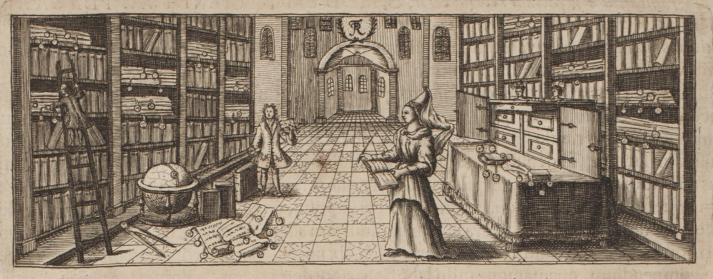

**En este documento:** 
- [Censos](#censos)
- [Armorial](#armorial-valaisan)
- [Memorias de Hyacinthe](#las-memorias-de-hyacinthe-clemenzo)
- [Árbol de Jean-Yves](#el-árbol-de-jean-yves)
- [Conclusiones](#conclusiones)
- [Línea directa](#línea-directa)
- [Árbol del clan](#árbol-del-clan-clemenzo)
- [Hipótesis](#hipótesis)
- [Tareas](#tareas)

---

> [!INFO] Clases en los censos del Valais
> Los censos valaisanos del siglo XIX dividían a la población en clases según la relación entre el burgués y la commune:
>
> - **1ère Classe** — Burgueses *residentes* en la commune. Aparecen con domicilio declarado en la misma localidad.
> - **2ème Classe** — Burgueses de la commune *domiciliados en otra commune*. Aparecen con "Lieu du domicile" distinto y una nota del tipo *"porté à [otra commune]"* indicando doble registro.
> - **4me Classe** — Burgueses *ausentes del cantón* ("ressortissans absens du pays"). Figura su profesión y el lugar donde residen fuera del Valais.
>
> Los Clemenzo aparecen en 2ème Classe en el censo de Riddes 1829 (burgueses de Riddes domiciliados en Ardon), y pasan a 1ère Classe en 1837, cuando la familia se establece definitivamente en Riddes. Joseph Florentin (p72) figura en la 4me Classe de Riddes 1837 y 1846 como cirujano en Nápoles.

## Censos

### 1802 — Riddes

**Fuente:** [Censo de Riddes 1802 — Archivo del Estado del Valais](https://recensements.vallesiana.ch/iiif/CH-AEV_3090_1802_Martigny_Riddes)

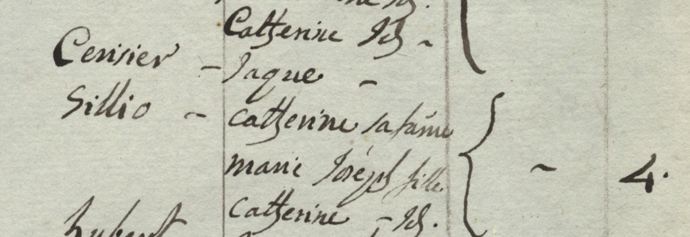

No se encontraron entradas Clemenzo/Clemenzoz en Riddes en este año. Consistente con la hipótesis de que la familia vivía en Ardon en 1802 y migró a Riddes en algún momento entre 1802 y 1829.

**Entrada Cerisier — de interés para p58:**

| Apellido  | Nombre      | Rol      |
|-----------|-------------|----------|
| Cerisier  | Jaque       | Jefe     |
| [Sillio?] | cattherine  | sa fame  |
| —         | marie José  | fille    |
| —         | cattherine  | fls.     |

Bracket = **4** personas.

La familia aparece identificada con doble apellido según el patrón habitual valaisano: **Cerisier** (apellido del padre) × **Sillio** (apellido de soltera de la madre):

| Nombre      | Rol         |
|-------------|-------------|
| Jaque       | Père (jefe) — Cerisier |
| cattherine  | sa fame — Sillio       |
| marie José  | fille                  |
| cattherine  | fls.                   |

Total: 4 personas. La **hija "cattherine fls."** tendría ~16 años si nació en 1786, coincidiendo exactamente con el año de nacimiento de p58 Marie Catherine Cerisier. → Ver H10.

---

### 1802 — Ardon

**Fuente:** [Censo de Ardon 1802 — Archivo del Estado del Valais](https://recensements.vallesiana.ch/iiif/CH-AEV_3090_1802_Martigny_Ardon)

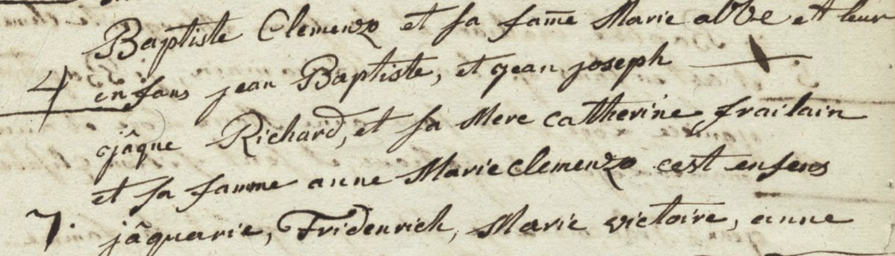

Primera aparición de los Clemenzo en los registros censales. Se identifican dos hogares consecutivos relacionados:

**Hogar 1 — Baptiste Clemenzo (4 personas):**

> *"Baptiste Clemenzo et sa fame Marie [al/ab?] et leur enfans jean Baptiste, et jean joseph"*

| Nombre            | Rol              |
|-------------------|------------------|
| Baptiste Clemenzo | Père (jefe)      |
| Marie [?]         | sa fame (esposa) |
| Jean Baptiste     | fils             |
| Jean Joseph       | fils             |

El "4" al margen indica recuento total: Baptiste + Marie + Jean Baptiste + Jean Joseph = 4 personas. El apellido de la esposa Marie no es legible con certeza.

**Jean Joseph** (fils de Baptiste, Ardon 1802) coincide con **p57 Jean Joseph Clemenzo** (n.1780), quien aparece 27 años después como jefe de hogar en Riddes 1829. → Ver H9.

**Hogar 2 — Jaque [R?] / Anne Marie Clemenzo (7 personas):**

> *"jaque [R?] et sa Mere cattherine Frailain et sa favome anne Marie Clemenzo — ces enfants: jaquerie, Friderich, Marie victoire, anne [+ más]"*

| Nombre              | Rol                |
|---------------------|--------------------|
| Jaque [R?]          | Jefe               |
| cattherine Frailain | sa Mere (madre)    |
| anne Marie Clemenzo | sa favome (esposa) |
| Jaquerie            | enfant             |
| Friderich           | enfant             |
| Marie victoire      | enfant             |
| anne                | enfant             |
| [3 más]             | (total = 7)        |

**Anne Marie Clemenzo** casó con un hombre de apellido [R?] (¿Richard?). Es una Clemenzo por nacimiento — posiblemente hija o hermana de Baptiste. Los dos hogares figuran consecutivos en el censo, sugiriendo proximidad y parentesco.

---

### 1829 — Riddes (Segunda Clase)

**Fuente:** [Censo de Riddes 1829 — Archivo del Estado del Valais](https://recensements.vallesiana.ch/iiif/CH-AEV_3090_1829_Martigny_Riddes)
**Cota:** CH AEV, DI 3090, 1829, Martigny, Riddes — Páginas 7 y 8

Este censo estaba dividido en dos secciones:
- **Primera Clase:** Burgueses residentes en la commune de Riddes
- **Segunda Clase:** Burgueses o comuneros establecidos *fuera* de la commune ("Seconde Classe — Contenant les Burgeois ou Communiers établis hors de la Commune")

Los Clemenzo de las líneas 21–34 pertenecen a la **Segunda Clase**: son burgueses de Riddes pero viven en Ardon. Por eso la columna "Lieu du domicile" dice "Ardon" y las observaciones dicen "porté à ardon" (también registrados en el censo de Ardon).

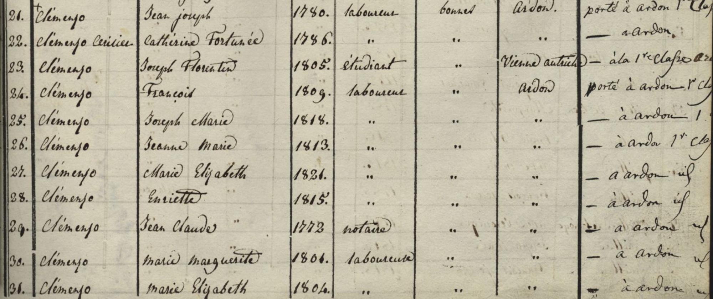
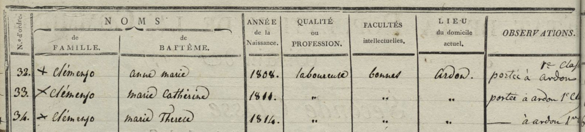

#### Familia Jean Joseph (líneas 21–28)

| Línea | Apellido            | Nombre             | Año nac. | Profesión  | Facultades | Domicilio         | Observaciones               |
|-------|---------------------|--------------------|----------|------------|------------|-------------------|-----------------------------|
| 21    | Clemenzo            | Jean Joseph        | 1780     | laboureur  | bonnes     | Ardon             | porté à ardon 1ère Classe   |
| 22    | Clemenzo Cerisier   | Catherine Fortunée | 1786     | "          | "          | "                 | — à ardon                   |
| 23    | Clemenzo            | Joseph Florentin   | 1805     | étudiant   | "          | Vienne (Autriche) | — à la 1ère classe ardon    |
| 24    | Clemenzo            | François           | 1809     | laboureur  | "          | Ardon             | porté à ardon 1ère Classe   |
| 25    | Clemenzo            | Joseph Marie       | 1818     | "          | "          | "                 | — à ardon 1ère classe       |
| 26    | Clemenzo            | Jeanne Marie       | 1813     | "          | "          | "                 | — à ardon 1ère Classe       |
| 27    | Clemenzo            | Marie Elizabeth    | 1821     | "          | "          | "                 | — à ardon [id]              |
| 28    | Clemenzo            | Henriette          | 1815     | "          | "          | "                 | — à ardon [id]              |

**Correspondencia con el árbol:**

| Línea | ID   | Nombre en árbol               | Nota                                                                                      |
|-------|------|-------------------------------|-------------------------------------------------------------------------------------------|
| 21    | p57  | Jean Joseph Clemenzo          | Nombre completo confirmado. En el censo de 1846 figura abreviado como "Joseph".           |
| 22    | p58  | Catherine Fortuneé "Pirisier" | Apellido real confirmado: **Cerisier**. Nombre completo probable: **Marie Catherine Fortunée Cerisier**. "Pirisier" en el árbol es error de transcripción. |
| 23    | p72  | Joseph Florentine Clemenzo    | En 1829 era **estudiante en Viena, Austria**. Dato extraordinario para un hijo de laboureur. |
| 24    | p36  | François Clemenzoz            | ✓                                                                                         |
| 25    | p73  | Joseph Marie Clemenzo         | ✓                                                                                         |
| 26    | p74  | Janne Marie Clemenzo          | ✓                                                                                         |
| 27    | p76  | Marie Elizabet Clemenzo       | ✓                                                                                         |
| 28    | p75  | Marie Henriette Clemenzo      | ✓                                                                                         |

**Notas:**
- **"Jeanne" (n.1820) no aparece.** Si hubiera nacido en 1820, tendría 9 años y debería estar listada. Su ausencia confirma que nació *después* de 1829 — el año "1820" del censo de 1850 es un error del censista.
- La columna "Observations" con *"porté à ardon"* indica doble registro: burgueses de Riddes con residencia y también registro en Ardon.

#### Familia Jean Claude (líneas 29–34) — inmediatamente debajo

| Línea | Apellido     | Nombre           | Año nac. | Profesión  | Facultades | Domicilio | Observaciones              |
|-------|--------------|------------------|----------|------------|------------|-----------|----------------------------|
| 29    | Clemenzo     | Jean Claude      | 1773     | notaire    | ..         | ..        | = à ardon [id]             |
| 30    | Clemenzo     | Marie Marguerite | 1801     | laboureure | ..         | ..        | — à ardon [id]             |
| 31    | Clemenzo     | Marie Elizabeth  | 1804     | ..         | ..         | ..        | — à ardon [id]             |
| 32    | + Clemenzo   | Anne Marie       | 1808     | laboureure | bonnes     | Ardon     | portée à ardon 1re Classe  |
| 33    | × Clemenzo   | Marie Catherine  | 1811     | ..         | ..         | ..        | portée à ardon 1re Classe  |
| 34    | × Clemenzo   | Marie Therese    | 1814     | ..         | ..         | ..        | — à ardon 1er[?]           |

Jean Claude (notario, n.1773) con cinco hijas: Marie Marguerite (1801), Marie Elizabeth (1804), Anne Marie (1808), Marie Catherine (1811), Marie Therese (1814). No aparece su esposa. Los símbolos + y × en líneas 32–34 probablemente indican estado civil (casada / viuda). Su relación con el hogar de Jean Joseph (n.1780) no está documentada.

---

### 1829 — Ardon (Primera Clase)

**Fuente:** Censo de Ardon 1829 — Archivo del Estado del Valais (Primera Clase: residentes de Ardon)

Este censo es el espejo del anterior: mientras el de Riddes 1829 registraba a la familia en Segunda Clase (burgueses de Riddes domiciliados en Ardon), este los muestra como residentes efectivos de Ardon.

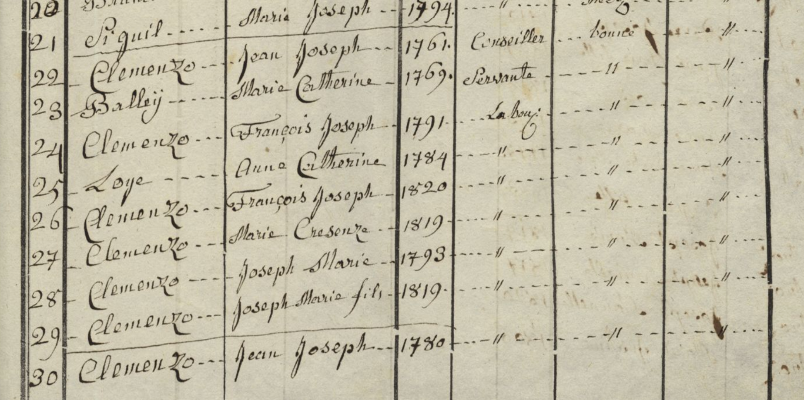

#### Jean Joseph Clemenzo n.1761 — rama diferente

| Línea | Apellido | Nombre | Año nac. | Profesión |
|---|---|---|---|---|
| 21 | Clemenzo | Jean Joseph | **1761** | Conseiller |
| 22 | [Clemenzo] | Marie Catherine | 1769 | Servante |
| 23 | Balleij | François Joseph | 1791 | Laboureur |
| 24 | Clemenzo | Anne Catherine | 1784 | — |
| 25 | Loye | François Joseph | 1820 | — |
| 26 | Clemenzo | Marie Crescenze | 1819 | — |
| 27 | Clemenzo | Joseph Marie | 1793 | — |
| 28 | Clemenzo | Joseph Marie fils | 1819 | — |

Un **segundo Jean Joseph Clemenzo** (n.1761), Conseiller. No es p57. Las entradas con apellido **Balleij** (l.23, François Joseph *1791) y **Loye** (l.25, François Joseph *1820) son miembros del hogar con apellido propio — probablemente yerno y nieto respectivamente, fruto de matrimonios de hijas de este Jean Joseph. La estructura es más extendida de lo que indicaba el censo de Riddes. Rama colateral (ver H9).

#### Familia Jean Joseph n.1780 — continuación en siguiente página

| Apellido | Nombre | Año nac. | Profesión | Observaciones |
|---|---|---|---|---|
| [Cerisier] | Catherine Fortunée | 1786 | Laboureur | Ardon |
| Clemenzo | Joseph Florentin | 1805 | Etudient | **à Fribourg en Breisgau** |
| Clemenzo | François | 1809 | Laboureur | — |
| Clemenzo | Joseph Marie | 1818 | — | — |
| Clemenzo | Jonne Marie | 1813 | — | — |
| Clemenzo | Enrijette | 1815 | — | — |
| Clemenzo | Marie Helizabet | 1821 | — | — |

Es la continuación del hogar de Jean Joseph n.1780 (p57). El apellido de Catherine aparece como **"Pirisier"** en este censo — escritura ambigua que en el siglo XIX se leyó como P, pero el acta de matrimonio de p75 (1840) y el censo de Riddes 1850 confirman definitivamente que es **Cerisier**.

**Discrepancia Joseph Florentin:** el censo de Riddes 1829 lo ubica en "Vienne (Autriche)" mientras este Ardon 1829 dice "Fribourg en Breisgau" (Freiburg im Breisgau, Alemania, ciudad universitaria desde 1457). Posibles explicaciones: los dos censos no son exactamente simultáneos y él se movió entre instituciones, o uno de los censistas cometió un error. Freiburg im Breisgau es mucho más accesible desde el Valais que Viena.

#### Jean Joseph y Jean Baptiste en Ardon 1829 — primer registro conjunto

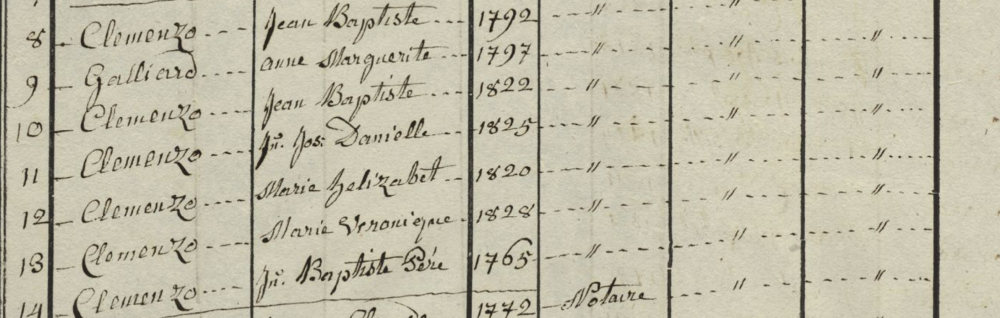

Este es el **primer censo en que Jean Joseph (p57) y Jean Baptiste Clemenzo aparecen juntos** en el mismo documento. En 1802 solo se ve el hogar de Baptiste con ambos hijos nombrados; acá, en 1829, cada uno aparece ya como adulto con su propia situación, y su padre sigue vivo.

| Entrada | Apellido | Nombre | Año nac. | Notas |
|---|---|---|---|---|
| — | Clemenzo | **Jean Joseph** | **1780** | p57 — en 1829 vive en Riddes (2da Clase allá) |
| — | Clemenzo + Galliard | **Jean Baptiste** | ~1774 | Residente en Ardon, con familia propia |
| — | Galliard | anne Marguerite | 1797 | Esposa de Jean Baptiste (apellido: **Galliard**) |
| 9 | Clemenzo | Jean Baptiste | 1822 | Fils ✓ árbol Jean-Yves |
| 10 | Clemenzo | Jn. Jos. Danielle | 1825 | Fils — **no figura en árbol de Jean-Yves** |
| 11 | Clemenzo | Marie helizabet | 1820 | Fille ✓ árbol Jean-Yves |
| 12 | Clemenzo | Marie Veronique | 1828 | Fille ✓ árbol Jean-Yves |
| 13 | Clemenzo | **Jn. Baptiste Père** | **1765** | Baptiste Clemenzo del censo 1802 — ver nota |

**Notas:**

- **Apellido de la esposa de Jean Baptiste: Galliard.** Jean-Yves llama a la esposa "Gaillard" — es la misma familia (variante ortográfica). El nombre "anne Marguerite" vs "Anne-Marie" en el árbol de Jean-Yves es una discrepancia menor, posiblemente nombre compuesto.

- **Hijo "Jn. Jos. Danielle" \*1825** no figura en el árbol de Jean-Yves — probablemente falleció joven.

- **Línea 13 — "Jn. Baptiste Père / 1765":** es Baptiste Clemenzo del censo de 1802, que en 1829 vive con su hijo Jean Baptiste. El año 1765 presenta una dificultad aritmética: si sus hijos nacieron en ~1774 y ~1780, los habría tenido con 9 y 15 años — imposible. Lo más probable es que el censista transcribiera mal el año (quizás "1745" leído como "1765" en cursiva valaisana), lo que daría una edad de ~29 años al nacer Jean Baptiste. En el censo de 1846 "Baptiste" aparece como anciano conviviente (~90 años), lo que es coherente con haber nacido en torno a 1745–1755. La confirmación requiere acta de bautismo en Ardon.

#### Jean Claude Clemenzo — rama notarial (Ardon 1829)

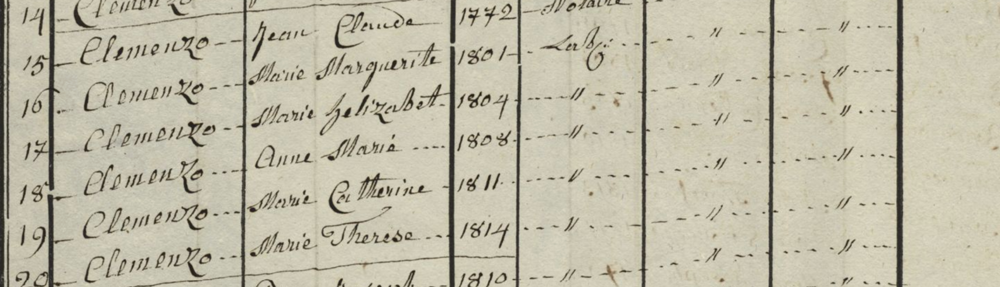

| Línea | Apellido | Nombre | Año nac. | Profesión |
|---|---|---|---|---|
| 14 | Clemenzo | Jean Claude | **1772** | Notaire |
| 15 | Clemenzo | Marie Marguerite | 1801 | Labr. |
| 16 | Clemenzo | Marie helizaBet | 1804 | — |
| 17 | Clemenzo | Anne Marie | 1808 | — |
| 18 | Clemenzo | Marie Catherine | 1811 | — |
| 19 | Clemenzo | Marie Therese | 1814 | — |
| 20 | Clemenzo | [nombre ilegible] | 1810 | — |

Jean Claude aparece aquí como n.1772 (vs n.1773 en el censo de Riddes 1829) — diferencia de un año, error habitual de transcripción. El censo de Ardon revela una **sexta hija** (l.20, n.1810) no registrada en el de Riddes, probablemente casada (de ahí el símbolo diferente).

---

### 1837 — Riddes

**Fuente:** Censo de Riddes 1837 — Archivo del Estado del Valais (1ère Classe: residentes)
**Cota:** CH AEV, DI 3090, 1837, Martigny, Riddes — Pág. 46

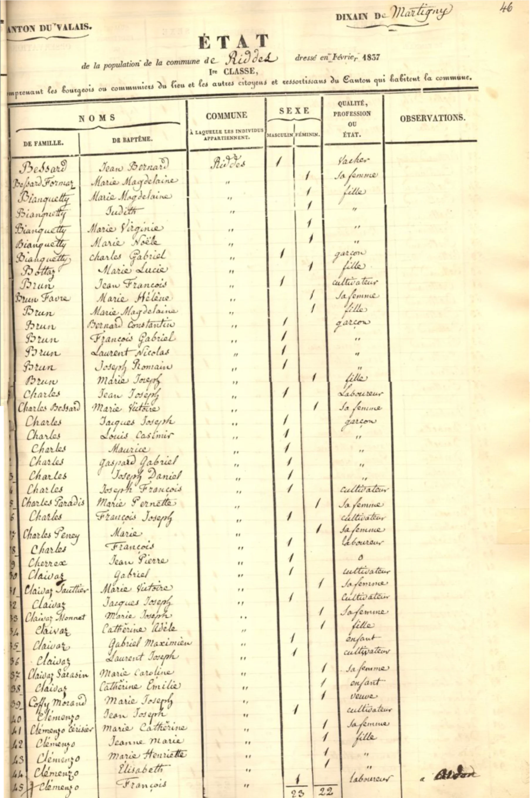

Primer censo que registra a los Clemenzo en **Primera Clase** (burgueses residentes de Riddes). En 1829 figuraban en Segunda Clase como domiciliados en Ardon; este cambio confirma que la familia se estableció definitivamente en Riddes en algún momento entre 1829 y 1837.

| Apellido  | Nombre          | Sexo | Rol       | ID  |
|-----------|-----------------|------|-----------|-----|
| Clemenzo  | Jean Joseph     | M    | père      | p57 |
| Clemenzo  | Marie Catherine | F    | la femme  | p58 |
| Clemenzo  | Janne Marie     | F    | fille     | p74 |
| Clemenzo  | Marie Henriette | F    | fille     | p75 |
| Clemenzo  | Marie Elisabeth | F    | fille     | p76 |
| Clemenzo  | François        | M    | fils      | p36 |

**Notas:**
- **p73 Joseph Marie (n.1818)** no aparece — ya no vivía en el hogar paterno.
- **p72 Joseph Florentin** no figura en el hogar, pero sí aparece en la 4me Classe (ver abajo).
- Este formato censal no incluye columna de apellido de soltera, por lo que no permite confirmar la ortografía de p58. La evidencia definitiva de **Cerisier** proviene del censo de Riddes 1829 y del acta de matrimonio de p75 (1840).
- Una observación marginal en la última fila parece indicar "à Ardon" — posiblemente François también estaba registrado en Ardon por su burguesía.

#### 4me Classe — ausentes de Riddes (1837)

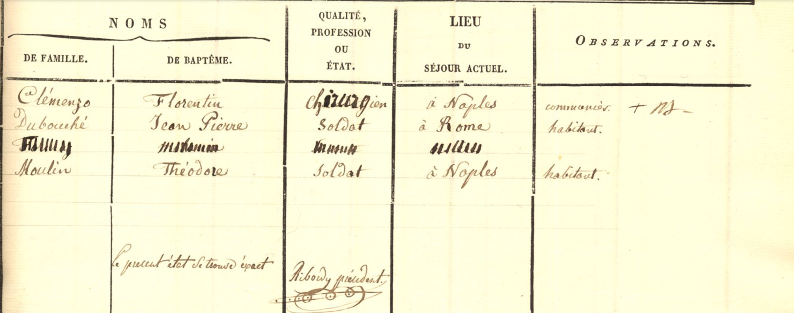

La 4me Clase registra "les ressortissans de la commune absens du pays" — burgueses de Riddes que residen fuera del cantón. La única entrada Clemenzo:

| Apellido | Nombre | Profesión | Lugar | Observaciones |
|---|---|---|---|---|
| Clémenzo | Florentin | Chirurgien | à Naples | communier + NJ— |

**Joseph Florentin (p72)** figura como **cirujano** ("chirurgien") residente en **Nápoles**. La observación "communier" confirma que mantiene sus derechos de burguesía en Riddes. En 1829 era estudiante (en Viena o Freiburg); para 1837 ya había completado sus estudios de medicina y ejercía en Italia.

---

### 1846 — Riddes

**Fuente:** [Censo de Riddes 1846 — Archivo del Estado del Valais](https://recensements.vallesiana.ch/iiif/CH-AEV_3090_1846_Martigny_Riddes)
**Cota:** CH AEV, DI 3090, 1846, Martigny, Riddes — Páginas 1 y 2

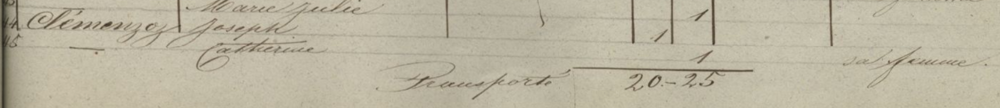
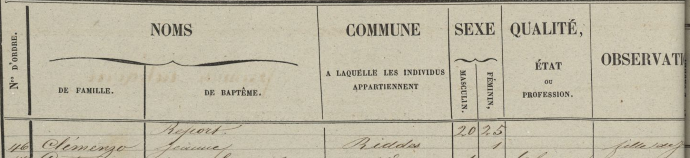

| Línea | Apellido  | Nombre    | Origen | Observación   |
|-------|-----------|-----------|--------|---------------|
| 44    | Clemenzoz | Joseph    | Riddes |               |
| 45    | Clemenzoz | Catherine | Riddes | sa femme      |
| 46    | Clemenzo  | Jeanne    | Riddes | fille majeure |

Las tres entradas forman un hogar: Joseph (l.44) = p57, vivo en 1846. Catherine (l.45) = p58 Marie Catherine Cerisier, anotada como **"sa femme"**. Jeanne (l.46) = hija adulta soltera, la misma que aparece en el censo de Riddes 1850.

**Nota sobre el nombre de p57:** Figura aquí como **"Joseph"** (sin "Jean"). El documento S 77 (1851) también lo llama "Joseph Clemenzoz de Riddes". El árbol lo registra como "Jean Joseph" — el censo de 1829 confirma el nombre completo. Probable que en 1846 el censista lo anotó abreviado. Confirmar en registros parroquiales.

#### 4me Classe — ausentes de Riddes (1846)

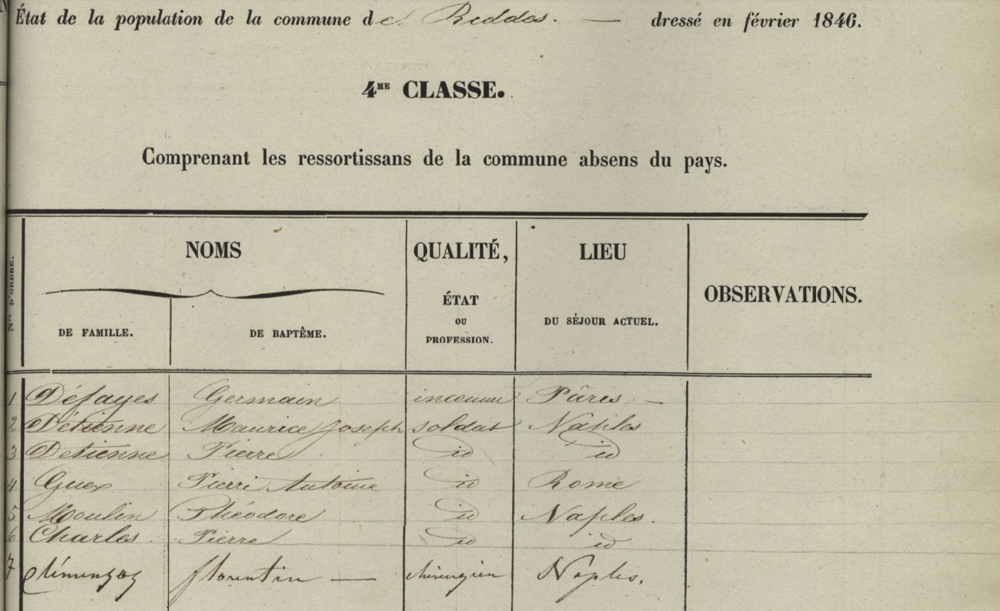

La misma 4me Clase del censo de febrero de 1846. Línea 7:

| Nº | Apellido | Nombre | Profesión | Lugar |
|---|---|---|---|---|
| 7 | Clemenzoz | Florentin | Chirurgien | Naples |

Florentin seguía en Nápoles en 1846. Desde 1837 hasta al menos febrero de 1846 ejerció como cirujano en Italia — un período mínimo de 9 años fuera de Riddes. No hay rastro suyo en censos posteriores disponibles.

---

### 1846 — Ardon

**Fuente:** [Censo de Ardon 1846 — Archivo del Estado del Valais](https://recensements.vallesiana.ch/iiif/CH-AEV_3090_1846_Conthey_Ardon)
**Cota:** CH AEV, DI 3090, 1846, Conthey, Ardon

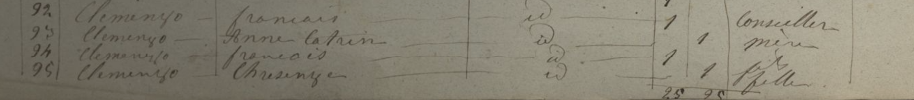
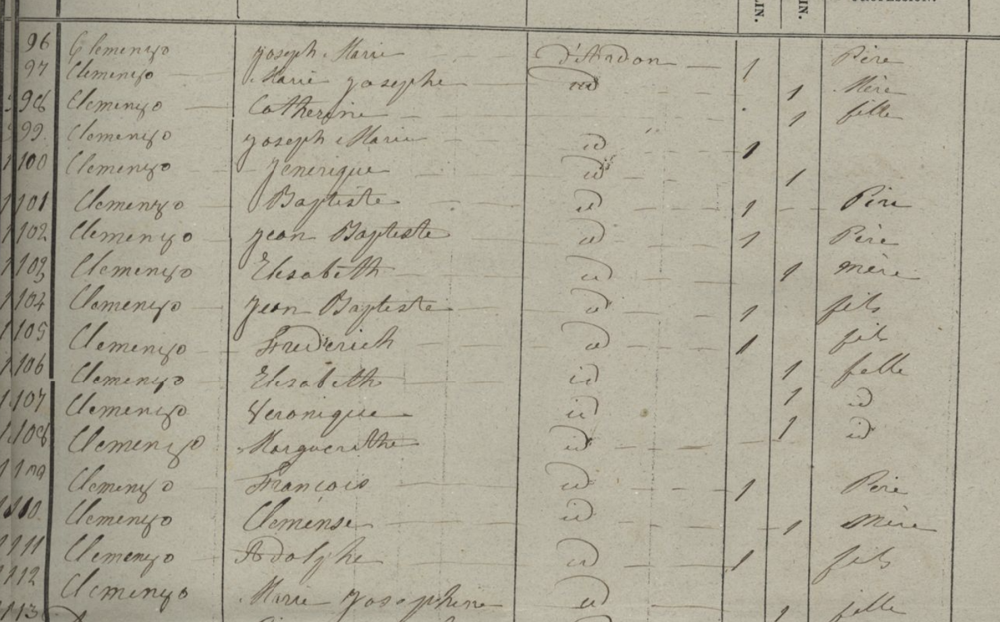

Todas las entradas tienen origen declarado **D'Ardon**.

| Línea | Apellido | Nombre          | Origen  | Sexo      | Rol / Profesión   |
|-------|----------|-----------------|---------|-----------|-------------------|
| 92    | Clemenzo | François        | D'Ardon | Masculino | Père — Conseiller |
| 93    | Clemenzo | Anne Catrin     | D'Ardon | Femenino  | Mère              |
| 94    | Clemenzo | François        | D'Ardon | Masculino | Fils              |
| 95    | Clemenzo | Chrisenge       | D'Ardon | Femenino  | Fille             |
| 96    | Clemenzo | Joseph Marie    | D'Ardon | Masculino | Père              |
| 97    | Clemenzo | Marie Josephe   | D'Ardon | Femenino  | Mère              |
| 98    | Clemenzo | Catherine       | D'Ardon | Femenino  | Fille             |
| 99    | Clemenzo | Joseph Marie    | D'Ardon | Masculino | Fils              |
| 100   | Clemenzo | Jenerique       | D'Ardon | Femenino  | Fille             |
| 101   | Clemenzo | Baptiste        | D'Ardon | Masculino | Père              |
| 102   | Clemenzo | Jean Baptiste   | D'Ardon | Masculino | Père              |
| 103   | Clemenzo | Elsabeth        | D'Ardon | Femenino  | Mère              |
| 104   | Clemenzo | Jean Baptiste   | D'Ardon | Masculino | Fils              |
| 105   | Clemenzo | Frédérich       | D'Ardon | Masculino | Fils              |
| 106   | Clemenzo | Elsabeth        | D'Ardon | Femenino  | Fille             |
| 107   | Clemenzo | Véronique       | D'Ardon | Femenino  | Fille             |
| 108   | Clemenzo | Margueritte     | D'Ardon | Femenino  | Fille             |
| 109   | Clemenzo | François        | D'Ardon | Masculino | Père              |
| 110   | Clemenzo | Clémence        | D'Ardon | Femenino  | Mère              |
| 111   | Clemenzo | Adolphe         | D'Ardon | Masculino | Fils              |
| 112   | Clemenzo | Marie Josephine | D'Ardon | Femenino  | Fille             |
| 113   | Clemenzo | [ilegible]      | D'Ardon | Femenino  | Fille             |

#### Familias identificadas — hipótesis basadas en este censo

Los grupos se delimitan por los marcadores de rol (père/mère inician cada unidad doméstica). Las asignaciones de identidad son hipótesis, no datos confirmados. En Ardon coexistían múltiples núcleos Clemenzo, todos con el mismo apellido — la diferenciación por el nombre de la mujer es la forma más práctica de identificarlos.

**Familia François Clemenzo × Anne Catrin — líneas 92–95** *(H3)*

| Línea | Nombre        | Rol               |
|-------|---------------|-------------------|
| 92    | François      | Père (Conseiller) |
| 93    | Anne Catrin   | Mère              |
| 94    | François      | Fils              |
| 95    | Chrisenge     | Fille             |

*H3:* François Conseiller (l.92) es probablemente el **François-Joseph Clemenzoz d'Ardon** del documento AC Riddes D 10/40 (1854), identificado como un Clemenzoz distinto de p36. Rama colateral sin confirmar.

**Familia Joseph Marie Clemenzo × Marie Josephe — líneas 96–100** *(H2)*

| Línea | Nombre        | Rol   |
|-------|---------------|-------|
| 96    | Joseph Marie  | Père  |
| 97    | Marie Josephe | Mère  |
| 98    | Catherine     | Fille |
| 99    | Joseph Marie  | Fils  |
| 100   | Jenerique     | Fille |

*H2:* El Joseph Marie père (l.96) tendría ~28 años en 1846, consistente con p73 Joseph Marie Clemenzo (n.1818, hermano de p36). Su familia no está en el árbol.

**Familia Jean Baptiste Clemenzo × Elsabeth — líneas 101–108** *(H4 — confirmado)*

| Línea | Nombre        | Rol         | Identidad (árbol Jean-Yves)                    | Edad 1846 |
|-------|---------------|-------------|------------------------------------------------|-----------|
| 101   | Baptiste      | Père        | Baptiste Clemenzo (patriarca del censo 1802)   | ~90+      |
| 102   | Jean Baptiste | Père        | Jean-Baptiste Clemenzo \* **1774** † 1859       | 72 ✓      |
| 103   | Elsabeth      | Mère        | [esposa de Jean-Baptiste — ver nota]           | —         |
| 104   | Jean Baptiste | Fils        | Jean-Baptiste \* **1822** † 1908               | 24 ✓      |
| 105   | Frédérich     | Fils        | Frédéric \* **1832** † 1885                    | 14 ✓      |
| 106   | Elsabeth      | Fille       | Anne-Marie-**Elisabeth** \* **1820** † 1890    | 26 ✓      |
| 107   | Véronique     | Fille       | Anne-Marie-**Véronique** \* **1828**           | 18 ✓      |
| 108   | Margueritte   | Fille       | Marguerite (no figura en árbol de Jean-Yves)   | —         |

**Nota:** Los datos del árbol de Jean-Yves confirman esta familia con precisión notable — cuatro hijos coinciden en nombre y edad calculada sin margen de error. L101 "Baptiste" es el patriarca del censo de 1802, que en 1846 tendría ~90 años como anciano en el hogar de su hijo. La "Elsabeth" de l.103 no coincide con "Anne-Marie Gaillard \*1797" que registra Jean-Yves como esposa de Jean-Baptiste: posible segundo matrimonio de Jean-Baptiste tras enviudar, o que "Elsabeth" sea su segundo nombre. Pendiente de aclaración con actas parroquiales de Ardon.

**Fuente:** Árbol genealógico de Jean-Yves (descendiente de Jean-Baptiste), basado en el *Armorial Valaisan, Sion et Zurich, 1946, p. 63*. → Ver H4 y H11.

**Familia François Clemenzo × Clémence — líneas 109–113** *(H1)*

| Línea | Nombre          | Rol   |
|-------|-----------------|-------|
| 109   | François        | Père  |
| 110   | Clémence        | Mère  |
| 111   | Adolphe         | Fils  |
| 112   | Marie Josephine | Fille |
| 113   | [ilegible]      | Fille |

*H1:* François (l.109) sería **p36 François Clemenzoz** (n.1809), con ~37 años en 1846. La esposa "Clémence" no coincide con Marie Louise Stalder (p37), quien figura en el censo de 1870 como su mujer: lo más probable es que Clémence fuera una **primera esposa** que falleció entre 1846 y 1850. Ver H1 en sección Hipótesis.

---

### 1850 — Riddes

**Fuente:** [Censo de Riddes 1850 — Archivo del Estado del Valais](https://recensements.vallesiana.ch/iiif/CH-AEV_3090_1850_Martigny_Riddes)
**Cota:** CH AEV, DI 3090, 1850, Martigny, Riddes — Página 3

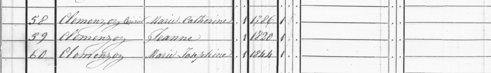

| Línea | Apellido           | Nombre          | Año nac. | Sexo     | Profesión   |
|-------|--------------------|-----------------|----------|----------|-------------|
| 58    | Clemenzoz Cerisier | Marie Catherine | 1786     | Femenino | Agricultora |
| 59    | Clemenzoz          | Jeanne          | 1820     | Femenino | Agricultora |
| 60    | Clemenzoz          | Marie Josephine | 1844     | Femenino |             |

La línea 58 usa doble apellido **Clemenzoz Cerisier** (casada + soltera), confirmando definitivamente que el apellido de p58 es **Cerisier**. Aparece sin marido: p57 falleció entre 1846 y 1850.

---

### 1870 — Riddes

**Fuente:** Recensement fédéral de la population au 1er Décembre 1870 — Archivo del Estado del Valais
**Cota:** CH AEV, DI 3090, 1870, Martigny, Riddes — Bulletin N.° 84

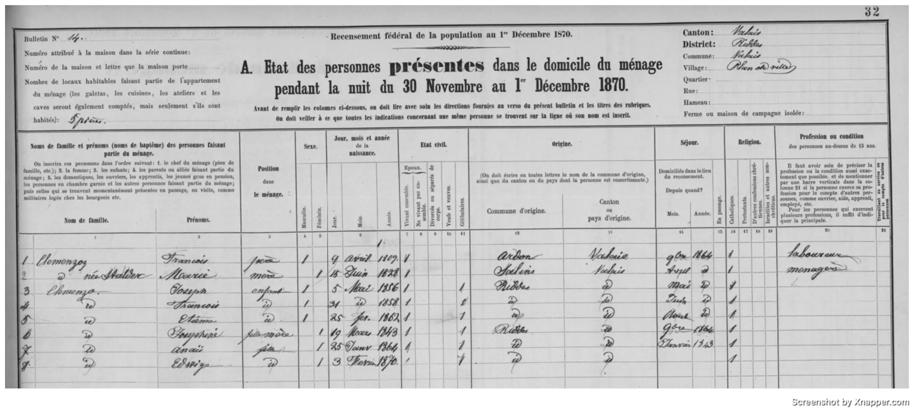

Censo federal suizo: fotografía del hogar de p36 en la noche del 30 de noviembre al 1 de diciembre de 1870.

| N° | Apellido  | Nombre          | Pos.      | Nacimiento     | E. civil  | Origen | Sexo |
|----|-----------|-----------------|-----------|----------------|-----------|--------|------|
| 1  | Clemenzo  | François        | Chef      | 9 Avril 1809   | Marié     | Ardon  | M    |
| 2  | [Clemenzo]| Marie-Stalder   | Femme     | 5 Mai 1828     | Mariée    | Riddes | F    |
| 3  | Clemenzo  | [José?]         | Fils      | [~1855–1856]   | Célibat.  | Riddes | M    |
| 4  | Clemenzo  | François        | Fils      | [~1858]        | Célibat.  | Riddes | M    |
| 5  | Clemenzo  | [Etienne?]      | Fils      | [~1862]        | Célibat.  | Riddes | M    |
| 6  | Clemenzo  | [Joséphine?]    | Fille     | [~1843]        | Célibat.  | Riddes | F    |
| 7  | Clemenzo  | [?]             | Fille     | [?]            | Célibat.  | Riddes | F    |

**Correspondencia con el árbol:**

| Entrada       | ID  | Nota |
|---------------|-----|------|
| François      | p36 | Nacimiento **9 Avril 1809** ✓ — origen Ardon ✓ |
| Marie-Stalder | p37 | **5 Mai 1828** ✓ — coincide con el árbol |
| [José?]       | p28 | José Clemenzo n.1856 — aquí ~14–15 años |
| François fils | p26 | François Clemenzo n.1858 — el futuro emigrante a Argentina, aquí ~12 años |
| [Etienne?]    | p40 | Etienne Clemenzo n.1862 — ~8 años |
| [Joséphine?]  | p77 | Joséphine Clemenzo n.1843 — ~27 años, soltera, viviendo con sus padres ✓ |

**Notas:**
- **p36 estaba vivo** en diciembre de 1870. El documento D 10/86 (11/01/1874) ya lo menciona en pasado — murió entre enero de 1871 y enero de 1874.
- La presencia de **p77 Joséphine** en el hogar paterno en 1870 confirma que era hija de p36, coherente con H8.
- El año de nacimiento de **p37 Marie Louise Stalder** aparece como **5 Mai 1828** — coincide con el árbol ✓.
- La entrada 7 corresponde a un hijo/a adicional no identificado aún (p78 o p79 en el árbol).
- **François (p26)** tenía ~12 años en este censo; emigraría a Argentina ~18 años después.

---

## Armorial Valaisan

El árbol genealógico de Jean-Yves cita el *Armorial Valaisan, Sion et Zurich, 1946, p. 63* como fuente base. Existen dos ediciones relevantes con entradas distintas para la familia Clemenzo.

### Edición 1946 — entrada CLEMENZ / CLEMENZO

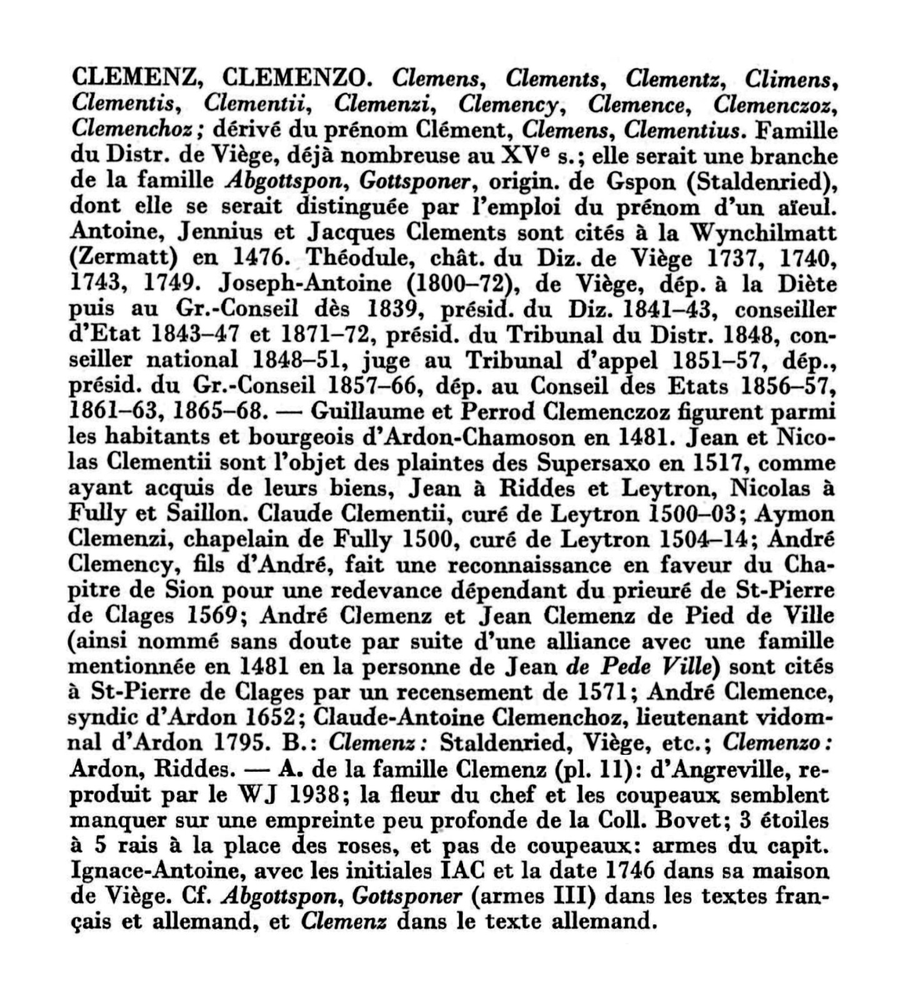

Edición bilingüe (francés / alemán). La entrada CLEMENZ/CLEMENZO cubre todas las variantes del apellido y distingue dos ramas por burguesía:

> *"B.: Clemenz: Staldenried, Viège, etc.; Clemenzo: **Ardon, Riddes**."*

Esto confirma explícitamente que la rama **Clemenzo** tiene su burguesía en **Ardon** y **Riddes** — exactamente la rama que investigamos.

**Datos históricos documentados:**
- **1481** — Guillaume et Perrod *Clemenczoz* figuran como habitantes y burgueses de Ardon-Chamoson. Primera mención documentada de la familia en Ardon, 321 años antes del censo 1802.
- **1517** — Jean *Clementii* figura a Riddes et Leytron (en el marco de una disputa con los Supersaxo). Primera mención en Riddes.
- **1500–1514** — Distintas menciones de clérigos Clemenz/Clemenzi en Leytron y Fully.
- **1569** — André *Clemency*, fils d'André, reconocimiento al Chapitre de Sion por el priorato de Saint-Pierre-de-Clages.
- **1652** — André *Clemence*, síndico de Ardon.
- **1795** — **Claude-Antoine Clemenchoz, lieutenant vidomnal d'Ardon.** Cargo de magistrado local en Ardon, siete años antes del censo 1802. Contemporáneo de Baptiste Clemenzo — posible pariente directo o incluso el mismo Baptiste bajo variante de apellido.

### Edición posterior (post-1977) — entrada CLEMENZO (Famille d'Ardon)

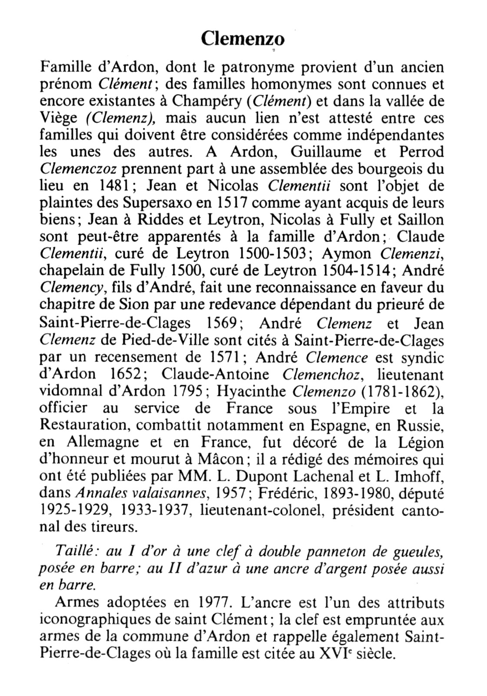

Edición más reciente (las armas fueron adoptadas en 1977). Artículo exclusivo para la rama Clemenzo de Ardon. Menciona a Hyacinthe Clemenzo (ver sección siguiente) y a Frédéric Clemenzo (1893–1980), diputado 1925–1929 y 1933–1937, teniente-coronel, presidente cantonal de tiradores. Puede ser descendiente de Jean-André vía Hyacinthe, o de Jean-Baptiste \*1774 vía Frédéric \*1832 — pendiente de verificación.

**Armas de la familia Clemenzo (adoptadas 1977):**
*"Au I d'or à une clef à double panneton de gueules, posée en barre; au II d'azur à une ancre d'argent posée aussi en barre."*
La clef viene de las armas de la commune d'Ardon; el ancla es atributo iconográfico de saint Clément (patrono de la familia). La clave y el ancla también evocan Saint-Pierre-de-Clages, donde la familia está citada en el siglo XVI.

---

## Las memorias de Hyacinthe Clemenzo

Hyacinthe Clemenzo dejó escritas sus memorias: *Souvenirs d'un officier valaisan au service de France*, publicadas en las *Annales valaisannes* de 1957. Son una fuente excepcional: registran su filiación exacta y permiten contextualizar a los Clemenzo de Ardon en las generaciones anteriores a los censos.

Una nota a pie de página del Capítulo I confirma:

> *"Fils de **Jean-André Clemenzo (1716–1812)** et de **Marie-Marguerite Favre (1728–1813)**."*

Hyacinthe **no es hijo de Baptiste Clemenzo** — es hijo de **Jean-André Clemenzo \*1716**, un patriarca distinto de la misma localidad. Esto descarta la hipótesis anterior de que Hyacinthe fuera hermano de Jean-Baptiste y Jean-Joseph.

Jean-André nació en **1716** y vivió hasta **1812** — estaba vivo durante el censo de 1802 (86 años). Hyacinthe nació en 1781 cuando Jean-André tenía 65 años — edad inusual pero documentada en familias longevas del Valais.

**Datos biográficos de Hyacinthe:**
- Nació el **17 de abril de 1781** en Ardon
- Estudió en la Abbaye de Saint-Maurice; obtuvo el diploma de notario en otoño de 1799 (el primero expedido bajo el nuevo régimen en el Valais)
- Casó en noviembre de 1801 en Sion; hijos: **Virginie** y **Patience**
- Se alistó en 1806 en el batallón valaisan para Napoleón; 20 años de campaña en Europa
- Enviudó; segundo matrimonio en 1821; hijos: **Camille y Etienne** (a quienes dedica las memorias en 1854)
- Primo hermano de Nicolas Favre, canónigo, curé de Liddes (rama materna Favre)
- La familia poseía un **mayen en Montot** (alpage sobre Ardon)
- Murió el 11 de julio de 1862 en Mâcon

Las memorias fueron preservadas por **M. Raymond de Laroche-Clémenso** (Lyon), casado con una bisnieta de Hyacinthe.

**Nota sobre Jean-André y Baptiste:** Ambos son patriarcas Clemenzo coexistentes en Ardon — Jean-André (n.1716, †1812) y Baptiste (n.~1745–1755, presente en 1802). El hecho de que compartan apellido y localidad sugiere que son parientes, pero no hay documentación que establezca la relación exacta. En Ardon convivían varios núcleos del apellido Clemenzo desde el siglo XV; que dos sean contemporáneos no implica vínculo directo documentado.

---

## El árbol de Jean-Yves

Jean-Yves es un descendiente de **Jean-Baptiste Clemenzo \*1774**, el hermano (probable) de Jean Joseph p57. Vive en Suiza y compartió su árbol genealógico, que fue clave para confirmar las hipótesis sobre el siglo XIX.

Su árbol parte de Jean-Baptiste \*1774 como primera generación documentada, con datos de nacimiento y fallecimiento respaldados por el *Armorial Valaisan* de 1946.

**Lo que el árbol de Jean-Yves aportó:**

1. **Confirmó la identidad de la Familia Jean Baptiste × Elsabeth en el censo de Ardon 1846** (H4 ✓): Los cuatro hijos listados en líneas 104–107 coinciden en nombre y edad calculada con los de su árbol — cuatro de cuatro, sin margen de error.

2. **Confirmó a Baptiste Clemenzo como ancestro común** (H11 ✓): Su árbol comienza en Jean-Baptiste \*1774, cuyo padre no figura en sus registros pero está implícito. El censo de 1802 lo nombra: Baptiste Clemenzo. Es la generación "cero" de Jean-Yves.

3. **Identificó un hijo no documentado:** "Jn. Jos. Danielle \*1825" aparece en el censo de 1829 como hijo de Jean-Baptiste, pero no figura en el árbol de Jean-Yves — probablemente murió en la infancia.

**Lo que queda sin resolver:**

- La esposa "Elsabeth" (l.103, 1846) no coincide con "Anne-Marie Gaillard \*1797" del árbol de Jean-Yves. Puede ser un segundo matrimonio de Jean-Baptiste tras enviudar, o que el censista usara el segundo nombre. Pendiente de acta parroquial de Ardon.
- Jean-Yves desconoce datos de Baptiste — su árbol no sube hasta ese nivel.

**En consecuencia:** Jean-Yves y el autor de este documento son primos lejanos, con Baptiste Clemenzo como ancestro común estimado en torno a 1745–1755.

---

## Conclusiones

Siete censos entre 1802 y 1870, el *Armorial Valaisan* en dos ediciones, las memorias de Hyacinthe y el árbol de Jean-Yves permiten trazar el siguiente panorama:

**Lo que está documentado:**

Los Clemenzo de Ardon tienen presencia documentada desde **1481** — cinco siglos antes de que Francisco cruzara el Atlántico. No son recién llegados al Valais; son una familia arraigada cuya historia se puede seguir en los archivos desde la Edad Media.

**Baptiste Clemenzo** (Ardon 1802) es el punto de partida de la investigación. Tenía al menos dos hijos — Jean Baptiste y Jean Joseph — y vivía con su esposa Marie, cuyo apellido no fue posible leer con certeza. Su año de nacimiento aparece como "1765" en el censo de 1829, pero ese dato es casi seguramente un error de transcripción: haberlo escrito así haría imposibles las edades de sus hijos. Lo más probable es que haya nacido entre 1745 y 1755.

**Jean Joseph Clemenzo (p57, n.~1780)** migró a Riddes. En 1829 era burgués de Riddes domiciliado aún en Ardon; en 1837 ya vivía en Riddes con su esposa Catherine Cerisier y seis hijos. Esta es la línea directa hacia Argentina.

**Jean Baptiste Clemenzo (\*1774)** permaneció en Ardon, donde su descendencia aparece en el censo de 1846 con cuatro hijos identificados. Hoy Jean-Yves y la rama argentina son primos lejanos que comparten a Baptiste como ancestro.

**Joseph Florentin (p72)** estudió medicina en algún lugar de Europa central (Viena o Freiburg) y ejerció como cirujano en Nápoles al menos entre 1837 y 1846 — una figura extraordinaria para la época, hijo de un laboureur del Valais que terminó viviendo en Italia.

**François / Francisco Clemenzo (p26, n.1858)** emigró a Argentina alrededor de 1880. En el censo de 1870 tenía 12 años y vivía con sus padres en Riddes; en 1895 ya aparece en Colón, Entre Ríos. Es el fundador de la rama argentina.

**Lo que es hipótesis:**

La identificación de Baptiste como padre de Jean Joseph (H9) se basa en coincidencia de nombre y edad — no en un acta de bautismo. Es sólida pero no confirmada documentalmente.

Jean-André Clemenzo (\*1716) y Baptiste Clemenzo son dos patriarcas Clemenzo coexistentes en Ardon, probablemente parientes, pero la relación exacta no está documentada.

---

## Línea directa

De Juan Martín (generación actual) hasta Baptiste Clemenzo, el ancestro más antiguo identificado. La filiación entre Baptiste y Jean Joseph es hipótesis documentalmente sólida pero no confirmada por acta de bautismo.

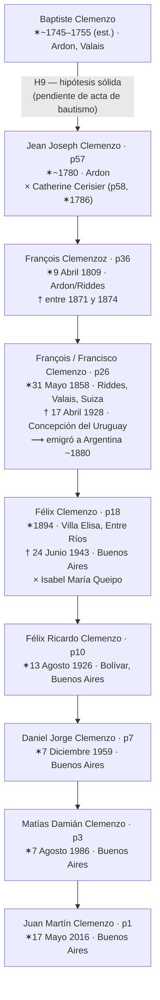

---

## Árbol del Clan Clemenzo

Relaciones documentadas (líneas continuas) e hipotéticas (líneas punteadas) de los Clemenzo de Ardon y Riddes. Se incluye la rama de Jean-Yves — descendientes de Jean Baptiste \*1774, prima lejana de la rama argentina.

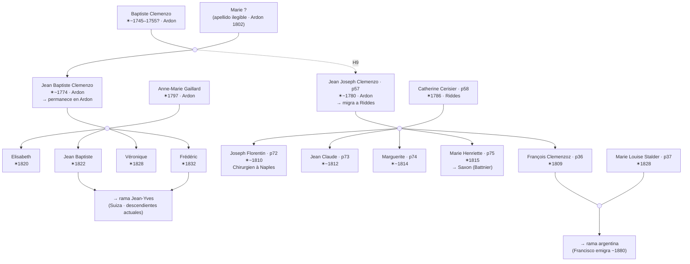

---

## Hipótesis

### H1 — Familia François × Clémence (Ardon 1846) = p36 François Clemenzoz (n. 1809)

El François père de las líneas 109–113 (censo Ardon 1846) tendría ~37 años, coincidiendo con p36. La fille "Marie Josephine" (l.112) encaja con **p77 Joséphine Clemenzo** (nacida 1843), quien tendría 3 años en este censo. "Adolphe" sería un hijo mayor no registrado en el árbol (fallecido joven o emigrado).

La dificultad: el árbol registra a **Marie Louise Stalder (p37, n.1828)** como esposa de p36, pero en el censo figura **Clémence**. Dos posibles explicaciones:
- p36 tuvo un **primer matrimonio con una Clémence** que falleció entre 1846 y 1850. Marie Louise Stalder sería su segunda esposa, lo que explica que los hijos José (n.1856), François (n.1858) y Etienne (n.1862) nazcan muchos años después.
- El **año 1828 de Marie Louise Stalder está errado** en el árbol.

### H2 — Familia Joseph Marie × Marie Josephe (Ardon 1846) = p73 Joseph Marie Clemenzo (n. 1818)

El Joseph Marie père (líneas 96–100) tendría ~28 años en 1846, consistente con p73 (hermano de p36). Su esposa "Marie Josephe" y sus hijos Catherine, Joseph Marie y Jenerique no están registrados en el árbol.

### H3 — Familia François × Anne Catrin (Ardon 1846) = François-Joseph Clemenzoz d'Ardon

El François Conseiller (líneas 92–95) es probablemente el **François-Joseph Clemenzoz d'Ardon** del documento AC Riddes D 10/40 (1854), identificado como un Clemenzoz diferente de p36. Su hijo también llamado François (l.94) sugiere dos generaciones en Ardon.

### H4 — Familia Jean Baptiste × Elsabeth (Ardon 1846) = rama Jean-Yves ✓ CONFIRMADO

El árbol genealógico de Jean-Yves, descendiente directo de esta rama, confirma la identidad con precisión documental:

- **Jean-Baptiste Clemenzo** \* 1774 † 1859 — el "Jean Baptiste" de l.102, con 72 años en 1846
- Sus hijos: Anne-Marie-Elisabeth \*1820, Jean-Baptiste \*1822, Anne-Marie-Véronique \*1828, Frédéric \*1832
  - Los cuatro cruzados con el censo: **4/4 coincidencias de nombre y edad calculada**
- La "Elisabeth" de l.103 (Mère) no coincide con el nombre "Anne-Marie Gaillard" que registra Jean-Yves como esposa de Jean-Baptiste. Posible segundo matrimonio o variante de nombre — pendiente de aclaración.

El "Baptiste" de l.101 es el padre de Jean-Baptiste \*1774, es decir, el mismo **Baptiste Clemenzo** del censo de Ardon 1802 — tendría ~90 años en 1846 y figuraría como patriarca anciano en el hogar de su hijo.

**Jean Joseph** (el otro hijo de Baptiste en 1802) es p57, quien migró a Riddes. La rama de Jean Baptiste permaneció en Ardon. **Baptiste Clemenzo es el ancestro común de ambas ramas.**

**Fuente:** Árbol de Jean-Yves, basado en el *Armorial Valaisan, Sion et Zurich, 1946, p. 63*.

### H5 — p58 no aparece en el censo de Ardon 1846 porque vivía en Riddes ✓ CONFIRMADO

Confirmado por su aparición en el censo de Riddes 1850 (línea 58), donde figura como "Clemenzoz Cerisier / Marie Catherine / 1786", sin marido. Consistente con el documento S 77 (1851), que la llama "veuve de Joseph Clemenzoz de Riddes".

### H6 — Jean Claude Clemenzo (notario, 1773) pudo haber financiado los estudios de Joseph Florentin

Jean Claude Clemenzo (n.1773) aparece listado inmediatamente después del hogar de Jean Joseph (n.1780) en el censo de Riddes 1829. La diferencia de 7 años y la proximidad en el censo sugieren parentesco cercano (¿hermanos?, ¿primos?). Jean Claude era **notario** — educación superior, posición social y recursos considerables.

Joseph Florentin (p72, n.1805) aparece en ese mismo censo como **étudiant en Viena, Austria** — extraordinario para un hijo de laboureur de Ardon. El costo de estudiar en Viena en 1829 superaría los medios de un agricultor. Es plausible que Jean Claude haya facilitado esa oportunidad.

### H7 — "Jeanne" es una hija tardía de p57/p58, nacida después de 1829

En el censo de Riddes 1850 (línea 59) aparece **Jeanne Clemenzoz** con año de nacimiento "1820". Sin embargo, el censo de 1829 lista a los 8 miembros del hogar y Jeanne no está — si hubiera nacido en 1820, tendría 9 años y debería figurar. Nació *después* de 1829, probablemente entre **1830 y 1833**. El "1820" del censo de 1850 es un error del censista. Aparece en Riddes 1846 como "fille majeure" con sus padres, y en 1850 como agricultora con su madre viuda.

### H8 — "Marie Josephine" (1844, Riddes 1850) es p77 Joséphine Clemenzo

El árbol registra a **p77 Joséphine Clemenzo** nacida en 1843 — diferencia de un año, habitual en registros manuscritos. En 1850 Joséphine (~6 años) viviría con su abuela porque su madre había fallecido. Refuerza la H1: la esposa Clémence de p36 murió entre 1846 y 1850, dejando a la niña al cuidado de p58.

### H9 — Jean Joseph fils de Baptiste (Ardon 1802) = posiblemente p57

**Nivel de certeza: hipótesis por nombre + argumento de edad. No confirmada documentalmente pero sólida.**

El censo de Ardon 1802 no consigna años de nacimiento para los hijos. Sin embargo, el censo de Ardon 1829 revela que en Ardon había **dos Jean Joseph Clemenzo simultáneos**:

- **Jean Joseph n.1761** (Conseiller): tenía esposa, hijos adultos y nietos en 1829. En 1802 habría tenido 41 años: imposible que figurara como hijo en el hogar de Baptiste.
- **Jean Joseph n.1780** (p57, Laboureur): en 1802 habría tenido ~22 años — edad perfectamente normal para un hijo joven aún en el hogar paterno.

La existencia de los dos Jean Joseph no debilita la hipótesis sino que la **refuerza por descarte**: el único que puede ser el hijo de Baptiste en 1802 es el nacido en 1780.

| Gen. | Persona | Nacimiento (est.) | Fuente |
|------|---------|-------------------|--------|
| G1   | **Baptiste Clemenzo** | ~1750–1760 | Ardon 1802 |
| G2   | **Jean Joseph Clemenzo** (p57) | 1780 | Riddes 1829 (año) + Ardon 1802 (nombre, sin año) |
| G3   | **François Clemenzoz** (p36) | 1809 | Riddes 1829 |
| G4   | **François Clemenzo** (emigrado) | 1858 | Riddes / Argentina |

Pendiente: acta de bautismo de Jean Joseph en Ardon (~1780) que mencione el nombre del padre.

### H10 — Jacques Cerisier (Riddes 1802) = posible padre de Catherine Cerisier (p58, n.1786)

La entrada del censo de Riddes 1802 muestra a **Jacques Cerisier** con su esposa **Catherine Sillio** y dos hijas, una también llamada "cattherine fls." La denominación "Cerisier — Sillio" sigue el patrón valaisano: apellido del padre × apellido de soltera de la madre. La hija Catherine tendría ~16 años en 1802 si nació en 1786, coincidiendo con p58.

Si la identificación es correcta:
- **Jacques Cerisier** = padre de p58
- **Catherine Sillio** = madre de p58

### H11 — Baptiste Clemenzo = ancestro común de mi línea y la de Jean-Yves ✓ CONFIRMADO INFORMALMENTE

El árbol de Jean-Yves confirma que su ancestro **Jean-Baptiste Clemenzo \*1774** figura en el censo de Ardon 1846 con cuatro hijos perfectamente identificables. Su árbol parte de Gen. II (Jean-Baptiste \*1774), lo que implica que la "Gen. I" no documentada es el padre: **Baptiste Clemenzo**, el patriarca del censo de Ardon 1802.

Del lado de mi línea, Jean Baptiste y Jean Joseph son los dos hijos de Baptiste en el censo de 1802. Jean Joseph migró a Riddes y es p57. Jean Baptiste \*1774 permaneció en Ardon y es el ancestro de Jean-Yves.

- Jean-Baptiste \*1774 (ancestro de Jean-Yves) y Jean Joseph \*1780 (p57, mi ancestro Gen. 7) son **hermanos**, hijos del mismo Baptiste Clemenzo
- Jean-Yves y yo compartimos a **Baptiste Clemenzo** como ancestro común — somos primos lejanos
- Jean-Baptiste \*1774 nació antes que Jean-Joseph \*1780, coherente con ser el hermano mayor

La confirmación documental completa requiere el acta de bautismo de Jean Joseph (~1780, Ardon) que mencione a Baptiste como padre.

**Fuente:** Árbol de Jean-Yves (comunicación personal, 2026). Referencia publicada: *Armorial Valaisan, Sion et Zurich, 1946, p. 63*.

---

## Tareas

- [x] ~~Buscar en recensements.vallesiana.ch el censo de Riddes para localizar a p58~~ → **Encontrada en Riddes 1850, línea 58** (Marie Catherine Cerisier, viuda)
- [x] ~~Leer las lecturas dudosas en la imagen del censo de Ardon 1846~~ → **Confirmado:** l.95 = Chrisenge, l.100 = Jenerique (J clara), l.110 = Clémence, l.111 = Adolphe. Se descubre l.113: fille adicional, nombre ilegible (imagen cortada en borde inferior)
- [ ] Verificar si **Clémence** (l.110) es una primera esposa de p36 — buscar actas de matrimonio y defunción en registros parroquiales de Ardon
- [ ] Buscar acta de defunción de **Clémence** en registros parroquiales de Ardon y Riddes, período 1846–1850
- [ ] Identificar la fille de l.113 (nombre ilegible por corte de imagen) — buscar en registros parroquiales de Ardon junto con Adolphe y Marie Josephine
- [ ] Buscar a **Jeanne Clemenzoz** (nacida post-1829) en registros parroquiales de Ardon/Riddes — confirmar si es hija de p57/p58
- [ ] Confirmar si **Marie Josephine (n.1844, Riddes 1850)** es p77 Joséphine — verificar acta de bautismo circa 1843–1844
- [x] ~~Actualizar el árbol: corregir nombre de p58 a **Marie Catherine Cerisier**~~ → **Hecho** (arbol.db actualizado)
- [ ] Verificar el nombre completo de p57: censos sugieren "Jean Joseph" (1829) o "Joseph" (1846) — confirmar en registros parroquiales
- [ ] Resolver discrepancia de Joseph Florentin: Riddes 1829 dice "Vienne (Autriche)", Ardon 1829 dice "Fribourg en Breisgau" — buscar registros universitarios en ambas ciudades (Universität Wien y Albert-Ludwigs-Universität Freiburg, siglo XIX)
- [x] ~~Buscar a **Joseph Florentin (p72)** en censos posteriores donde aparece solo~~ → **Encontrado:** Riddes 1837 y 1846 (4me Classe — ausentes): **Chirurgien à Naples**; mínimo 9 años en Italia; mantiene burguesía en Riddes
- [x] ~~Investigar al Grupo C (Jean Baptiste + Baptiste) para determinar el parentesco con la línea principal~~ → **Resuelto: Baptiste Clemenzo (Ardon 1802) = padre de Jean Joseph (p57) y de Jean Baptiste (Grupo C)**
- [ ] Buscar acta de bautismo de Jean Joseph Clemenzo (~1780) en registros parroquiales de Ardon — confirmar que el padre es Baptiste Clemenzo (confirmaría H9 y H11)
- [ ] Buscar acta de bautismo de Jean Baptiste Clemenzo (~1774) en registros parroquiales de Ardon — confirmar mismo padre Baptiste (confirmaría H11)
- [x] ~~Compartir hallazgos del censo de Ardon 1802 con Jean-Yves~~ → **Hecho:** su árbol confirma rama Jean-Baptiste; 4/4 coincidencias nombre+edad; H11 prácticamente confirmada
- [x] ~~Consultar el Armorial Valaisan~~ → **Hecho:** dos ediciones analizadas; familia en Ardon desde 1481; Claude-Antoine Clemenchoz vidomnal 1795; Hyacinthe \*1781 hijo de Jean-André, no de Baptiste
- [x] ~~Buscar las memorias de **Hyacinthe Clemenzo (1781–1862)**~~ → **Hecho:** PDF leído (*Souvenirs d'un officier valaisan*, Annales valaisannes 1957); padres confirmados: Jean-André Clemenzo \*1716 × Marie-Marguerite Favre \*1728; Hyacinthe NO es hijo de Baptiste
- [ ] Investigar **Claude-Antoine Clemenchoz, lieutenant vidomnal d'Ardon 1795** — ¿es Baptiste Clemenzo bajo variante de apellido, o un pariente? Buscar en registros parroquiales de Ardon y en el AEV
- [ ] Verificar si **Frédéric (1893–1980)** del Armorial es descendiente de Frédéric \*1832 del árbol de Jean-Yves — confirmaría la continuidad de esa rama hasta el siglo XX
- [ ] Identificar el apellido de "Marie [?]", esposa de Baptiste Clemenzo (Ardon 1802) — buscar en registros parroquiales de Ardon
- [ ] Identificar el apellido completo del esposo de Anne Marie Clemenzo ("Jaque [R?]", Ardon 1802)
- [ ] Buscar a Baptiste Clemenzo en censos anteriores a 1802 o en registros parroquiales de Ardon — determinar año de nacimiento y origen
- [x] ~~Verificar si "Sillio" es un dit-name de Cerisier o familia independiente~~ → **Resuelto: "Cerisier — Sillio" = patrón valaisano, padre Cerisier × madre Sillio**
- [x] ~~Leer imagen censo Riddes 1837~~ → **Hecho:** familia en 1ère Classe (residentes) por primera vez; 6 personas (p57, p58, p74, p75, p76, p36); sin columna de apellido de soltera en este formato
- [x] ~~Leer imagen censo Riddes 1870~~ → **Hecho:** p36 vivo en dic. 1870; p37 nació 5 Mai **1828** ✓; p77 Joséphine en el hogar confirma H8; p26 François con ~12 años
- [x] ~~Verificar año de nacimiento de p37 Marie Louise Stalder~~ → **1828** ✓ — el censo 1870 lo confirma; árbol correcto

---

*Última actualización: 2026-05-10*
