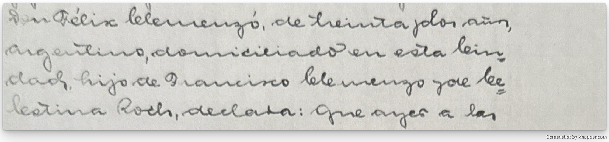
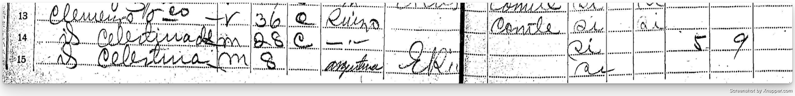
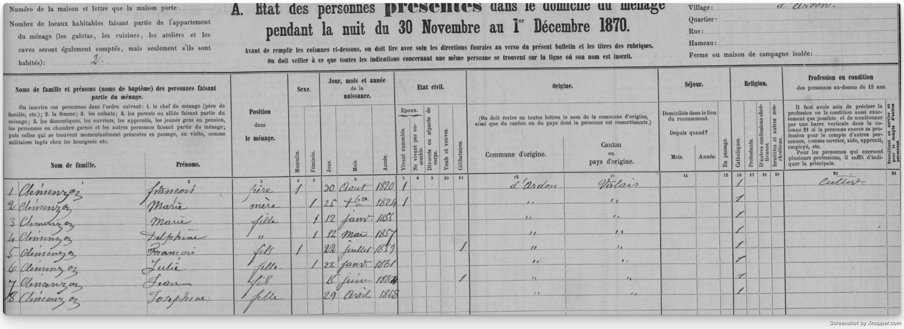
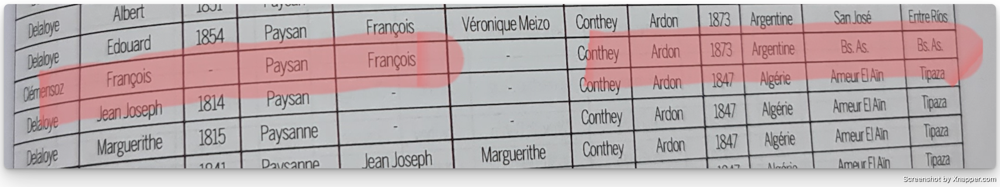
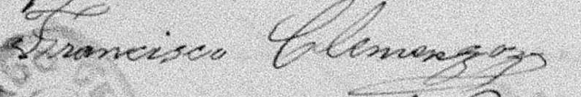

Le nom de Francisco Clemenzo apparaît pour la première fois dans l'acte de naissance de son petit-fils Félix Ricardo Clemenzo.

À partir de ce détail, j'ai réussi à l'identifier au recensement de 1895 dans la province d'Entre Ríos, où il apparaît avec certains de ses enfants.

De ce registre se dégagent certains points :
- Il était d'origine suisse.
- Il déclarait avoir 36 ans en 1895 (bien que cet âge ne correspond pas dans tous les documents).
- Il avait déjà plusieurs enfants à ce moment, et d'autres naîtraient après.

### Les lieux où il a vécu

La documentation trouvée jusqu'à présent situe Francisco dans différents endroits :

- Ardon, Valais, Suisse, autour de 1870 (encore sans certitude qu'il s'agisse de lui) ⁉
- Colonie San José, Entre Ríos, en 1892 ✅
- Colonie Yeruá, Département de Concordia, Entre Ríos, en 1899 ✅
- Concepción del Uruguay, Entre Ríos, en 1928 ✅

<iframe src="mapa-francisco-embed.html" width="100%" height="500" frameborder="0"></iframe>

Je n'ai pas encore trouvé de registre de son arrivée en Argentine. Dans la base du CEMLA (Centre d'Études des Migrations Latinoaméricaines), où figurent généralement les débarquements, ni Francisco ni Celestina n'apparaissent.

> [!NOTE] Prochaines étapes possibles
> Examiner les départs de navires depuis la Suisse ou enquêter sur quels ports utilisaient habituellement les émigrés du Valais.

### L'âge de Francisco

Si nous tenons comme valide l'enregistrement d'Ardon, Francisco serait né le 22 juillet 1859. Cela le situerait à 11 ans au recensement suisse de 1870 et à 14 ans à l'arrivée en Argentine en 1873.

Dans le livre Valaisans émigrés au 19ème siècle de Maurice Carron apparaît un François Clémensoz, originaire d'Ardon, qui aurait quitté pour l'Argentine en 1873.
Si nous acceptons qu'il s'agit de Francisco, cela signifierait qu'il est arrivé dans le pays à 14 ans. Ce détail s'accorderait avec la date de naissance de 1859 et l'âge qu'il a déclaré dans certains documents ultérieurs.
Cependant, je n'ai pas encore trouvé de registre d'embarquement ou d'arrivée qui confirme ce détail, je le considère donc comme une hypothèse probable mais en attente de vérification.

Le document suivant où il réapparaît est l'acte de baptême de León Francisco Clemenzo en 1892, ce qui laisse un vide d'environ vingt ans sans registres.

Au recensement de 1895, Francisco déclare avoir 36 ans, ce qui correspond à une naissance vers 1859. Cependant, en 1897, avec la naissance de sa fille Luisa, il déclare à nouveau avoir 36 ans.

Enfin, à sa mort en 1928, l'acte de décès indique qu'il avait 72 ans, trois de plus que ceux qui correspondraient si nous acceptons 1859 comme année de naissance.

Tous ces détails peuvent être vérifiés dans le dossier de François Clemenzo, à la fois dans sa galerie et dans ses mentions.

> [!NOTE] À propos de l'âge
> Les contradictions d'âges sont très courantes en généalogie. Les protagonistes eux-mêmes ne se souvenaient pas toujours exactement de leurs dates.

### Les variations du nom de famille

Un autre point frappant sont les variations du nom de famille dans différents registres :

- Clemenzo
- Clemence
- Clemenso
- Clemenceau

Malgré ces formes, Francisco signait comme Clemenzoz.

En français, le z final se prononce très légèrement, presque comme un s, ce qui peut expliquer la confusion. Cependant, au recensement suisse de 1870, le nom de famille apparaît clairement comme Clemenzo.

Dans une conversation avec un possible parent éloigné, il a mentionné qu'un ancêtre né en Valais avait changé son nom en Clemenso après avoir vécu en France. Cela m'a servi d'exemple que les variations de noms de famille n'étaient pas exceptionnelles.

> [!NOTE] Questions ouvertes sur Francisco
> Il reste encore plusieurs questions sans réponse :
> Pourquoi n'apparaissent pas les registres de naissance ou de baptême de tous ses enfants ?
> Quelle était sa vraie occupation ? Certains documents le mentionnent comme laboureur et d'autres comme charpentier.
> Pourquoi n'a-t-il pas pu s'établir dans une colonie ?
> Comment est-il arrivé en Argentine et en quelle année exactement ?
