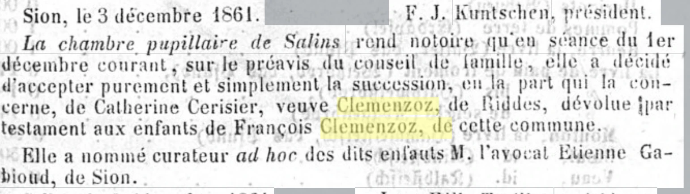
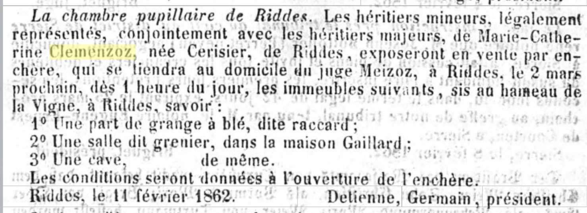
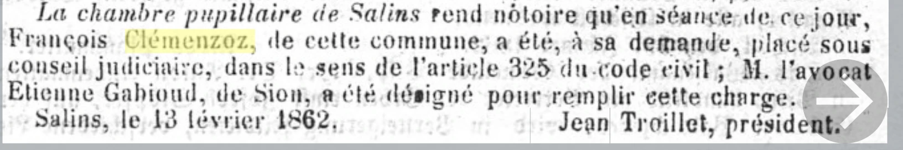
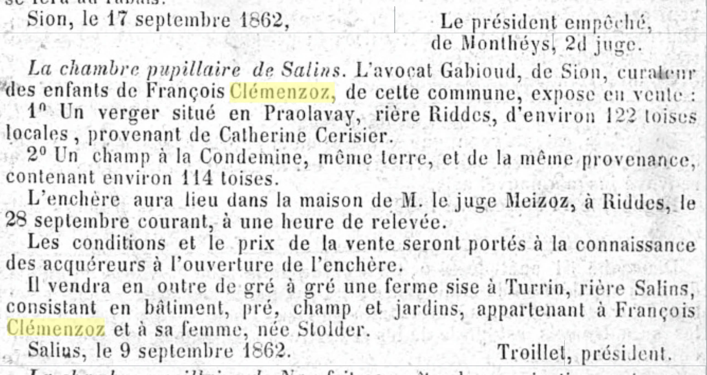
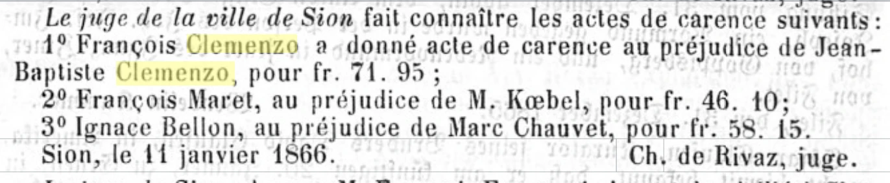

# La ruina de François

Hay historias familiares que se transmiten, y otras que quedan enterradas en la letra chica de los periódicos. Esta es de las segundas. Entre diciembre de 1861 y enero de 1866, la *Gazette du Valais* —el periódico que publicaba los avisos judiciales del cantón— registró cinco veces el apellido Clemenzoz. Leídos en orden, los cinco avisos cuentan una sola historia: la desintegración del patrimonio de **François Clemenzoz** (1809–c.1873), el padre del Francisco que años después emigraría a Argentina.

Los avisos aparecieron buscando el apellido en [e-newspaperarchives.ch](https://www.e-newspaperarchives.ch/), la hemeroteca digital de la prensa histórica suiza. Son textos breves, burocráticos, sin un gramo de drama intencional. Y justamente por eso impresionan: nadie está contando una tragedia, solo publicando edictos. La tragedia se arma sola al ponerlos en fila.

**Los protagonistas**, para quien llega sin contexto: Jean Joseph Clemenzo y Catherine Cerisier, un matrimonio de Riddes, tuvieron seis hijos. Uno de ellos, François, se casó con Marie Louise Stalder y se estableció en Salins, un pueblo de montaña sobre Sion. Entre sus hijos estaba Francisco (n. 1858), el tatarabuelo del autor, que emigró a Argentina en 1873 con 15 años.

---

## Primer aviso — el testamento que salta una generación

*Gazette du Valais, 8 de diciembre de 1861.*

_Gazette du Valais, 8-12-1861: la cámara pupilar de Salins acepta la sucesión de Catherine Cerisier_
> *La cámara pupilar de Salins hace saber que en sesión del 1.° de diciembre corriente, a propuesta del consejo de familia, ha decidido aceptar pura y simplemente la herencia, en la parte que le corresponde, de Catherine Cerisier, viuda Clemenzoz, de Riddes, legada por testamento **a los hijos de François Clemenzoz**, de esta comuna. Ha nombrado curador ad hoc de dichos hijos al abogado Etienne Gabioud, de Sion.*

Catherine Cerisier, la viuda de Jean Joseph, había muerto. Y su testamento hace algo llamativo: no deja sus bienes a su hijo François, sino que **salta una generación** y los lega directamente a los nietos — que en ese momento eran tres: Josephine (18 años), José (5) y Francisco (3).

¿Por qué una madre desheredaría de hecho a su hijo en favor de los nietos? El testamento no lo dice y no hay que ponerle palabras a una mujer que murió hace más de 160 años. Pero el segundo acto de esta historia, diez semanas después, vuelve difícil no hacerse la pregunta.

Como los herederos eran menores, la cámara pupilar de Salins —el órgano comunal que protegía los intereses de huérfanos y menores— les nombró un curador: el abogado Etienne Gabioud, de Sion. Conviene retener el nombre, porque va a reaparecer.

## Segundo aviso — la subasta del caserío de la Vigne

*Gazette du Valais, 16 de febrero de 1862.*

_Gazette du Valais, 16-02-1862: subasta de los inmuebles de Marie-Catherine Clemenzoz née Cerisier_
> *Los herederos menores, legalmente representados, conjuntamente con los herederos mayores, de Marie-Catherine Clemenzoz, nacida Cerisier, de Riddes, expondrán en venta por subasta [...] los inmuebles siguientes, sitos en el caserío de la Vigne, en Riddes: 1.° una parte de granero para cereales, llamada* raccard*; 2.° una sala llamada granero, en la casa Gaillard; 3.° una bodega, ídem.*

La liquidación de la herencia. Los «herederos mayores» son los seis hijos adultos de Catherine; los «menores, legalmente representados» son los nietos del testamento, con Gabioud como representante.

El inventario merece una pausa, porque retrata la propiedad rural valesana del siglo XIX: no se subasta un granero, sino **una parte** de un *raccard* (el granero de madera sobre pilotes típico del Valais); no una casa, sino *una sala* dentro de la casa de otra familia, y una bodega en la misma casa ajena. Generación tras generación de particiones hereditarias habían fragmentado la propiedad hasta el punto de que una familia podía ser dueña de un cuarto de granero y un sótano en la casa del vecino. Ese minifundio extremo — el *morcellement* — es una de las claves económicas del Valais de la época, y uno de los motores de la emigración.

## Tercer aviso — François pide su propia curatela

*Gazette du Valais, 23 de febrero de 1862.*

_Gazette du Valais, 23-02-1862: François Clemenzoz colocado bajo consejo judicial a su propia solicitud_
> *La cámara pupilar de Salins hace saber que en sesión del día de hoy, François Clémenzoz, de esta comuna, ha sido, **a su propia solicitud**, colocado bajo consejo judicial, en el sentido del artículo 325 del código civil; el abogado Etienne Gabioud, de Sion, ha sido designado para desempeñar esta función.*

Este es el documento central de la serie. El 13 de febrero de 1862 —diez semanas después de la muerte de su madre, dos días después de que se anunciara la subasta de la herencia— François se presentó ante la cámara pupilar de Salins y pidió que lo pusieran bajo **consejo judicial**: una curatela de asistencia por la cual no podía firmar contratos ni disponer de bienes sin la aprobación de un consejero. El artículo 325 del código civil valesano la preveía para pródigos y malos administradores. Es menos severa que la interdicción total, pero su efecto es claro: François perdía el manejo de su economía. Y el consejero designado fue el mismo Gabioud que ya cuidaba la herencia de sus hijos — todo el patrimonio familiar quedaba bajo el control de un solo abogado de Sion.

Lo que el aviso no dice es **por qué**. ¿Deudas? ¿Alcohol? ¿Enfermedad? ¿Una estrategia legal para protegerse de acreedores? ¿Una imposición familiar maquillada de pedido voluntario? Las causas posibles son muchas y la fuente no autoriza ninguna. Lo único documentado es la secuencia: la madre lega saltando a su hijo, y el hijo —semanas después— pide formalmente que le administren la vida.

Un detalle humano que sí está documentado: **doce días después de ese trámite nació Etienne, su hijo menor**. Cuando François caminó hasta la cámara pupilar a entregar el control de sus bienes, su mujer cursaba el último mes de embarazo.

## Cuarto aviso — se vende todo

*Gazette du Valais, 21 de septiembre de 1862.*

_Gazette du Valais, 21-09-1862: venta de la herencia de los niños y de la granja de Turrin_
> *El abogado Gabioud, de Sion, curador de los hijos de François Clémenzoz, de esta comuna, expone en venta: 1.° un vergel situado en Praolavay, término de Riddes, de unas 122 toesas locales, procedente de Catherine Cerisier; 2.° un campo en la Condemine, misma tierra, de la misma procedencia, de unas 114 toesas. [...] Venderá además, por trato directo, **una granja sita en Turrin, término de Salins, consistente en edificio, prado, campo y jardines, perteneciente a François Clémenzoz y a su mujer, nacida Stolder**.*

Siete meses después del consejo judicial, Gabioud liquida en un solo aviso dos patrimonios distintos:

- **La herencia de los niños**: el vergel de Praolavay y el campo de la Condemine, en Riddes, «procedentes de Catherine Cerisier». Las parcelas eran chicas — 122 y 114 toesas locales, del orden de unos cientos de metros cuadrados cada una. La abuela había querido que esos bienes llegaran a sus nietos; sus nietos los tuvieron unos nueve meses.
- **La granja familiar**: en Turrin, un caserío de Salins. Edificio, prado, campo y jardines — una explotación completa, el hogar de la familia. El aviso la describe como perteneciente «a François Clémenzoz y a su mujer, nacida Stolder»: era un bien del matrimonio, y de paso este aviso es la primera fuente primaria que confirma el apellido de Marie Louise Stalder.

Para el rastreo genealógico, esa frase final vale oro. Para la historia familiar, es el punto de no retorno: después de septiembre de 1862, la familia de François ya no tenía granja propia.

## Quinto aviso — 71 francos con 95

*Gazette du Valais, 14 de enero de 1866.*

_Gazette du Valais, 14-01-1866: acto de carencia entre François y Jean-Baptiste Clemenzo_
> *El juez de la ciudad de Sion da a conocer los siguientes actos de carencia: 1.° François Clemenzo dio acto de carencia en perjuicio de Jean-Baptiste Clemenzo, por fr. 71,95 [...]*

Cuatro años después, el epílogo. Un «acto de carencia» certifica que un embargo fracasó: se buscaron bienes para cobrar una deuda y no se encontró nada embargable. La fórmula del aviso es ambigua sobre quién debía a quién — la lectura más coherente con todo lo anterior es que François era el deudor insolvente, aunque queda pendiente confirmar la convención de la época. En cualquier caso, el monto habla solo: el conflicto judicial es por **71 francos con 95 céntimos**. De la granja con prado, campo y jardines a un embargo infructuoso por el precio de unas semanas de jornal.

El otro nombre del aviso también es de la familia: **Jean-Baptiste Clemenzo**. Un Jean-Baptiste hermano de Jean Joseph —y por lo tanto tío de François— está documentado en los censos de principios de siglo, aunque para 1866 tendría más de 90 años, así que este podría ser un descendiente homónimo de esa rama. Si es así, la ironía es notable: las dos ramas de la familia que hoy se reencuentran a través de la genealogía se cruzaron por última vez en un juzgado, por 72 francos.

---

## La geografía de la ruina

Los cinco avisos dibujan un mapa. Todos los puntos caben en unos 20 kilómetros del valle del Ródano y sus laderas:

| Lugar | Qué es | Qué pasó ahí |
|---|---|---|
| **Riddes** (~480 m, valle) | Comuna de origen de Catherine Cerisier | Sus inmuebles: el caserío de **la Vigne** (raccard, sala, bodega), el vergel de **Praolavay**, el campo de **la Condemine** |
| **Salins** (~1.000 m, montaña sobre Sion) | Comuna de François y de los Stalder | La cámara pupilar que tramitó todo; la granja familiar en el caserío de **Turrin** |
| **Ardon** (~500 m, valle) | Burguesía ancestral de los Clemenzo; ahí nació François en 1809 | El punto de partida de la familia |
| **Sion** (~500 m, capital) | Sede del abogado Gabioud y del juez del acto de carencia | Donde se administró y se liquidó todo |

La familia vivía repartida entre dos pisos del paisaje: los bienes heredados de los Cerisier estaban abajo, en la llanura de Riddes; la vida cotidiana y la granja estaban arriba, en Salins. Riddes y Salins están a unos 16 kilómetros y 500 metros de desnivel — dos mundos que el matrimonio de Jean Joseph (de la órbita de Ardon/Riddes) con los bienes de Salins había conectado. Que la granja de Turrin fuera un bien *del matrimonio* François–Stalder, y que los Stalder fueran una familia establecida de Salins, sugiere que esa granja pudo venir por el lado de ella — aunque esto es hipótesis, no dato.

## El Valais de 1860, o por qué esto no es (solo) una historia personal

Sería fácil leer estos avisos como el retrato de un hombre que fracasó. Conviene resistir la tentación, porque el contexto era brutal:

- **El minifundio hereditario.** La partición igualitaria entre herederos, repetida durante generaciones sobre un territorio de montaña, había pulverizado la propiedad. La «parte de raccard» de la subasta de 1862 no es una anécdota: es el sistema. Parcelas de 100 toesas no alimentaban a una familia.
- **El río.** La llanura del Ródano —donde estaban los bienes de Riddes— era una zona de pantanos e inundaciones recurrentes. La gran crecida de septiembre de 1860 devastó el valle pocos meses antes del primer aviso de esta serie; la corrección sistemática del Ródano recién empezó en 1863.
- **La emigración ya había empezado.** La colonia San José, en Entre Ríos, había sido fundada en 1857 — en buena parte por valesanos. Cuando François entregaba su granja, vecinos de Ardon y Riddes ya escribían cartas desde Argentina. La válvula de escape estaba abierta y era conocida.

En ese marco, la insolvencia de un campesino de Salins con seis bocas que alimentar no necesita explicaciones extraordinarias. Las causas posibles —malas cosechas, deudas heredadas, mala administración, salud, el río— son demasiadas para elegir una sin evidencia. Lo que los avisos documentan no es el porqué, sino el resultado.

## Epílogo: lo que quedó

| Año | Hecho |
|---|---|
| 1851–1861 | Muere Catherine Cerisier; su testamento intenta blindar a los nietos |
| 1862 | Consejo judicial para François; se subasta la herencia y se vende la granja de Turrin |
| 1866 | Acto de carencia por 71,95 francos |
| ~1871–1874 | Muere François; en enero de 1874 un tutor vende la última tierra de los huérfanos, en Chassoure |
| **1873** | **Francisco, de 15 años, figura en el registro de emigrados rumbo a «Argentine, Bs. As.»** |
| 1905 | El tribunal de Conthey liquida los últimos bienes en Riddes y gira a Buenos Aires, vía el Consulado de Suiza, 829,25 francos para Francisco y 200,75 para su hermano Etienne |

Francisco emigró sin patrimonio: todo lo que su abuela había intentado preservar para él se había vendido cuando tenía cuatro años. Pero el lazo con el Valais no se cortó del todo — cuarenta y tres años después de la muerte de Catherine, los últimos francos de aquella historia cruzaron el Atlántico en una transferencia consular. Para entonces Francisco era un carpintero de Entre Ríos con hijos argentinos, y la granja de Turrin, el raccard de la Vigne y los 71,95 francos eran exactamente lo que son hoy: letra chica en un periódico viejo, esperando que alguien la lea.

---

## Fuentes

- *Gazette du Valais*, Vol. 7 N.° 98 (8-12-1861); Vol. 8 N.° 14 (16-02-1862), N.° 16 (23-02-1862), N.° 76 (21-09-1862); Vol. 12 N.° 4 (14-01-1866). Digitalizadas en [e-newspaperarchives.ch](https://www.e-newspaperarchives.ch/).
- Censos del Valais 1829–1880 (recensements.vallesiana.ch) y árbol genealógico del sitio — fichas de [François p36](../../arbol.html?focus=p36), [Catherine Cerisier p58](../../arbol.html?focus=p58) y [Francisco p26](../../arbol.html?focus=p26).
- Carta del Tribunal de Conthey, 4-02-1905 (archivo familiar).
- Transcripciones completas y análisis documental en la ficha de investigación `gazette-valais-1861-1866.md`.
