## Les années en Suisse - Jusqu'à 1870

**Recensement de Riddes de 1870**

Francisco, ainsi que ses frères José et Etienne, apparaissent au recensement de 1870, enregistrés comme résidents de **Riddes** (spécifiquement dans le hameau de Villy), avec ses parents François Clemenzoz et Marie Stalder.

À partir de ce recensement, on peut extraire quelques dates importantes :

- **François Clemenzoz** : 9 avril 1809
- **Marie Stalder** : 15 juin 1828
- **José Clemenzo** : 5 mai 1856
- **Francisco Clemenzo** : 31 mai 1858
- **Etienne Clemenzo** : 25 février 1862

En outre, **Joséphine Clemenzo**, née le 19 mars 1843, figure comme mère célibataire. Elle a eu les filles suivantes :

- **Anaïs Clemenzo**
- **Edwige Clemenzo**

Les communes d'origine sont :

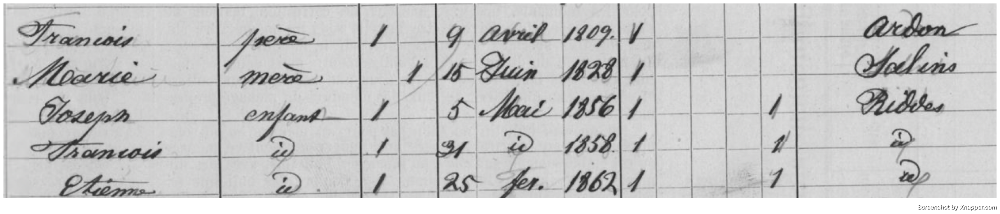

**Villy, Riddes**

La partie supérieure de la feuille du recensement nous donne la localisation de la famille :

*Plan de Villy*

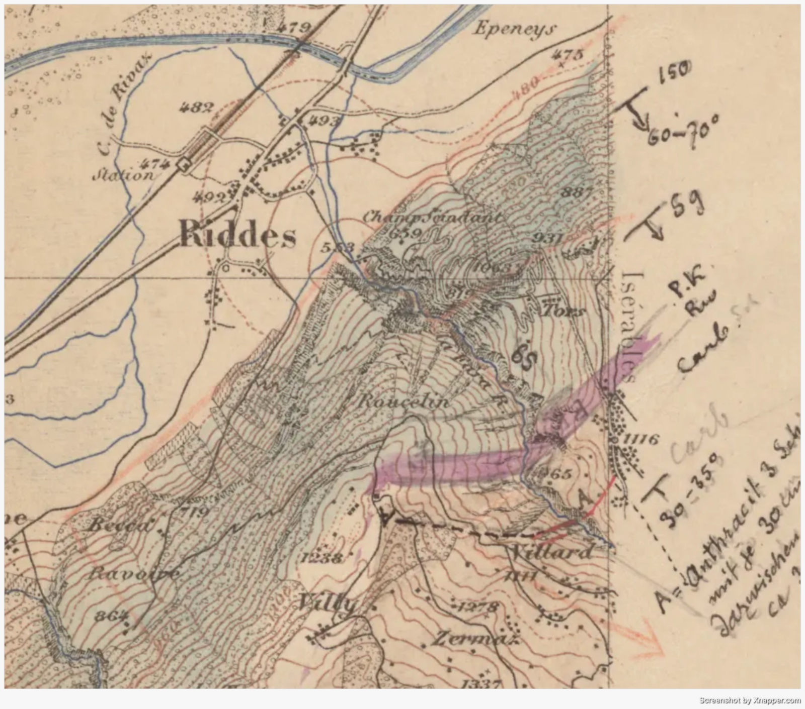
*Carte de Riddes de 1890, on peut voir la zone de Villy*

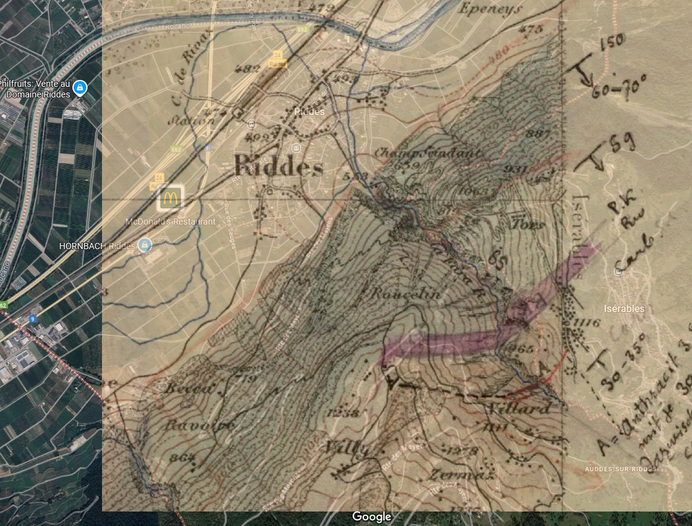
*Superposition de l'ancienne carte de Villy sur Google Maps*

**Documents en Argentine**. Il existe divers recensements, actes et registres avec sa signature, disponibles [ici](../../archivo.html). Parmi eux, je mets en avant le suivant :

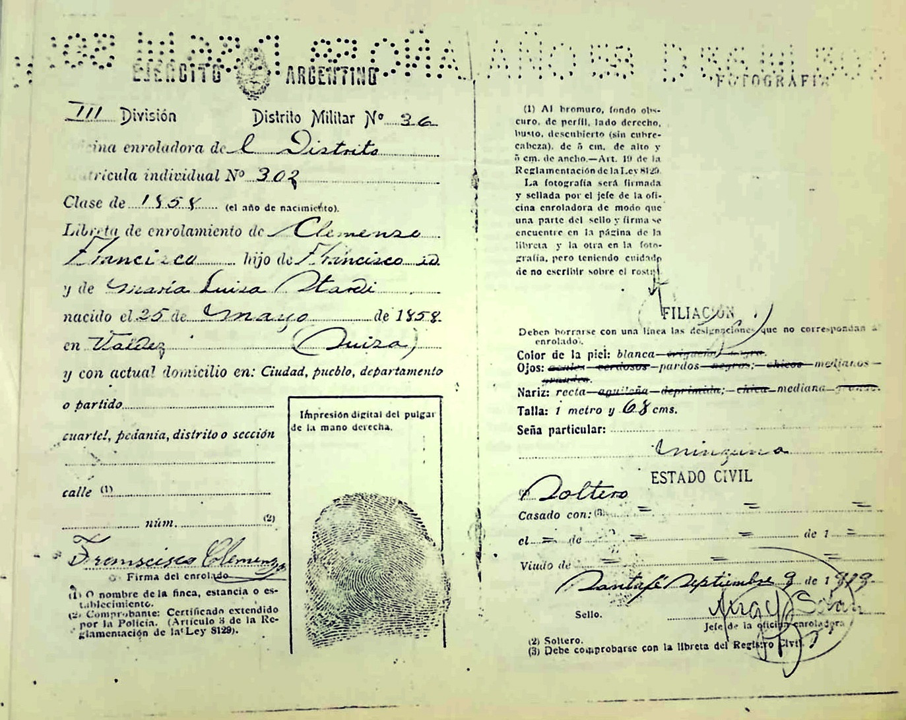

Dans ce document, on vérifie les noms des parents : François Clemenzoz et **Maria Luisa Stalder** (dans certaines sources apparaît comme Stardi). Le document est daté de 1919 et Francisco y figure comme célibataire.

## Années en Argentine

### Entre Ríos

**1873**

Selon le livre *Valaisans émigrés au XIXe siècle* de Maurice Carron

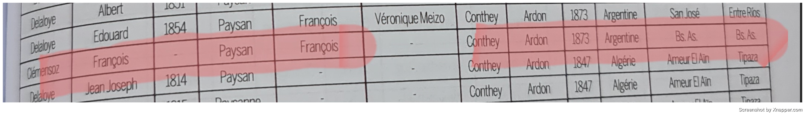
*Un Francisco Clemenzoz est mentionné, originaire de Conthey, Ardon, qui arrive en 1873.*

D'autre part, dans _La Colonie San José et l'Immigration Européenne_ de Celia A. Vernaz apparaît un Clemenzoz arrivé depuis **Riddes, Valais**, qui est exactement l'origine de la famille Clemenzoz. Cependant, l'année n'est pas enregistrée.

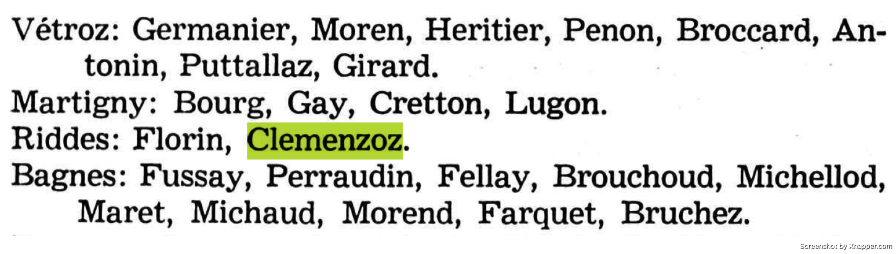

Pourrait-il s'agir de la même personne ? Peut-être que Francisco est né à Conthey et a vécu à Riddes, ou vice-versa.

Selon Google Maps, Ardon est situé à seulement une heure de Riddes, il ne serait donc pas étrange que dans différents documents l'un ou l'autre endroit soit mentionné :

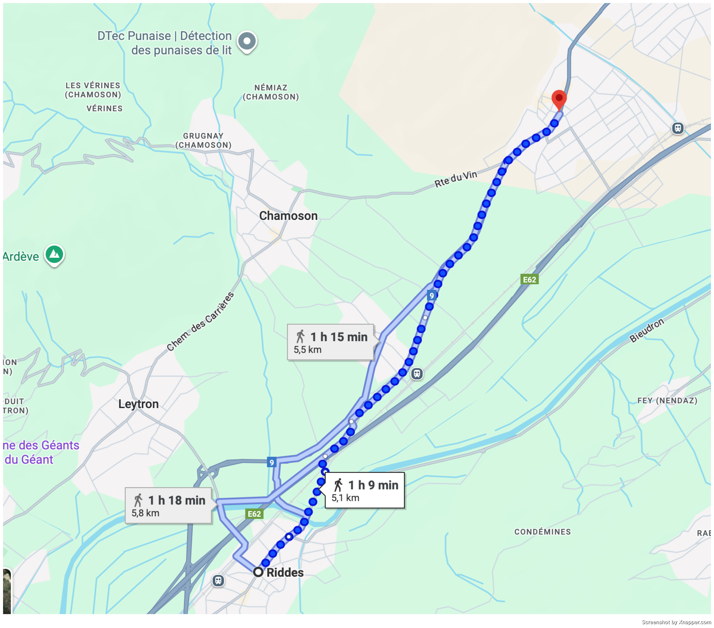

**1892**

La première preuve documentaire avec la signature de Francisco en Argentine correspond à l'acte de naissance de son fils **León Francisco**, né en 1891 :

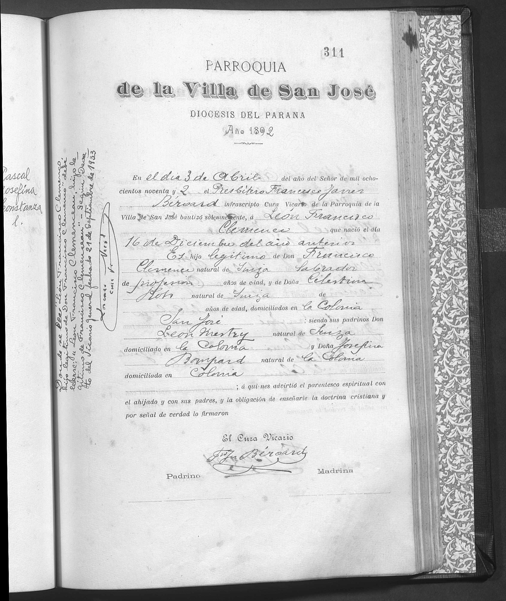

Ceci nous laisse quelques questions :

- En 1891, Francisco avait déjà connu **Celestina Roh**.
- Il était domicilié à la **Colonie San José, Entre Ríos**.
- Il existe un laps de **19 ans sans registres** de Francisco.

À partir de là surgissent plusieurs questions :

1. Francisco et Celestina se sont-ils rencontrés à **Santa Fe** et ont-ils voyagé ensemble à Entre Ríos ?
2. Francisco était-il déjà à **Entre Ríos** et a-t-il connu Celestina quand elle a déménagé avec sa famille de Santa Fe ?
3. Se connaissaient-ils auparavant en **Suisse** et sont-ils arrivés ensemble à Santa Fe ?
4. Étant donné que Celestina est venue avec sa famille, est-il possible que Francisco l'ait aussi fait ?
5. Pourrait-ce être le **père de Francisco** qui apparaît dans les livres de la Colonie ?
6. Pourquoi n'existe-t-il pas de registres clairs de la **famille complète** ?

Quant à la famille de Francisco, il existe une lettre de 1905 du tribunal de Conthey, concernant un héritage, où est mentionné **Etienne**, un frère de Francisco :

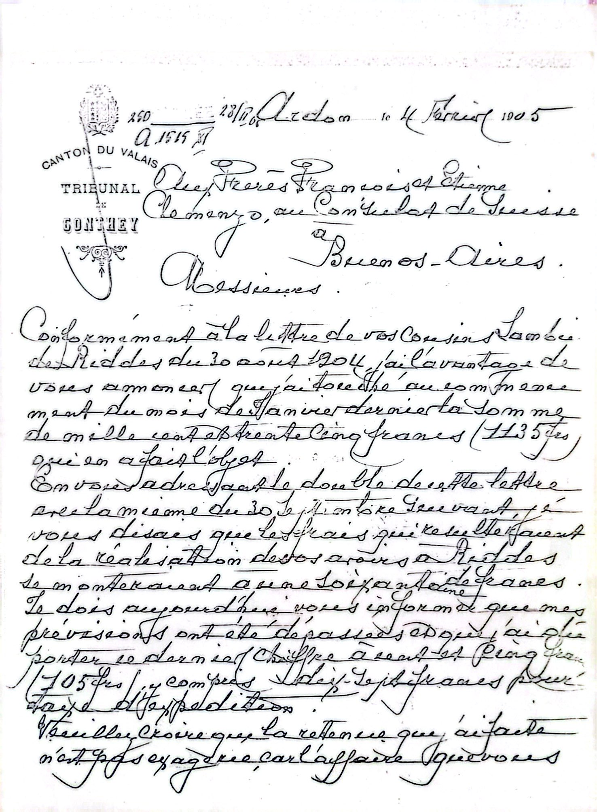

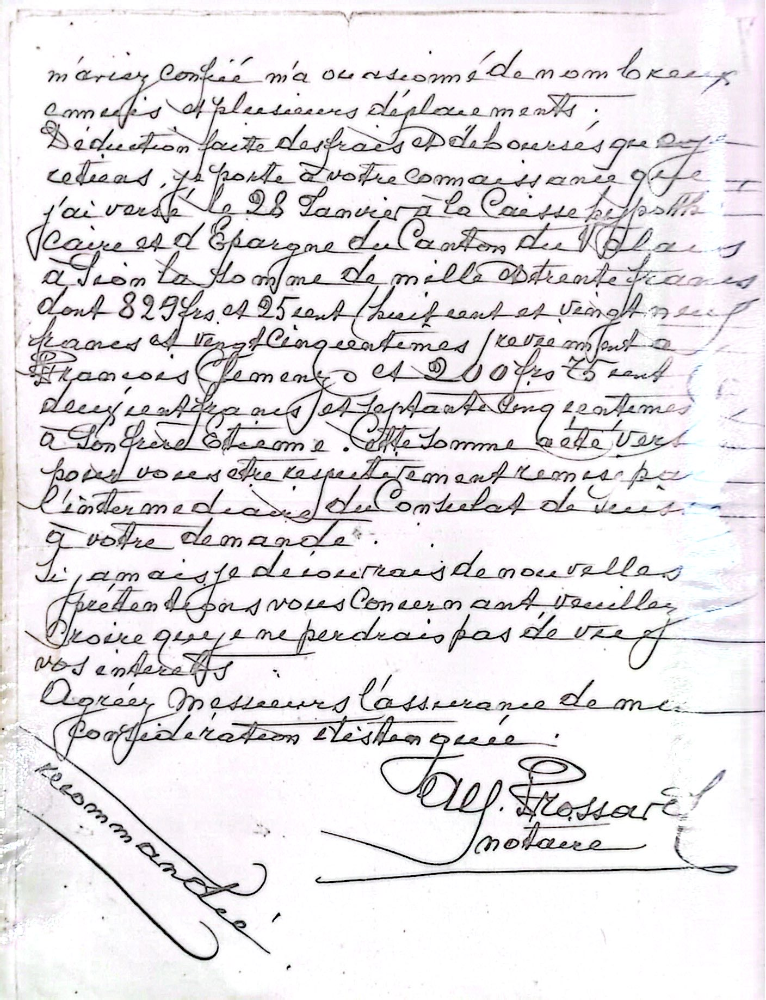

Ceci a mené à l'hypothèse qu'Etienne Clemenzo pourrait être **Esteban Clemenzoz**, qui a plusieurs registres sur FamilySearch. Parmi eux, on retrouve ce qui suit :

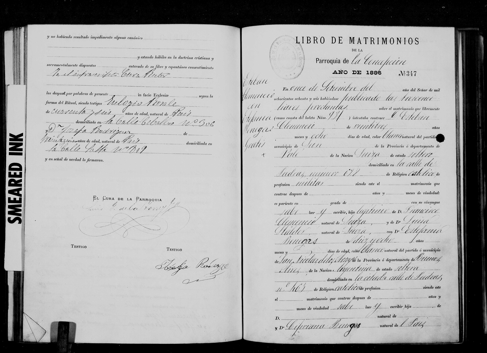

Ceci confirme que **Esteban Clemenzoz et Francisco Clemenzo étaient frères**, tous deux fils de François Clemenzoz et Marie Luisa Stalder.

Revenant aux enfants de Francisco à Entre Ríos, nous avons :

- Celestina Clemenzo (probable fille de Celestina, antérieure à sa rencontre avec Francisco)
- León Francisco Clemenzo (1891)
- Francisca Clemenzo (inconnue)
- Pedro Clemenzo (inconnue)
- Félix Clemenzo (1894)
- María Luisa Clemenzo (1897)
- Carlota Julia Clemenzo (1899)

Francisca Clemenzo et Pedro Clemenzo figurent au recensement de Colón de 1895, parmi les cinq enfants que Francisco et Celestina déclaraient avoir jusqu'à ce moment :

![[FJHC_1859_censo1895_1.jpg]]

![[FJHC_1859_censo1895_2.jpg]]

Dans ce document apparaît un fils nommé Francisco, que j'interprète comme **León Francisco Clemenzo**.

Le cinquième enfant n'est pas listé, mais j'estime qu'il s'agit de **Félix Clemenzo**, né en 1894.

En conclusion, selon les documents trouvés, Francisco s'est établi à Entre Ríos au moins en 1892 et y a résidé jusqu'au moins 1899, année de la naissance de sa dernière fille, Carlota.

### Santa Fe

**1919**

La référence documentaire suivante correspond au registre militaire de 1919, qui situe Francisco à Santa Fe :

![[FJHC_1859_militar_1.jpeg]]

![[FJHC_1859_militar_2.jpeg]]

![[FJHC_1859_militar_3.jpeg]]

![[FJHC_1859_militar_4.jpeg]]

### Retour à Entre Ríos

**1928**

Enfin, l'acte de décès de Francisco en 1928 confirme qu'il était à **Concepción del Uruguay, Entre Ríos**.

![[FJHC_1859_defuncion.jpg]]

Tous les documents peuvent être consultés en détail en cliquant [ici](../../archivo.html#/francois-clemenzo).

## Observations

- Entre son arrivée (1873) et le premier registre à Entre Ríos (1891), il y a **près de deux décennies sans traces claires**.
- Il n'est pas totalement défini s'il est parti de **Conthey, Ardon ou Riddes**, car les sources mentionnent des endroits différents, bien que proches.
- Les enfants apparaissent de manière fragmentée dans différents recensements et actes, ce qui ouvre la possibilité qu'il existe encore des registres non localisés.

---

> Merci
> Il y a quelques années, je ne connaissais que le nom de mon grand-père ; aujourd'hui je peux remonter jusqu'à mon arrière-arrière-grand-père. Tout a aidé : les conversations, les voyages avec mon père et toutes ces personnes qui ont dû m'écouter parler de généalogie, de registres et de documents.
> Sans la collaboration de Gustavo Clemenzo, je n'aurais pas pu confirmer beaucoup de choses que je sais maintenant avec certitude ; il m'a partagé des documents clés.
> Un remerciement très spécial à Jean-Yves, pour sa grande amabilité d'avoir consacré son temps à chercher un registre pour moi à Sion, simplement dans l'intention de m'aider.
> Les conversations avec Lucía Magallanes ont aussi été très précieuses, car elle m'a fait remarquer des détails que j'avais négligés.
> Et à Hernán, qui m'a aidé à l'édition de beaucoup d'images.
