## Los años en Suiza - Hasta 1870

**Censo de Riddes de 1870**

Francisco, junto a sus hermanos José y Esteban, aparecen en el censo de 1870, registrados como residentes en **Riddes** (específicamente en la aldea de Villy), junto a sus padres François Clemenzoz y Marie Stalder.

A partir de este censo se pueden extraer algunas fechas importantes:

- **François Clemenzoz**: 9 de abril de 1809
    
- **Marie Stalder**: 15 de junio de 1828
    
- **José Clemenzo**: 5 de mayo de 1856
    
- **Francisco Clemenzo**: 31 de mayo de 1858
    
- **Esteban Clemenzo**: 25 de febrero de 1862
    

Además, aparece **Josephine Clemenzo**, nacida el 19 de marzo de 1843, registrada como madre soltera. Ella tuvo las siguientes hijas:

- **Anaïs Clemenzo**
    
- **Edwige Clemenzo**

Las comunas de origen son:

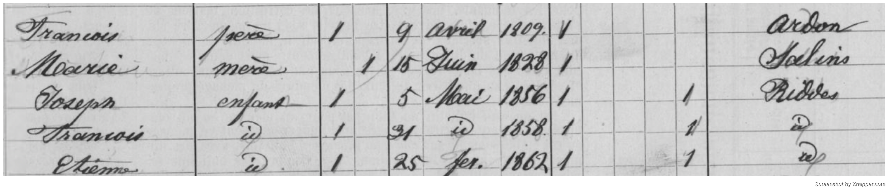

**Villy, Riddes**

La parte superior de la planilla del censo nos da la localización de la familia:

*Plan de Villy*

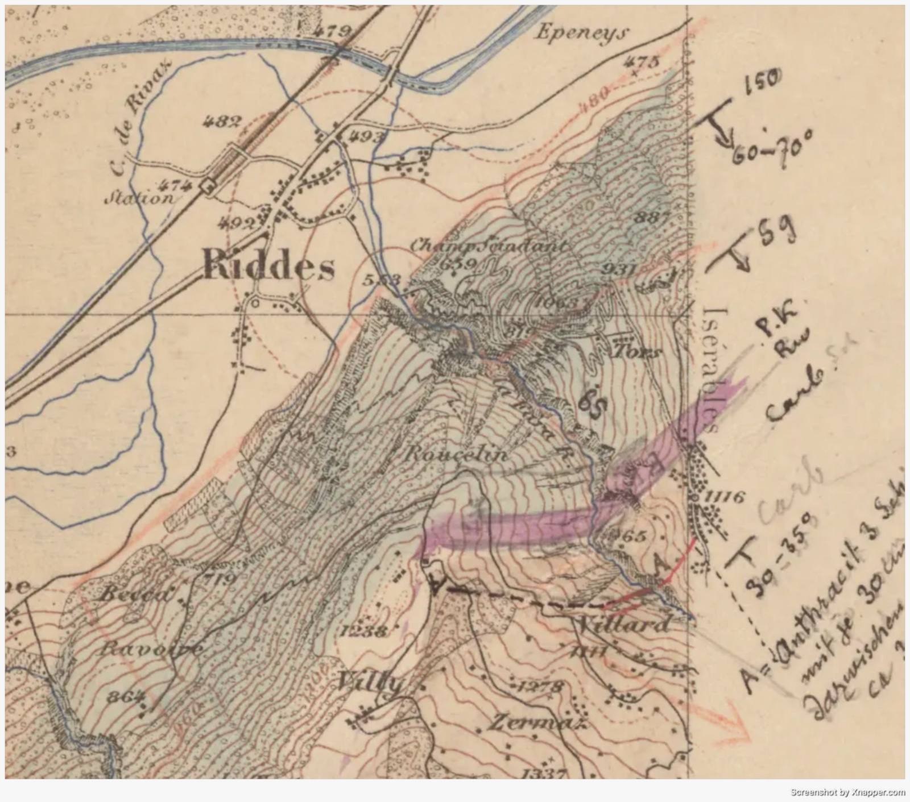
*Mapa de Riddes de 1890, se aprecia la zona de Villy*

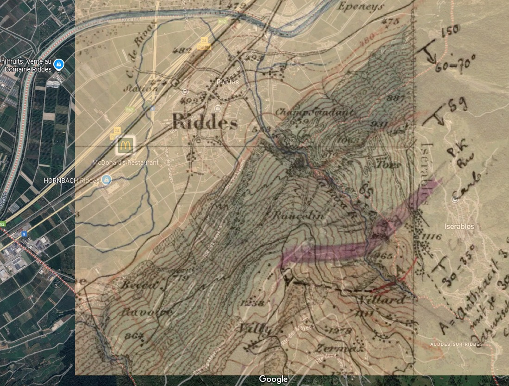
*Superposción del antiguo mapa de Villy con Google Maps*

**Documentos en Argentina**. Existen diversos censos, actas y registros con su firma, disponibles [aquí](https://cmzo.github.io/web-genealogia/archivo.html). Entre ellos destaco el siguiente:

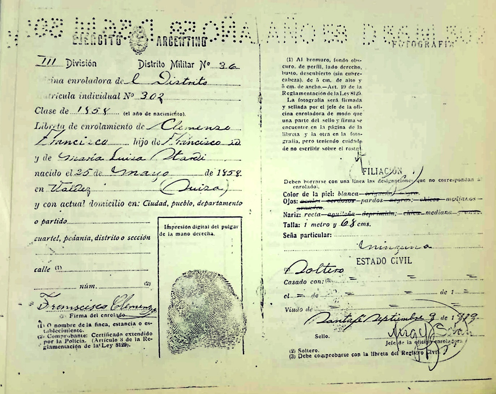

En este documento se verifican los nombres de los padres: François Clemenzoz y **Maria Luisa Stalder** (en algunas fuentes aparece como Stardi). El documento está fechado en 1919 y Francisco figura como soltero.

## Años en Argentina

### Entre Rios

**1873**

Según el libro *Valaisans émigrés au XIXe siècle* de Maurice Carron

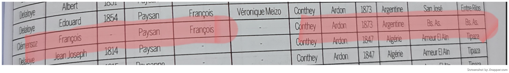
*Se menciona a un Francisco Clemenzoz, originario de Conthey, Ardon, que llega en 1873.* 

Por otro lado, en _La Colonia San José y la Inmigración Europea_ de Celia A. Vernaz aparece un Clemenzoz llegado desde **Riddes, Valais**, que es el origen exacto de la familia Clemenzoz. Sin embargo, no consta el año.

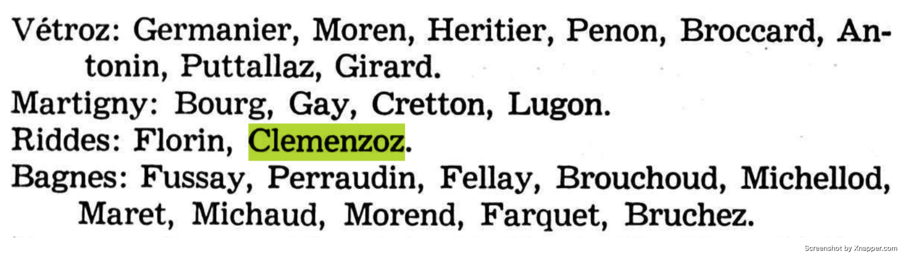

¿Podría tratarse de la misma persona? Tal vez Francisco nació en Conthey y vivió en Riddes, o viceversa.

Según Google Maps, Ardon se encuentra a solo una hora de Riddes, por lo que no sería extraño que en distintos documentos se mencionara uno u otro lugar:

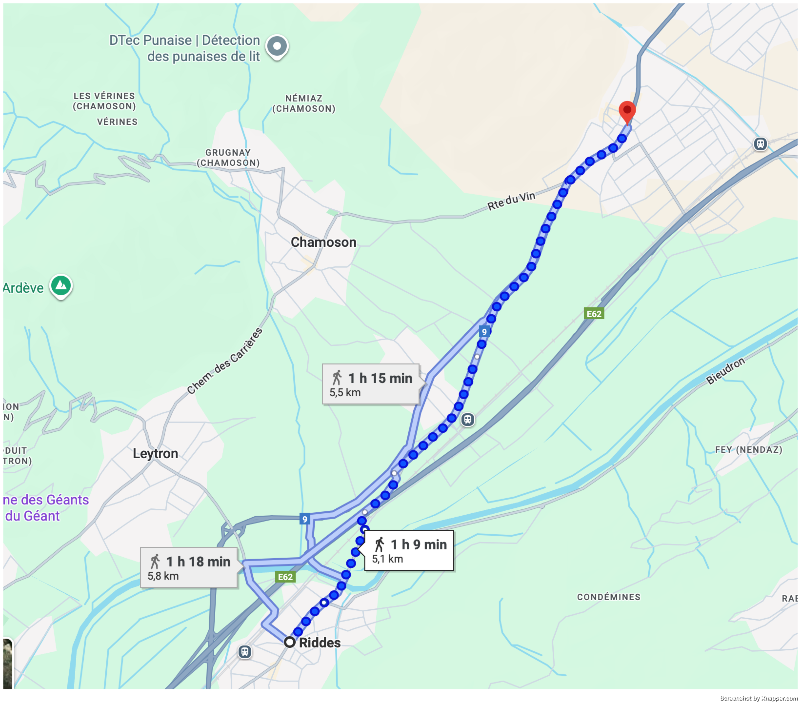

**1892**

La primera evidencia documental con firma de Francisco en Argentina corresponde al acta de nacimiento de su hijo **León Francisco**, nacido en 1891:

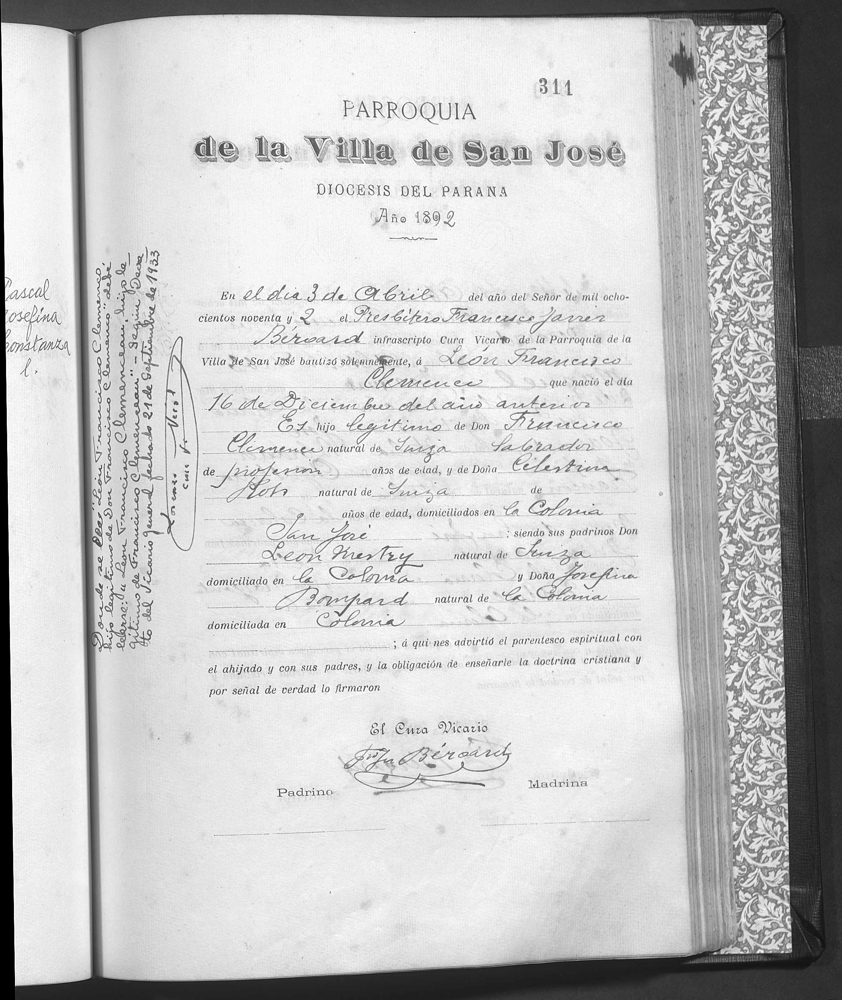

Esto nos deja algunas cuestiones:

- En 1891 Francisco ya había conocido a **Celestina Roh**.
- Estaba domiciliado en la **Colonia San José, Entre Ríos**.
- Existe un lapso de **19 años sin registros** de Francisco.
    

A partir de esto surgen varias preguntas:

1. ¿Francisco y Celestina se conocieron en **Santa Fe** y viajaron juntos a Entre Ríos?
    
2. ¿Francisco ya estaba en **Entre Ríos** y conoció a Celestina cuando ella se mudó con su familia desde Santa Fe?
    
3. ¿Se conocían previamente en **Suiza** y llegaron juntos a Santa Fe?
    
4. Dado que Celestina vino con su familia, ¿es posible que Francisco también lo hiciera?
    
5. ¿Podría ser el **padre de Francisco** quien aparece en los libros de la Colonia?
    
6. ¿Por qué no existen registros claros de la **familia completa**?

En relación a la familia de Francisco, existe una carta de 1905 del Tribunal de Conthey, referida a una herencia, donde se nombra a **Etienne**, un hermano de Francisco:

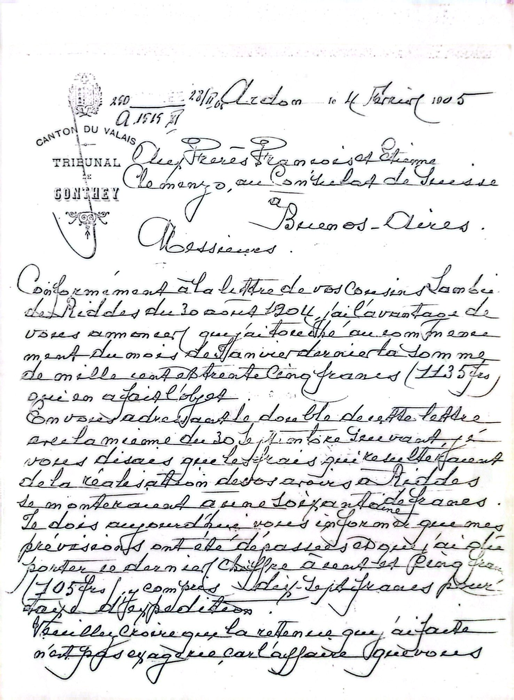

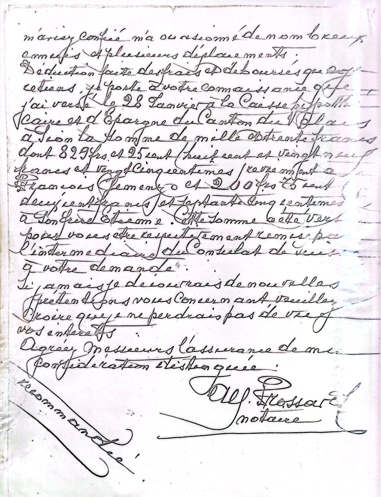

Esto llevó a la hipótesis de que Etienne Clemenzo podría ser **Esteban Clemenzoz**, quien tiene varios registros en FamilySearch. Entre ellos se encontré el siguiente:

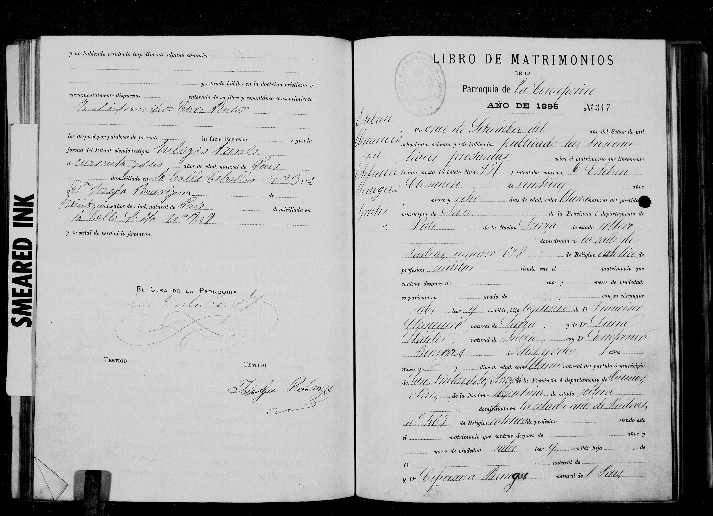

Esto confirma que **Esteban Clemenzoz y Francisco Clemenzo eran hermanos**, ambos hijos de François Clemenzoz y Marie Luisa Stalder.

Volviendo a los hijos de Francisco en Entre Rios, tenemos a:

- Celestina Clemenzo (Probable hija de Celestina, anterior a conocer a Francisco)
- Leon Francisco Clemenzo (1891)
- Francisca Clemenzo (desconocido)
- Pedro Clemenzo (desconocido)
- Felix Clemenzo (1894)
- Maria Luisa Clemenzo (1897)
- Carlota Julia Clemenzo (1899)

Francisca Clemenzo y Pedro Clemenzo figuran en el censo de Colón de 1895, dentro de los cinco hijos que declaraban tener Francisco y Celestina hasta ese momento:

![[FJHC_1859_censo1895_1.jpg]]

![[FJHC_1859_censo1895_2.jpg]]

En dicho documento aparece un hijo llamado Francisco, que interpreto como **León Francisco Clemenzo**.

El quinto hijo no está listado, pero estimo que se trata de **Félix Clemenzo**, nacido en 1894.

En conclusión, según lo que indican los documentos encontrados, Francisco se estableció en Entre Ríos al menos en 1892 y permaneció allí hasta, por lo menos, 1899, año en que nació su última hija, Carlota.

### Santa Fe

**1919**

La siguiente referencia documental corresponde al registro militar de 1919, que sitúa a Francisco en Santa Fe:

![[FJHC_1859_militar_1.jpeg]]

![[FJHC_1859_militar_2.jpeg]]

![[FJHC_1859_militar_3.jpeg]]

![[FJHC_1859_militar_4.jpeg]]

### Vuelta a Entre Rios

**1928**

Finalmente, el acta de defunción de Francisco en 1928 confirma que se encontraba en **Concepción del Uruguay, Entre Ríos**.

![[FJHC_1859_defuncion.jpg]]

Todos los documentos se pueden consultar en detalle haciendo click [acá](https://cmzo.github.io/web-genealogia/archivo.html#/francois-clemenzo).

## Observaciones

- Entre su llegada (1873) y el primer registro en Entre Ríos (1891) hay **casi dos décadas sin rastros claros**.
- No está del todo definido si partió desde **Conthey, Ardon o Riddes**, ya que las fuentes mencionan lugares distintos, aunque cercanos.
- Los hijos aparecen de manera fragmentada en distintos censos y actas, lo que abre la posibilidad de que existan registros aún no localizados.

>  Gracias
> Hace unos años solo conocía el nombre de mi abuelo; hoy puedo llegar hasta mi tatarabuelo. Todo sirvió: las charlas, los viajes con mi papá, y todas aquellas personas que me tuvieron que aguantar hablando de genealogía, registros y documentos.
> Sin la colaboración de **Gustavo Clemenzo** no hubiese podido confirmar muchas cosas que hoy sé con certeza; me compartió documentos clave.  
>También me sirvieron mucho todas las conversaciones con **Lucia Magallanes**, quien me hizo notar detalles que había pasado por alto.  
>Y a **Hernán**, que ayudó con la edición de muchísimas imágenes.
