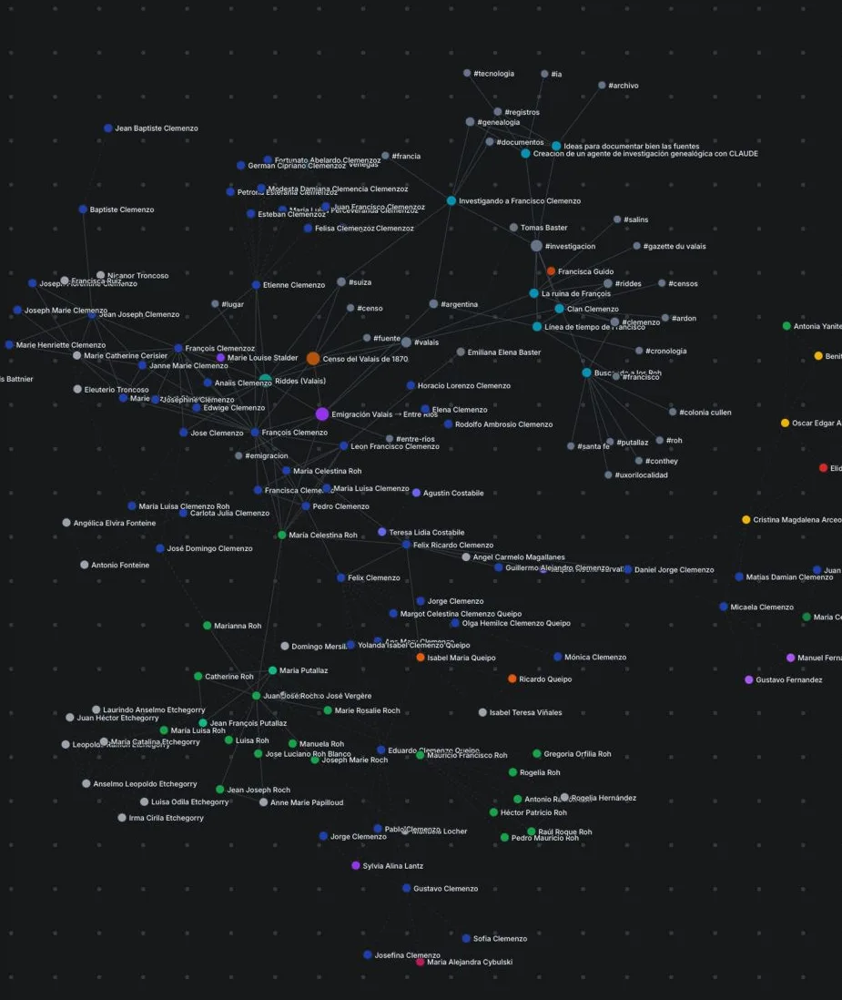
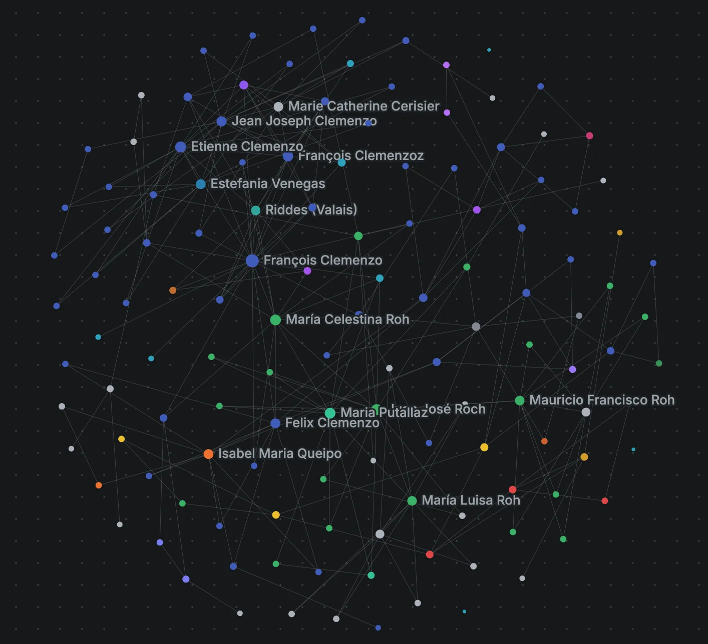

# Una LLM Wiki para mi genealogía

En abril de 2026, Andrej Karpathy publicó un [gist](https://gist.github.com/karpathy/442a6bf555914893e9891c11519de94f) describiendo un patrón que venía usando para gestionar su propia investigación. Lo llamó **LLM Wiki**: en lugar de que un modelo redescubra la información en cada consulta, un agente la **compila una vez** en una base de markdown y la **mantiene actualizada**. El gist juntó más de cinco mil estrellas en días.

Me interesó porque describía, con nombre y forma, algo que yo estaba haciendo a mano. Así que lo puse a prueba sobre un corpus que ya tenía: el archivo de mi investigación genealógica —censos, actas, prensa del siglo XIX, notas. Este post documenta esa prueba: de dónde viene la idea, cómo la implementé, y la parte que más trabajo me dio, que no fue la IA sino el grafo.

## La idea es vieja: Zettelkasten

Mucho antes de los LLM, el sociólogo **Niklas Luhmann** construyó un sistema de fichas de papel —el *Zettelkasten*— con unas 90.000 notas enlazadas entre sí por un sistema de identificadores. Con eso produjo más de 70 libros. **Sönke Ahrens** lo popularizó en 2017 con *How to Take Smart Notes*.

Lo central del Zettelkasten no son las notas: son los **enlaces**. Cada nota es atómica (una idea), y en lugar de archivarse en carpetas se conecta a otras. No hay jerarquía rígida; la estructura **emerge** de las conexiones. Es, literalmente, un grafo de conocimiento hecho con fichas y referencias cruzadas.

## La era digital: Second Brain y Obsidian

La versión digital de esta idea es el PKM (*personal knowledge management*). **Tiago Forte** la sistematizó en *Building a Second Brain* con dos siglas: **CODE** (Capturar, Organizar, Destilar, Expresar) y **PARA** (Projects, Areas, Resources, Archives). La tesis: descargá tu memoria a un sistema externo confiable y producí a partir de ahí.

La herramienta que llevó esto al mainstream fue **Obsidian**: notas en markdown plano, enlaces `[[wiki-style]]`, y —lo que más se ve— una **vista de grafo** donde cada nota es un nodo y cada enlace una arista. **Zsolt Viczián** (canal *Visual PKM*, autor del plugin Excalidraw para Obsidian) llevó esto un paso más allá: el conocimiento no solo se escribe, se **dibuja y se navega**.

Yo uso Obsidian desde hace años para organizar mis notas personales, las de investigación y todo aquello que implique guardar conocimiento que pueda llegar a necesitar en el futuro. Cuando la relación entre dos notas es obvia, las enlazo —y lo mismo con los tags—, pero nunca logré incorporar ese proceso con naturalidad. Ahí es donde entra Claude…

## El salto de 2026: la IA mantiene el cerebro

Todo lo anterior asume un autor humano que escribe y enlaza las notas. La propuesta de Karpathy cambia quién hace el mantenimiento: **el agente**.

La distinción importante es con **RAG** (*retrieval-augmented generation*), el patrón habitual para darle conocimiento a un LLM. RAG **recupera** fragmentos relevantes en cada consulta y los descarta después: no acumula nada. La LLM Wiki hace lo contrario —**compila** el conocimiento en artefactos persistentes (markdown con referencias cruzadas) y los mantiene. Karpathy lo resume así: *"los LLM no se aburren, no se olvidan de actualizar una referencia cruzada, y pueden tocar 15 archivos de una pasada"*.

La estructura que propone son tres capas: **fuentes crudas** (inmutables), **wiki** (markdown sintetizado y enlazado, mantenido por la IA) y **schema** (las convenciones y los flujos). Y tres operaciones: **ingerir** fuentes nuevas, **consultar** sintetizando lo compilado, y **mantener** —detectar contradicciones y páginas huérfanas.

## Se vuelve estándar: OKF de Google

Dos meses después, el 12 de junio de 2026, Google Cloud anunció el **Open Knowledge Format (OKF)**, que formaliza exactamente este patrón como estándar abierto: una forma estandarizada de que los agentes lean, escriban e intercambien conocimiento en markdown, sin lock-in.

La forma más clara de ubicarlo es contra **MCP** (el otro estándar de agentes): MCP gobierna *cómo* un agente se conecta a herramientas y datos en vivo; OKF gobierna *qué sabe* el agente —la capa de conocimiento curada y estable, antes de tocar las fuentes. Conexión vs. conocimiento.

## Mi implementación

Apliqué el patrón con tres capas, igual que el gist:

- **Fuentes crudas**: los documentos —censos del Valais, actas de Entre Ríos, prensa, fotos—. Inmutables.
- **Wiki (markdown mantenido por un agente)**: una nota por persona (`content/personas/p*.md`) y páginas de lugar/fuente/evento (`content/wiki/*.md`). No las escribo a mano: las crea y actualiza un **agente** a través de un servidor MCP, con herramientas como `crear_archivo_investigacion` y `crear_pagina_wiki`.
- **Schema**: una plantilla fija para las notas más un par de `CLAUDE.md` que documentan las convenciones y el flujo. Y una herramienta de *mantenimiento* (`estado_wiki`) que hace de lint: marca personas sin etiquetar, notas huérfanas, etc. —el "detectar contradicciones" de Karpathy.

Sobre eso construí una **[Wiki navegable](wiki.html)**: un grafo donde las personas, los lugares, las fuentes y los posts del blog son puntos conectados. Hay tres tipos de arista:

1. **Familia** — padre/madre/cónyuge, derivadas de la base de datos del árbol.
2. **Enlace** — menciones explícitas entre notas (`[[p26]]`, o el id en prosa).
3. **Tag** — etiquetas temáticas. No son nodos del grafo, pero funcionan como **hubs transversales**: un tag como `#emigracion` conecta personas con posts y con páginas, cruzando dominios que el parentesco no toca.

Esto deja dos vistas complementarias del mismo material: el **[Árbol](arbol.html)** muestra la *estructura* (genealogía, datos, documentos), y la **Wiki** muestra el *conocimiento* (cómo se entrelaza todo lo demás).

## El grafo: lo que costó

Quería que el grafo se viera como el de Obsidian: un disco redondo, ordenado, que invitara a explorarse. Conseguirlo me llevó bastantes más horas de las que esperaba, y el camino fue de frustración y descarte.

**Primer problema: una maraña.** Empecé con D3 y un layout de fuerzas clásico. El resultado era un ovillo. Medí el grafo y encontré la causa: de las ~460 aristas, **el 51% eran de tags**, y unos pocos tags gigantes (uno tocaba un tercio de los nodos) se solapaban entre sí, amarrando todo al centro. La solución fue sacar los tags del lienzo —siguen vivos en el panel y el resaltado, pero no se dibujan—. El grafo pasó a ser disperso, casi un árbol.

**Segundo problema: no era un círculo.** Con pocos nodos (≈130), ningún layout de fuerzas daba la forma redonda de Obsidian. Probé de todo: clusters por familia, nodos compuestos, layouts deterministas (anillos por grado, un "mandala" por generación), y un post-proceso que reasignaba los radios a mano. Todo quedaba a medias —o muy rígido, o con el borde dentado.

**La solución fue dejar de inventar y copiar el modelo real.** Obsidian no usa ningún truco: es física continua con tres fuerzas —repulsión entre todos los nodos, un resorte al centro, y resortes en los enlaces—. El círculo no se dibuja; *emerge* de la repulsión empujando hacia afuera contra el centro. Lo reimplementé sobre [Cytoscape.js](https://js.cytoscape.org/) y le agregué lo único que faltaba para garantizar la forma con tan pocos nodos: un **borde circular** que confina los nodos dentro de un disco. La misma simulación maneja el arrastre: agarrás un nodo, los conectados lo siguen, lo soltás y todo vuelve al círculo.

_El primer intento, con los tags como nodos del grafo: una maraña donde unos pocos hubs gigantes amarran todo al centro._

_El mismo grafo con los tags fuera del lienzo y la física de Obsidian con borde circular: un disco donde se distinguen las familias._

## Un laboratorio para reproducirlo

Para que esto no quedara como una caja negra —y para poder reproducirlo yo mismo más adelante— armé un **[laboratorio del grafo](lab-grafo.html)**: un sandbox donde elegís cuántos nodos y conexiones, movés cada parámetro de la física en vivo, y ves el resultado al instante. Genera un grafo sintético con *preferential attachment* (el modelo que hace emerger hubs), así que se parece a un grafo de conocimiento real.

Incluye una **receta copiable**: el listado de todos los parámetros más una explicación de la técnica, lista para pegar a un LLM y reconstruir cualquier configuración. De hecho, los valores con los que quedó la Wiki salieron de jugar ahí y copiar la receta.

## Cierre

Lo que aprendí poniendo a prueba la idea: la parte de IA fue la más directa —el agente mantiene el markdown bien y sin quejarse—. Lo difícil fue la representación. Y el patrón de fondo no es nuevo: Luhmann ya enlazaba fichas en los años 60. Lo que cambió en 2026 es **quién mantiene los enlaces**.

## Para consultar

- [El gist original de Karpathy — *LLM Wiki*](https://gist.github.com/karpathy/442a6bf555914893e9891c11519de94f)
- [Open Knowledge Format — Google Cloud](https://cloud.google.com/blog/products/data-analytics/how-the-open-knowledge-format-can-improve-data-sharing)
- Sönke Ahrens, *How to Take Smart Notes* — la puerta de entrada moderna al Zettelkasten de Luhmann.
- [Building a Second Brain — Tiago Forte](https://www.buildingasecondbrain.com/)
- [Visual PKM — Zsolt Viczián (YouTube)](https://www.youtube.com/@VisualPKM)
- [Cytoscape.js](https://js.cytoscape.org/) — la librería con la que está dibujado el grafo.
- Este sitio: la **[Wiki](wiki.html)**, el **[Árbol](arbol.html)** y el **[laboratorio del grafo](lab-grafo.html)**. El código está en el [repositorio](https://github.com/cmzo/web-genealogia).
