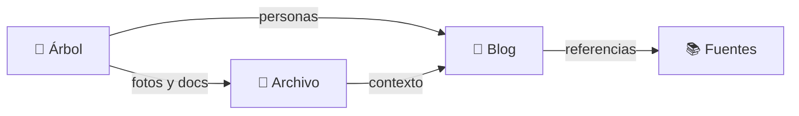

## ¿Primera vez aquí?

Un archivo genealógico digital sobre la familia Clemenzo, originaria de **Riddes**, cantón de Valais, Suiza, y su rama emigrada a Entre Ríos, Argentina, a fines del siglo XIX.

Este sitio documenta un proceso de investigación en curso: hay hallazgos confirmados, fechas aproximadas y preguntas sin respuesta. Los datos se actualizan a medida que aparecen nuevas fuentes.

> [!TIP] Por dónde empezar
> Si llegás sin contexto previo, el **Árbol** es el mejor punto de entrada. Desde ahí podés saltar al Archivo y al Blog según lo que encontrés.

---

## Las secciones

### 🌳 Árbol

El árbol genealógico interactivo. Muestra la familia centrada en una persona y se navega haciendo click en cualquier tarjeta. Cubre varias generaciones hacia arriba y hacia abajo.

**Qué encontrás:** fechas y lugares de nacimiento y muerte, padres, matrimonios, hijos. Cada persona tiene una pestaña de investigación con notas y fuentes, y una pestaña de archivos con fotos y documentos.

> [!WARNING] Mejor en tablet o computadora
> En celular el árbol puede verse reducido y la navegación con teclado no aplica.

### 📁 Archivo

Vista tabular de todas las personas y sus archivos: fotos de época, actas, documentos. Permite buscar por nombre o ID de persona, y filtrar por rama familiar.

**Qué encontrás:** el material documental asociado a cada persona, agrupado y etiquetado.

### 📝 Blog

Artículos de investigación sobre hallazgos, documentos encontrados e hipótesis. Cada entrada documenta el proceso y cita sus fuentes.

**Qué encontrás:** contexto histórico, análisis de documentos, conclusiones provisionales.

### 📚 Fuentes

Repositorio de fuentes consultadas: archivos cantonales suizos, registros parroquiales, censos digitalizados, bibliografía heráldica. Con links directos cuando están disponibles.

**Qué encontrás:** las referencias que sostienen los datos del árbol y los artículos.

---

## Cómo se relacionan las secciones

---

## Recorridos sugeridos

| Si te interesa… | Empezá por… |
|---|---|
| Explorar el árbol familiar | **Árbol** → click en cualquier persona → panel de detalle |
| Ver fotos y documentos | **Archivo** → buscá un nombre o filtrá por rama |
| Leer sobre la investigación | **Blog** → artículos ordenados por fecha |
| Verificar una fuente | **Fuentes** → organizadas por país e institución |

### Atajos de teclado en el árbol

| Tecla | Acción |
|---|---|
| ↑ | Ir al padre |
| ↓ | Ir al primer hijo |
| ← → | Ciclar entre hermanos / ir al cónyuge |
| Enter / Espacio | Abrir panel de detalle |
| Escape | Cerrar panel |

---

> [!NOTE] Los datos son un trabajo en progreso
> Algunas fechas son aproximadas y se muestran con `~`. Si encontrás un error o tenés información adicional, escribime desde [Contacto](contacto.html).
