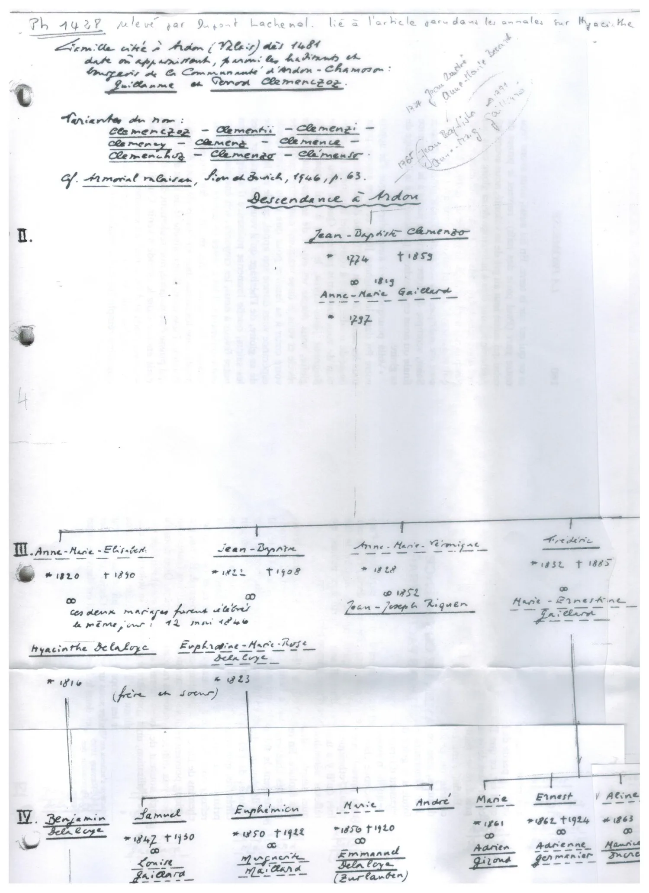
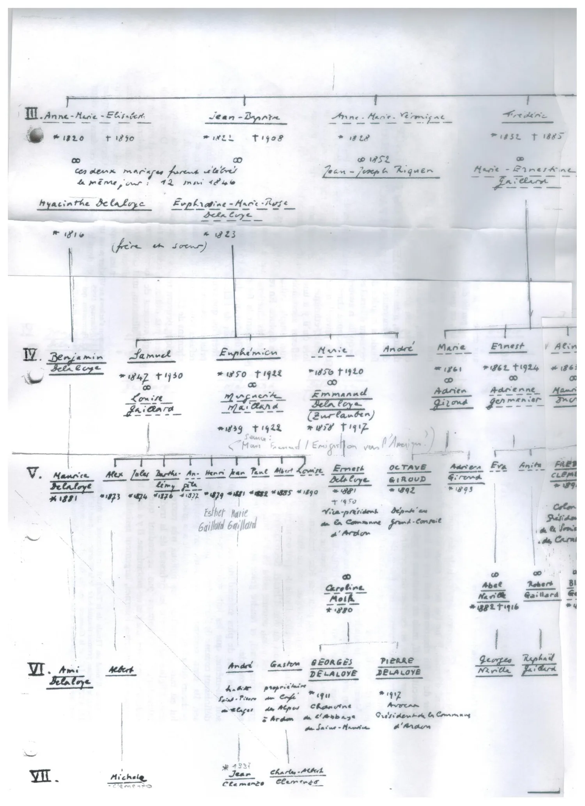
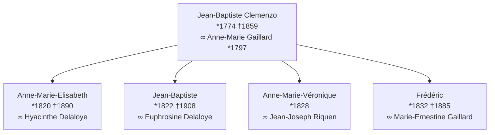
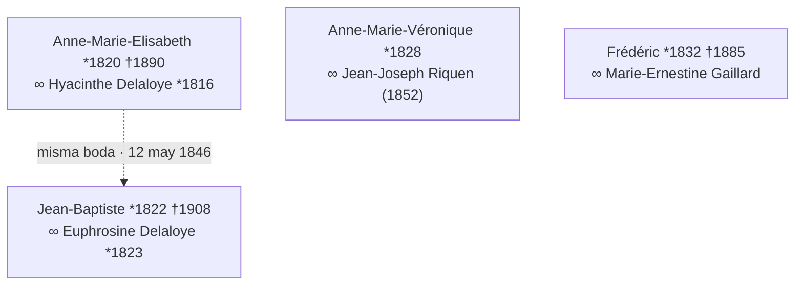
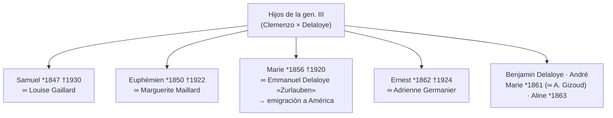
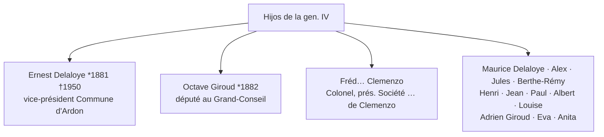
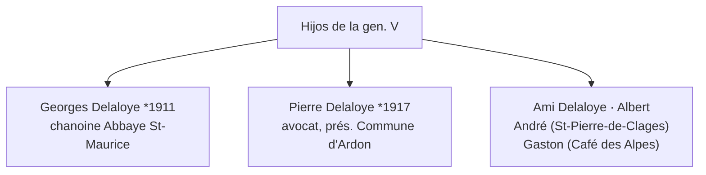
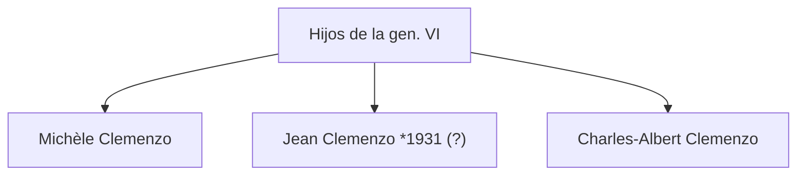

# Árbol de Jean-Yves Clemenzo

Árbol genealógico **manuscrito** compilado por **Jean-Yves Clemenzo**, titulado *«Descendance à Ardon»*: reconstruye la rama de los Clemenzo que **permaneció en [[ardon-valais|Ardon]]**, en paralelo a la rama que emigró a Entre Ríos (ver [[emigracion-valais-entrerios|emigración Valais → Entre Ríos]]). Dos fotografías del original están en el archivo de investigación.

> [!note] Original manuscrito
> Varias entradas de las generaciones IV–V están borrosas o cortadas en el borde derecho de la hoja; las lecturas dudosas se señalan con *(?)*.

## Origen y fuentes

- **Ref.:** «Ph 1438, relevé par Dupont Lachenal», ligado a un artículo de los *Annales* sobre Hyacinthe.
- **Origen:** familia citada en **Ardon (Valais) desde 1481**, entre los habitantes y burgueses de la comunidad de **Ardon-Chamoson**: **Guillaume** y **Perrod Clemenczoz**.
- **Variantes del apellido:** Clemenczoz · Clementii · Clemenzi · Clemenay · Clemenz · Clemence · Clemenchoz · Clemenzo · Clémens.
- **Cita:** *Armorial Valaisan*, Sion & Zurich, 1946, p. 63.
- **Generaciones previas** (nota al margen, parcial): ~1734 Jean-Baptiste ∞ Anne-Marie Gérard → 1765 Jean-Baptiste… *(lectura insegura)*.

## Gen. II — el tronco documentado

- **Jean-Baptiste Clemenzo** *1774 †1859 ∞ 1819 **Anne-Marie Gaillard** *1797.

## Gen. III — los cuatro hijos

- **Anne-Marie-Elisabeth** *1820 †1890 ∞ **Hyacinthe Delaloye** *1816
- **Jean-Baptiste** *1822 †1908 ∞ **Euphrosine-Marie-Rose Delaloye** *1823
- **Anne-Marie-Véronique** *1828 ∞ 1852 **Jean-Joseph Riquen**
- **Frédéric** *1832 †1885 ∞ **Marie-Ernestine Gaillard**

> [!info] Doble casamiento
> *«Ces deux mariages furent célébrés le même jour: 12 mai 1846»* — los dos hermanos Clemenzo (Anne-Marie-Elisabeth y Jean-Baptiste) se casaron con dos hermanos **Delaloye** (Hyacinthe y Euphrosine, *«frère et sœur»*) el **mismo día**.

## Gen. IV — Clemenzo + Delaloye

Por el doble casamiento, esta generación mezcla descendencia Clemenzo y Delaloye.

- Benjamin Delaloye · **Samuel** *1847 †1930 (∞ Louise Gaillard) · **Euphémien** *1850 †1922 (∞ Marguerite Maillard) · **Marie** *1856 †1920 (∞ **Emmanuel Delaloye «Zurlauben»** *1858 †1917 — *«émigration vers l'Amérique»*) · André · **Marie** *1861 (∞ Adrien Gizoud) · **Ernest** *1862 †1924 (∞ Adrienne Germanier) · **Aline** *1863.

## Gen. V

- Maurice Delaloye *1881 · Alex *1873 · Jules *1874 · Berthe-Rémy *1876 · *(ilegible)* *1872 · Henri *1879 · Jean *1881 · Paul *1882 · Albert *1885 · Louise *1890.
- **Ernest Delaloye** *1881 †1950 — vice-président de la Commune d'Ardon.
- **Octave Giroud** *1882 — député au Grand-Conseil. Adrien Giroud *1893 · Eva · Anita.
- **Fréd… Clemenzo** — Colonel, président de la Société … de Clemenzo *(cortado)*.

## Gen. VI

- Ami Delaloye · Albert · André (Saint-Pierre-de-Clages) · Gaston (propr. *Café des Alpes*, Ardon).
- **Georges Delaloye** *1911 — chanoine de l'Abbaye de Saint-Maurice.
- **Pierre Delaloye** *1917 — avocat, président de la Commune d'Ardon.

## Gen. VII — entorno probable de Jean-Yves

- Michèle Clemenzo · Jean Clemenzo *1931 *(?)* · Charles-Albert Clemenzo.

## Qué aporta a la investigación

1. **Confirma el tronco de Ardon** con línea masculina continua desde 1481 hasta el s. XX.
2. **Resuelve el homónimo Jean-Baptiste**: el tío †1859 = Jean-Baptiste *1774 (gen. II); el primo *1822 †1908 = su hijo (gen. III). Coincide con el acta de carencia de 1866 que aparece en las notas de [[p26|François Clemenzo (1858)]].
3. **Pista de emigración:** Marie Clemenzo (*1856) ∞ Emmanuel Delaloye, con nota de **emigración a América** — otra rama a cruzar con los datos de Entre Ríos.

## La hipótesis «Elisabeth née Clementz ∞ Lambiel»

El árbol de Jean-Yves resuelve una de las candidatas de un enigma abierto: ¿quién era la **«Elisabeth née Clementz»** casada con **Jean Antoine Lambiel** en [[riddes-valais|Riddes]] (según el [[censo-valais-1870|censo del Valais de 1870]] y el de 1850)? Sus hijos son, casi con seguridad, los **«cousins Lambiel»** que en 1904 iniciaron la liquidación de los bienes suizos de la rama emigrada.

Había **dos candidatas**:

| # | Candidata | Origen |
|---|-----------|--------|
| 1 | [[p76|Marie Elizabet Clemenzo]] (n. 1821) | Hermana de [[p36|François Clemenzoz]], hija de [[p57|Jean Joseph Clemenzo]] — la rama emigrada |
| 2 | **Anne-Marie-Elisabeth Clemenzo** (n. 1820 †1890) | Rama de Jean-Baptiste/Ardon — este árbol |

**El árbol descarta la candidata 2:** la muestra casada con **Hyacinthe Delaloye el 12-05-1846**, no con un Lambiel; y la pareja Lambiel×Clementz ya tenía su primer hijo en **1842** (boda ~1840-41), imposible para alguien que se casó en 1846.

→ Queda en pie [[p76|Marie Elizabet Clemenzo]]. Si se confirma (acta de matrimonio Lambiel×Clementz, o consulta directa a Jean-Yves), los «cousins Lambiel» serían **primos hermanos** de los hijos de [[p36|François Clemenzoz]].
