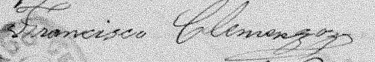

# Ejemplo de Post en Markdown

Este es un ejemplo de cómo escribir posts usando **Markdown**. El sistema automáticamente convertirá este archivo en una página HTML con el diseño editorial de tu sitio.

## Características del sistema

- **Front Matter**: Los metadatos van entre `---` al inicio
- **Markdown completo**: Puedes usar todos los elementos de Markdown
- **Blockquotes**: Se convierten automáticamente al estilo de tu sitio
- **Aside dinámico**: Imágenes y contenido a la derecha

> Este es un blockquote que se verá con el estilo que ya tienes definido en tu CSS. El sistema automáticamente lo formatea correctamente.

## Imágenes en Markdown

Puedes incluir imágenes de varias formas:

### Imagen simple


### Imagen con título


### Imagen con HTML personalizado
<figure class="article-image">
  
  <figcaption style="margin-top: 12px; font-size: 13px; color: #6b7280; line-height: 1.4; font-family: 'Inter', sans-serif;">Pie de imagen personalizado</figcaption>
</figure>

## Aside dinámico

Como puedes ver, la imagen de la firma aparece a la derecha del contenido. Esto se logra usando el campo `aside` en el Front Matter:

```yaml
aside: |
  
  
  *Firma histórica de Francisco José H. Clemenzo, 1859*
```

## Espaciado mejorado

Ahora los títulos h2 tienen más espaciado para mejor legibilidad. Este espaciado hace que el contenido sea más fácil de leer y más agradable visualmente.

### Subtítulos h3

Los subtítulos h3 también tienen su propio espaciado optimizado.

## Metadatos disponibles

- `title`: Título del post
- `description`: Descripción para las tarjetas
- `image`: Imagen de la tarjeta
- `category`: Categoría del post
- `date`: Fecha de publicación
- `tags`: Tags separados por comas
- `featured`: Si es destacado (true/false)
- `slug`: URL del post (opcional, se genera automáticamente)
- `kicker`: Texto pequeño arriba del título
- `aside`: Contenido que aparece a la derecha (Markdown)

## Flujo de trabajo

1. Crear archivo `.md` en `/posts/`
2. Escribir contenido en Markdown
3. Agregar `aside` en el Front Matter si quieres contenido a la derecha
4. Ejecutar `npm run build`
5. El post aparece automáticamente en el blog

¡Así de simple!
